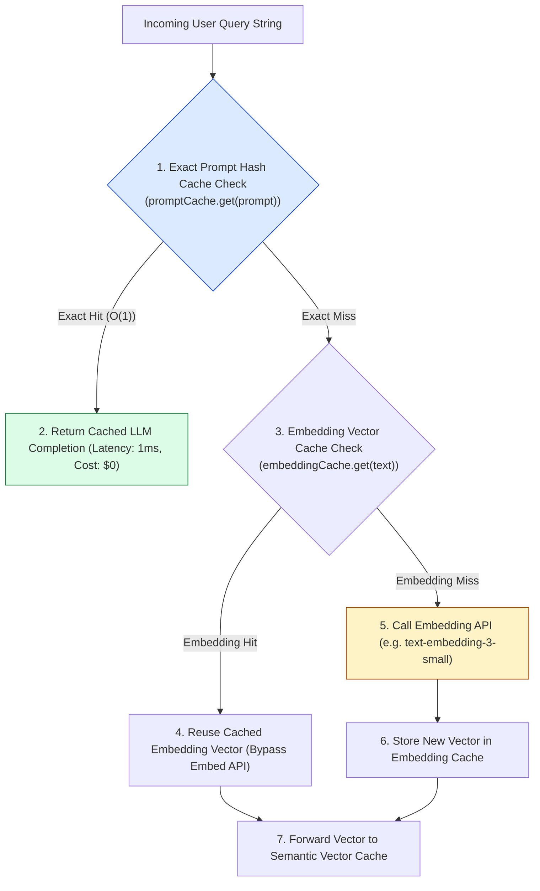
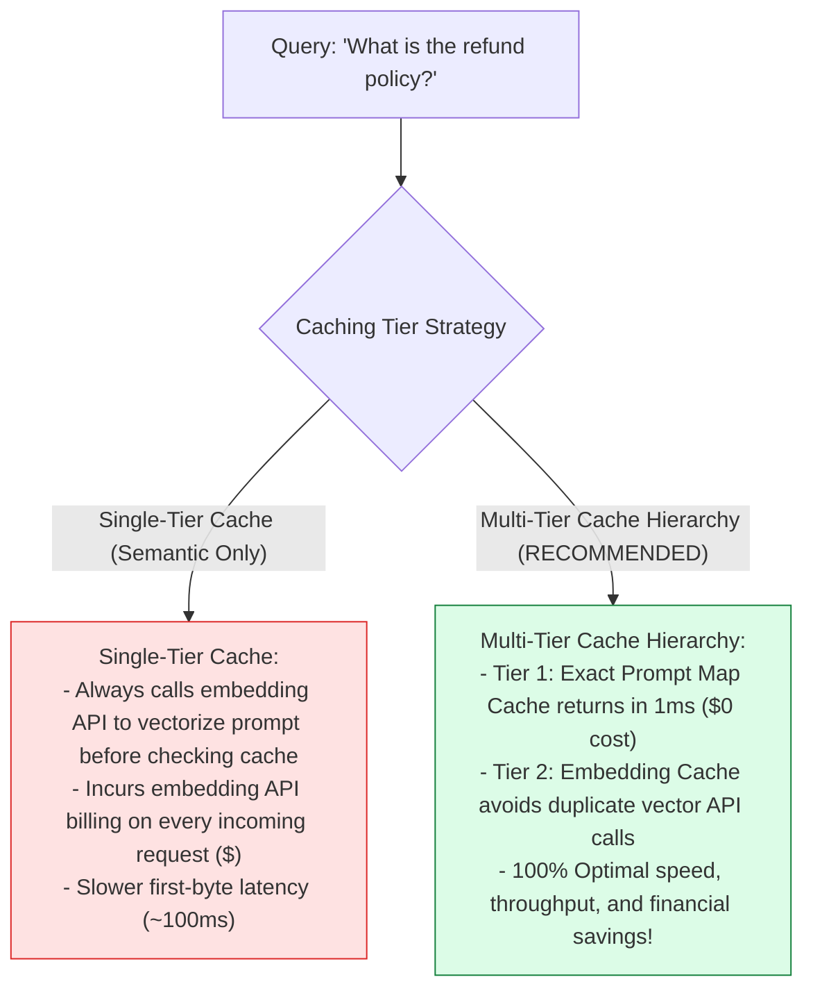
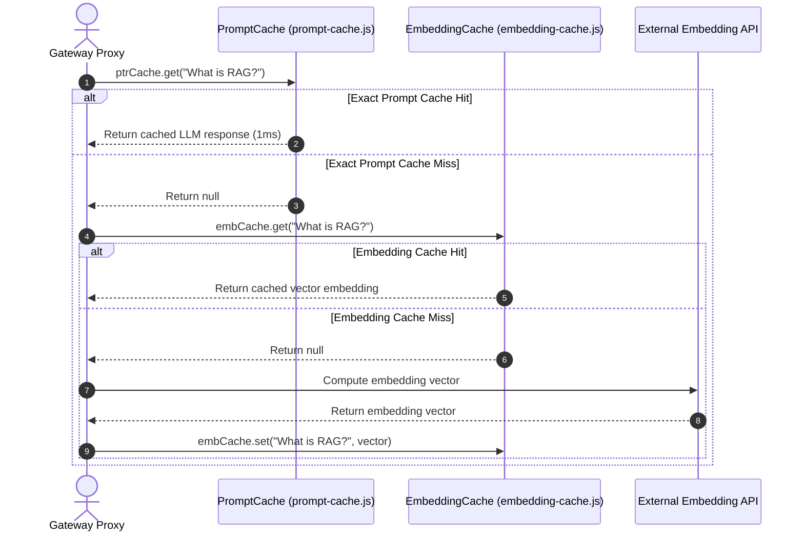

# Module 02: Multi-Tier Exact Prompt & Embedding Vector Caching (`src/caching/`)

## Overview

While semantic vector caching handles fuzzy query similarity, computing vector embeddings for incoming queries still requires an API network request unless the embedding itself is cached. The **Multi-Tier Caching Layer (`src/caching/`)** combines **Exact Prompt Caching** (`src/caching/prompt-cache.js`) and **Embedding Vector Caching** (`src/caching/embedding-cache.js`). Exact prompt caching delivers $O(1)$ instant lookups for duplicate query strings, while embedding caching stores generated vectors to eliminate redundant embedding API calls.

Understanding **$O(1)$ Map Hash Lookups**, **Multi-Tier Caching Hierarchies**, **Embedding API Cost Offloading**, and **Cache Invalidation Protocols** is essential for high-throughput AI infrastructure.

---

## 1. Multi-Tier Caching Topology



---

## 2. Single-Layer Caching vs. Multi-Tier Cache Hierarchy



### Multi-Tier Cache Reference Matrix

| Cache Tier | Target Module | Data Structure | Lookup Complexity | Primary Technical Purpose |
| :--- | :--- | :--- | :--- | :--- |
| **Tier 1: Prompt Cache** | `prompt-cache.js` | `Map<string, string>` | $O(1)$ Hash Lookup | Instant 1ms return for exact duplicate prompts. |
| **Tier 2: Embedding Cache**| `embedding-cache.js`| `Map<string, number[]>`| $O(1)$ Hash Lookup | Eliminates duplicate embedding API calls. |
| **Tier 3: Semantic Cache** | `semantic-cache.js` | Vector Array | $O(N)$ Cosine Similarity | Serves fuzzy semantically equivalent queries. |

---

## 3. Asynchronous Multi-Tier Execution Sequence



---

## 4. Code Walkthrough (`src/caching/`)

### Exact Prompt Cache (`src/caching/prompt-cache.js`)

```javascript
/**
 * Exact Prompt String Cache
 * Delivers O(1) instant hash lookup for duplicate prompt strings
 */
export class PromptCache {
  constructor() {
    this.cache = new Map();
    console.log("⚡ [PROMPT CACHE] Initialized O(1) exact-match string cache.");
  }

  /**
   * Retrieves cached response for exact prompt string
   * @param {string} prompt - Input query prompt
   * @returns {any|null} Cached response object or null
   */
  get(prompt) {
    if (!prompt) return null;
    const hit = this.cache.get(prompt);
    if (hit) {
      console.log(`🎯 [PROMPT CACHE HIT] O(1) match for prompt: "${prompt.slice(0, 30)}..."`);
      return hit;
    }
    return null;
  }

  /**
   * Stores exact prompt string and response payload
   */
  set(prompt, response) {
    if (!prompt || !response) return;
    this.cache.set(prompt, response);
    console.log(`💾 [PROMPT CACHE STORED] Saved exact prompt key (${this.cache.size} total entries).`);
  }

  /**
   * Clears exact prompt cache
   */
  clear() {
    this.cache.clear();
    console.log("🧹 [PROMPT CACHE CLEARED] Reset complete.");
  }
}
```

### Embedding Vector Cache (`src/caching/embedding-cache.js`)

```javascript
/**
 * Embedding Vector Cache
 * Stores computed vector embeddings by text string to avoid duplicate API calls
 */
export class EmbeddingCache {
  constructor() {
    this.cache = new Map();
    console.log("⚡ [EMBEDDING CACHE] Initialized vector embedding cache.");
  }

  /**
   * Retrieves cached vector embedding for input text
   * @param {string} text - Target text string
   * @returns {number[]|null} Cached vector array or null
   */
  get(text) {
    if (!text) return null;
    const vector = this.cache.get(text);
    if (vector) {
      console.log(`🎯 [EMBEDDING CACHE HIT] Reusing cached vector for text: "${text.slice(0, 30)}..."`);
      return vector;
    }
    return null;
  }

  /**
   * Stores text string and generated vector array
   */
  set(text, embedding) {
    if (!text || !embedding) return;
    this.cache.set(text, embedding);
    console.log(`💾 [EMBEDDING CACHE STORED] Saved vector embedding (${embedding.length} dims).`);
  }

  /**
   * Clears embedding cache
   */
  clear() {
    this.cache.clear();
    console.log("🧹 [EMBEDDING CACHE CLEARED] Reset complete.");
  }
}
```

---

## Key Production Takeaways

1. **Implement Multi-Tier Cache Hierarchies**: Evaluate Tier 1 exact prompt hash caches (`PromptCache`) before invoking Tier 2 embedding vector caches (`EmbeddingCache`).
2. **Achieve 1ms Lookup Speed with $O(1)$ Hash Maps**: Use JavaScript `Map` data structures for exact prompt string lookups to achieve 1ms response latency.
3. **Eliminate Duplicate Embedding API Billing**: Cache generated embedding vectors (`EmbeddingCache`) to avoid paying embedding API provider fees for repeated text inputs.
4. **Isolate Caching Layers**: Keep caching modules decoupled so individual tiers can be enabled or disabled independently inside the gateway proxy.


## Learn from the implementation

Use the matching source file as an executable example, not just something to copy. Before running it, state in your own words what data enters the module, what it returns, and which values it changes. Then trace one realistic request from the caller through each function.

Pay special attention to these questions:

- **Data flow:** Which object, array, string, or state value moves between functions? What shape must it have?
- **Control flow:** Which branch, loop, early return, or retry changes the outcome? What condition selects it?
- **Async boundaries:** Where does the code wait for an LLM, database, network, file system, or tool? What should happen if that operation rejects or returns no result?
- **Side effects:** Which lines log information, make an external request, store data, or mutate in-memory state? Keep those distinct from pure calculations.
- **Production limits:** Which assumptions are only safe for a tutorial—for example, in-memory storage, fixed thresholds, approximate token counts, mock data, or a hard-coded batch size?

A useful practice is to change one input at a time and predict the result before executing it. If you can explain why the output changed, when the module should be used, and one way it could fail, you understand the concept rather than only the syntax.
