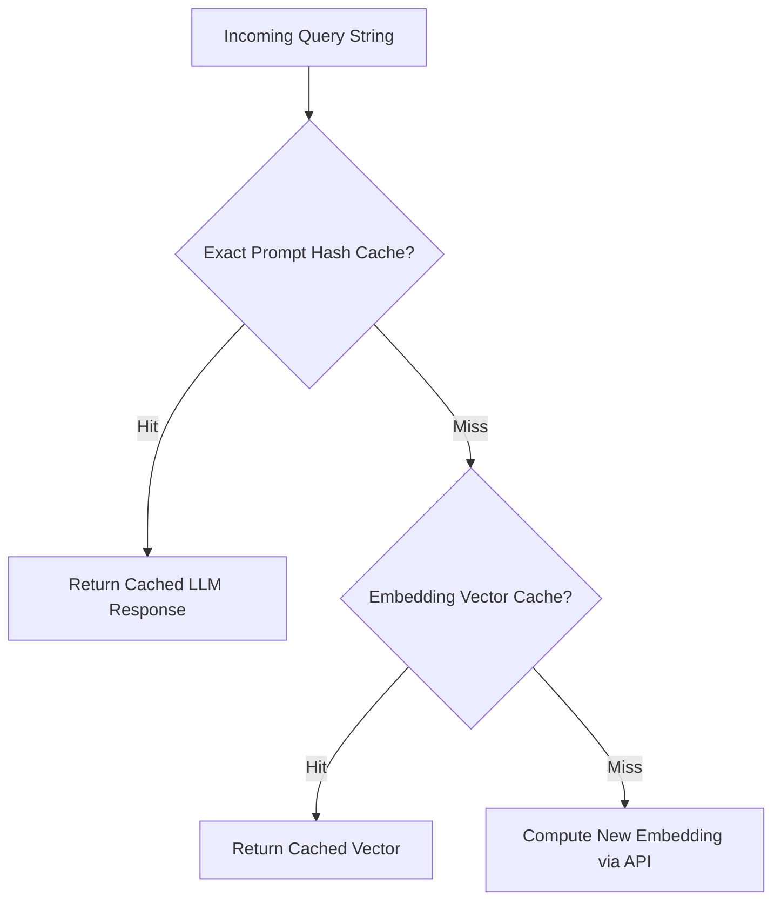

# File 02: Prompt & Embedding Caching (`src/caching/`)

## Overview
**Prompt Caching** (`prompt-cache.js`) and **Embedding Caching** (`embedding-cache.js`) store exact prompt strings and embedding vectors to avoid duplicate API calls for identical inputs.

---

## 1. Multi-Tier Cache Architecture



---

## 2. Caching Implementation (`src/caching/`)

### Exact Prompt Cache (`src/caching/prompt-cache.js`)
```javascript
export class PromptCache {
    constructor() {
        this.cache = new Map();
    }

    get(prompt) {
        return this.cache.get(prompt) || null;
    }

    set(prompt, response) {
        this.cache.set(prompt, response);
    }
}
```

### Embedding Cache (`src/caching/embedding-cache.js`)
```javascript
export class EmbeddingCache {
    constructor() {
        this.cache = new Map();
    }

    get(text) {
        return this.cache.get(text) || null;
    }

    set(text, embedding) {
        this.cache.set(text, embedding);
    }
}
```

---

## Key Takeaways
1. Exact string hashing provides $O(1)$ instant lookup for duplicate queries.
2. Embedding caching avoids redundant embedding API billing for repeated text chunks.
