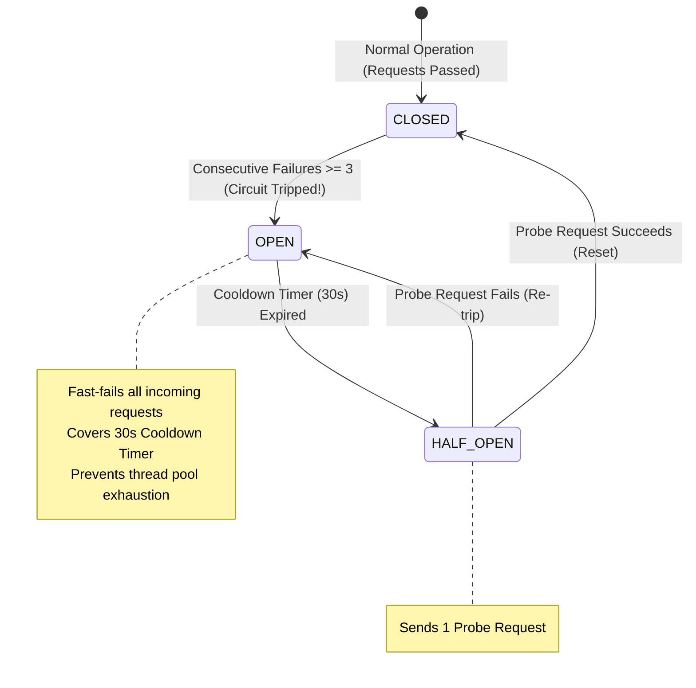
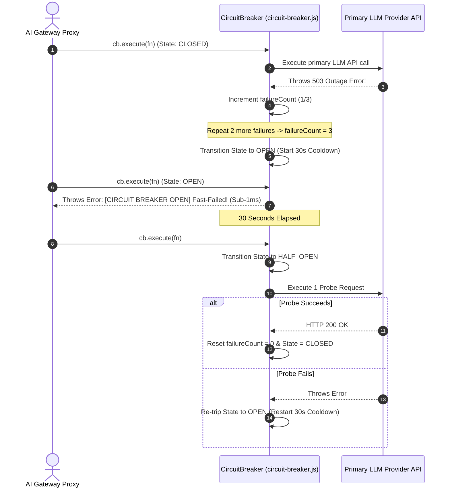

# Module 03: Circuit Breaker Pattern & Outage Shielding (`src/resilience/circuit-breaker.js`)

## Overview

When a downstream LLM provider experiences an outage or severe rate limiting (503 Service Unavailable / 429 Too Many Requests), continuing to flood the provider API with incoming user requests causes thread pool exhaustion, high latency timeouts, and cascading application failures. The **Circuit Breaker Pattern (`src/resilience/circuit-breaker.js`)** implements a 3-state finite state machine (**CLOSED**, **OPEN**, **HALF_OPEN**) that monitors consecutive failure counts. When failures reach the threshold ($N=3$), the circuit trips to **OPEN**, fast-failing subsequent requests during a $30\text{s}$ cooldown period before probing for recovery.

Understanding **Finite State Machine Transitions**, **Consecutive Failure Thresholds ($N=3$)**, **Cooldown Reset Timers ($30\text{s}$)**, and **HALF_OPEN Probe Requests** is essential for resilient cloud architectures.

---

## 1. Circuit Breaker State Machine Topology



---

## 2. Unprotected Naive Requests vs. Circuit Breaker Shielding

```mermaid
flowchart TD
    DownstreamOutage[Downstream OpenAI / Provider Outage (503)] --> FailStrategy{Outage Handling Strategy}

    FailStrategy -- "Unprotected Naive Requests (Cascading Failure)" --> NaiveCalls["Unprotected Naive Requests:<br/>- Retries failing requests continuously during outage<br/>- Exhausts application server HTTP worker thread pools<br/>- Entire web application crashes for all users"]

    FailStrategy -- "Circuit Breaker Outage Shielding (RECOMMENDED)" --> CircuitShield["Circuit Breaker Outage Shielding:<br/>- Trips to `OPEN` state after 3 failures & fast-fails instantly<br/>- Preserves application worker threads & fails over to fallback provider<br/>- 100% System resilience & stability during provider outages!"]

    style CircuitShield fill:#dcfce7,stroke:#15803d
    style NaiveCalls fill:#fee2e2,stroke:#dc2626
```

### Circuit Breaker State Specification Matrix

| State Identifier | Request Behavior | Transition Condition | Operational Technical Purpose |
| :--- | :--- | :--- | :--- |
| **`CLOSED`** | Passes requests to API | Failures $< 3$ | Normal operational baseline mode. |
| **`OPEN`** | Fast-fails with Error | Failures $\ge 3$ | Shielding mode; blocks API calls during outage. |
| **`HALF_OPEN`** | Allows 1 probe request | $30\text{s}$ Cooldown Expired | Probing mode; tests provider recovery. |

---

## 3. Asynchronous Circuit Breaker Lifecycle Sequence



---

## 4. Code Walkthrough (`src/resilience/circuit-breaker.js`)

```javascript
/**
 * Circuit Breaker Resilience Module
 * Implements a 3-state finite state machine (CLOSED, OPEN, HALF_OPEN) to prevent cascading failures
 */
export class CircuitBreaker {
  /**
   * Initializes CircuitBreaker with threshold parameters
   * @param {number} failureThreshold - Consecutive failures before tripping to OPEN (default: 3)
   * @param {number} resetTimeoutMs - Cooldown time in ms before entering HALF_OPEN (default: 30000ms)
   */
  constructor(failureThreshold = 3, resetTimeoutMs = 30000) {
    this.failureThreshold = failureThreshold;
    this.resetTimeoutMs = resetTimeoutMs;
    this.state = "CLOSED"; // States: "CLOSED", "OPEN", "HALF_OPEN"
    this.failureCount = 0;
    this.lastStateChange = Date.now();

    console.log(`⚡ [CIRCUIT BREAKER] Initialized (Threshold: ${failureThreshold} failures, Cooldown: ${resetTimeoutMs}ms)`);
  }

  /**
   * Executes an asynchronous function wrapped in circuit breaker monitoring logic
   * @param {Function} fn - Async operation function to execute
   * @returns {Promise<any>} Result payload from executed function
   */
  async execute(fn) {
    // 1. Evaluate OPEN state cooldown status
    if (this.state === "OPEN") {
      if (Date.now() - this.lastStateChange > this.resetTimeoutMs) {
        this.state = "HALF_OPEN";
        console.log("🔄 [CIRCUIT BREAKER: HALF_OPEN] Cooldown expired. Testing provider probe request...");
      } else {
        const remainingCooldown = Math.ceil((this.resetTimeoutMs - (Date.now() - this.lastStateChange)) / 1000);
        console.warn(`🚨 [CIRCUIT BREAKER OPEN] Fast-failing request. Cooldown remaining: ${remainingCooldown}s`);
        throw new Error(`[CIRCUIT BREAKER OPEN] Provider requests blocked due to consecutive failures. Retry in ${remainingCooldown}s.`);
      }
    }

    // 2. Execute protected operation
    try {
      const result = await fn();
      this.onSuccess();
      return result;
    } catch (err) {
      this.onFailure(err);
      throw err;
    }
  }

  /**
   * Handler for successful executions
   */
  onSuccess() {
    if (this.state === "HALF_OPEN") {
      console.log("✅ [CIRCUIT BREAKER: CLOSED] Probe request succeeded! Circuit fully restored.");
    }
    this.failureCount = 0;
    this.state = "CLOSED";
  }

  /**
   * Handler for execution failures
   */
  onFailure(err) {
    this.failureCount++;
    console.warn(`⚠️ [CIRCUIT BREAKER FAILURE] Count: ${this.failureCount}/${this.failureThreshold} (Error: ${err.message})`);

    if (this.failureCount >= this.failureThreshold) {
      this.state = "OPEN";
      this.lastStateChange = Date.now();
      console.error(`🚨 [CIRCUIT BREAKER TRIPPED -> OPEN] Threshold reached! Fast-failing all requests for ${this.resetTimeoutMs / 1000}s.`);
    }
  }

  /**
   * Returns current circuit breaker status summary
   */
  getStatus() {
    return {
      state: this.state,
      failureCount: this.failureCount,
      lastStateChange: new Date(this.lastStateChange).toISOString()
    };
  }
}
```

---

## Key Production Takeaways

1. **Protect Thread Pools with Circuit Breakers**: Use `CircuitBreaker` wrappers around all external LLM provider API calls to prevent thread pool exhaustion during outages.
2. **Fast-Fail During Outages**: When the circuit trips to `OPEN`, fail requests in under $1\text{ms}$ without spending time on network HTTP socket connections.
3. **Probe Recovery in `HALF_OPEN` State**: Allow a single probe request when cooldown timers expire to automatically detect when downstream providers recover.
4. **Trigger Secondary Provider Failovers**: Combine circuit breaker fast-fails with fallback chains (`fallback-chain.js`) to route traffic to alternative LLM vendors seamlessly.

