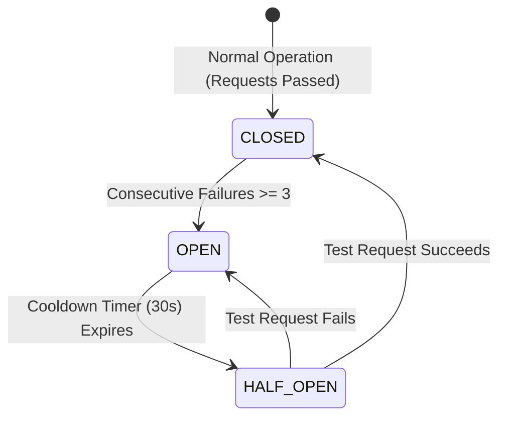

# File 03: Circuit Breaker Pattern (`src/resilience/circuit-breaker.js`)

## Overview
The **Circuit Breaker Pattern** monitors downstream LLM provider error rates. When consecutive failures exceed a threshold ($N=3$), the circuit trips to **OPEN**, fast-failing subsequent requests for a reset cooldown period ($30\text{s}$) to prevent API cascading failures.

---

## 1. Circuit Breaker State Machine



---

## 2. Circuit Breaker Implementation (`src/resilience/circuit-breaker.js`)

```javascript
export class CircuitBreaker {
    constructor(failureThreshold = 3, resetTimeoutMs = 30000) {
        this.failureThreshold = failureThreshold;
        this.resetTimeoutMs = resetTimeoutMs;
        this.state = "CLOSED"; // CLOSED, OPEN, HALF_OPEN
        this.failureCount = 0;
        this.lastStateChange = Date.now();
    }

    async execute(fn) {
        if (this.state === "OPEN") {
            if (Date.now() - this.lastStateChange > this.resetTimeoutMs) {
                this.state = "HALF_OPEN";
                console.log("[CIRCUIT BREAKER] Entering HALF_OPEN state. Testing probe request...");
            } else {
                throw new Error("[CIRCUIT BREAKER OPEN] Provider requests blocked due to consecutive failures.");
            }
        }

        try {
            const result = await fn();
            this.onSuccess();
            return result;
        } catch (err) {
            this.onFailure();
            throw err;
        }
    }

    onSuccess() {
        this.failureCount = 0;
        this.state = "CLOSED";
    }

    onFailure() {
        this.failureCount++;
        if (this.failureCount >= this.failureThreshold) {
            this.state = "OPEN";
            this.lastStateChange = Date.now();
            console.error(`[CIRCUIT BREAKER TRIPPED] State changed to OPEN.`);
        }
    }
}
```

---

## Key Takeaways
1. Protects applications from thread pool exhaustion during provider outages.
2. Automatically probes for provider recovery via the **HALF_OPEN** state.
