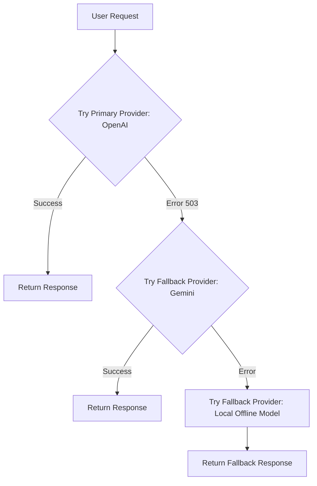

# File 04: Multi-Provider Fallback Chain (`src/resilience/fallback-chain.js`)

## Overview
The **Multi-Provider Fallback Chain** routes completion requests across an ordered sequence of providers (**OpenAI** $\rightarrow$ **Gemini** $\rightarrow$ **Local Offline Model**), ensuring uninterrupted application availability during vendor outages.

---

## 1. Fallback Chain Execution



---

## 2. Fallback Chain Implementation (`src/resilience/fallback-chain.js`)

```javascript
export async function fallbackChain(messages, providers = []) {
    const defaultProviders = [
        async () => {
            console.log("[FALLBACK CHAIN] Attempting Provider 1 (OpenAI)...");
            throw new Error("OpenAI API Rate Limit 429"); // Simulated failure
        },
        async () => {
            console.log("[FALLBACK CHAIN] Provider 1 Failed. Falling back to Provider 2 (Gemini)...");
            return "Response generated successfully by Gemini fallback model.";
        },
        async () => {
            console.log("[FALLBACK CHAIN] Falling back to Provider 3 (Local Offline Model)...");
            return "Response generated by Local Model.";
        }
    ];

    const chain = providers.length > 0 ? providers : defaultProviders;

    for (let i = 0; i < chain.length; i++) {
        try {
            const response = await chain[i]();
            console.log(`[FALLBACK CHAIN SUCCESS] Provider index ${i} succeeded.`);
            return response;
        } catch (err) {
            console.warn(`[FALLBACK CHAIN WARN] Provider index ${i} failed: ${err.message}`);
        }
    }

    throw new Error("[FALLBACK CHAIN EXHAUSTED] All registered LLM providers failed.");
}
```

---

## Key Takeaways
1. Eliminates single point of failure (SPOF) on single LLM vendor APIs.
2. Gracefully degrades to local or secondary models.
