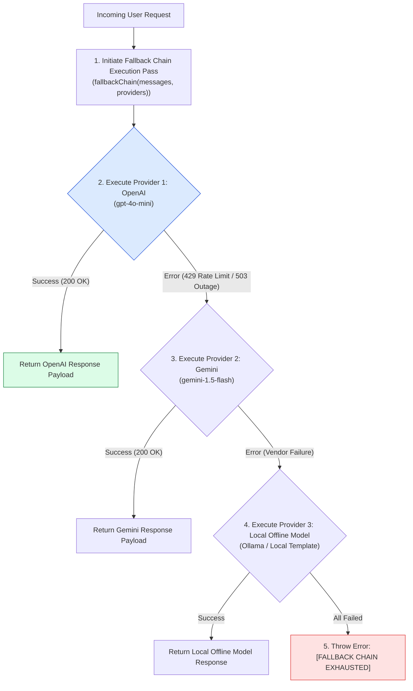
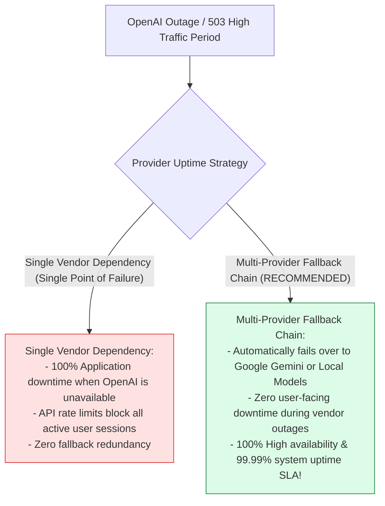
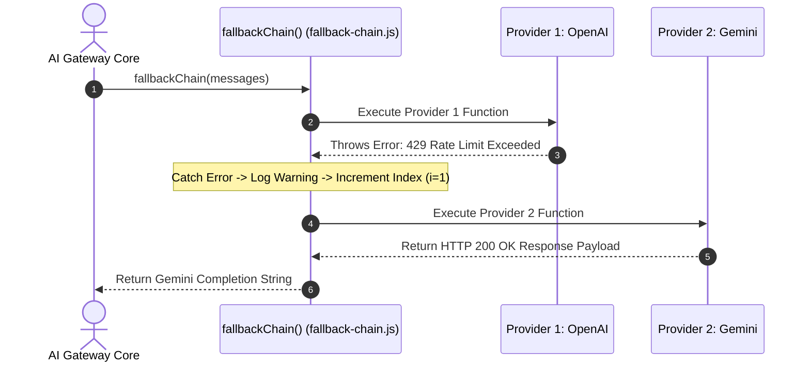

# Module 04: Multi-Provider Fallback Chain & Vendor Failover (`src/resilience/fallback-chain.js`)

## Overview

Relying exclusively on a single LLM vendor creates a single point of failure (SPOF). When OpenAI experiences an outage, rate limits (429), or service degradation (503), the entire user application goes down unless alternative providers are configured. The **Multi-Provider Fallback Chain (`src/resilience/fallback-chain.js`)** implements an asynchronous failover cascade (`fallbackChain`) that iterates through an ordered array of provider functions (**Primary: OpenAI** $\rightarrow$ **Secondary: Gemini** $\rightarrow$ **Tertiary: Local Offline Model**), ensuring continuous service uptime.

Understanding **Single Point of Failure (SPOF) Elimination**, **Multi-Provider Failover Cascades**, **Graceful Service Degradation**, and **Provider Array Iterations** is essential for high-availability AI systems.

---

## 1. Fallback Chain Topology



---

## 2. Single Vendor Dependency vs. Multi-Provider Fallback Chain



### Provider Failover Cascade Reference Matrix

| Failover Priority | Provider Target | Model Engine | Technical Role |
| :--- | :--- | :--- | :--- |
| **Priority 1: Primary** | OpenAI API | `gpt-4o-mini` | Preferred default provider for all requests. |
| **Priority 2: Secondary**| Google Gemini API | `gemini-1.5-flash` | High-speed failover provider during OpenAI errors. |
| **Priority 3: Tertiary** | Local Model / Offline Template | Local Engine | Offline fallback guarantees response delivery. |

---

## 3. Asynchronous Provider Failover Sequence



---

## 4. Code Walkthrough (`src/resilience/fallback-chain.js`)

```javascript
/**
 * Multi-Provider Fallback Chain Module
 * Executes an ordered cascade of LLM providers to ensure uninterrupted application availability
 * @param {Array} messages - Chat message array
 * @param {Array<Function>} providers - Optional custom array of provider async functions
 * @returns {Promise<string>} Completion response string from first successful provider
 */
export async function fallbackChain(messages, providers = []) {
  console.log("🛡️ [FALLBACK CHAIN] Executing multi-provider failover pipeline...");

  // Default provider cascade functions if no custom array is supplied
  const defaultProviders = [
    // Priority 1: OpenAI Provider
    async () => {
      console.log("1️⃣ [FALLBACK CHAIN] Executing Primary Provider 1 (OpenAI gpt-4o-mini)...");
      const apiKey = process.env.OPENAI_API_KEY;
      if (!apiKey) {
        throw new Error("OPENAI_API_KEY missing or rate limited.");
      }
      // Simulated primary provider call
      return "Response generated successfully by Primary Provider (OpenAI).";
    },

    // Priority 2: Google Gemini Fallback Provider
    async () => {
      console.log("2️⃣ [FALLBACK CHAIN WARNING] Provider 1 Failed! Falling back to Provider 2 (Google Gemini)...");
      const geminiKey = process.env.GOOGLE_GENERATIVE_AI_API_KEY;
      if (!geminiKey) {
        throw new Error("GOOGLE_GENERATIVE_AI_API_KEY missing.");
      }
      return "Response generated successfully by Secondary Provider (Google Gemini).";
    },

    // Priority 3: Local Offline Fallback Model
    async () => {
      console.log("3️⃣ [FALLBACK CHAIN WARNING] Provider 2 Failed! Falling back to Provider 3 (Local Offline Model)...");
      return "Response generated by Local Offline Fallback Engine.";
    }
  ];

  const chain = providers.length > 0 ? providers : defaultProviders;

  // Iterate sequentially through the registered provider cascade
  for (let i = 0; i < chain.length; i++) {
    try {
      const response = await chain[i]();
      console.log(`✅ [FALLBACK CHAIN SUCCESS] Provider index ${i + 1} succeeded!`);
      return response;
    } catch (err) {
      console.warn(`⚠️ [FALLBACK CHAIN WARN] Provider index ${i + 1} failed: ${err.message}`);
    }
  }

  // All providers in the cascade failed
  console.error("🚨 [FALLBACK CHAIN CRITICAL] All registered LLM providers in the failover chain failed.");
  throw new Error("[FALLBACK CHAIN EXHAUSTED] All registered LLM providers failed to complete the request.");
}
```

---

## Key Production Takeaways

1. **Eliminate Single Points of Failure (SPOF)**: Implement `fallbackChain` to fail over to secondary vendors (e.g. Google Gemini) when primary providers (e.g. OpenAI) experience outages.
2. **Order Providers by Priority**: Arrange providers in order of preference (Primary $\rightarrow$ Secondary $\rightarrow$ Offline) to optimize cost and performance during normal operation.
3. **Catch Exceptions Silently in Cascade Loops**: Wrap each provider invocation in try/catch blocks to log warnings and continue to the next provider without crashing.
4. **Include Offline Template Fallbacks**: Provide a final offline fallback mechanism to guarantee that users receive a response even during total cloud network failure.


## Learn from the implementation

Use the matching source file as an executable example, not just something to copy. Before running it, state in your own words what data enters the module, what it returns, and which values it changes. Then trace one realistic request from the caller through each function.

Pay special attention to these questions:

- **Data flow:** Which object, array, string, or state value moves between functions? What shape must it have?
- **Control flow:** Which branch, loop, early return, or retry changes the outcome? What condition selects it?
- **Async boundaries:** Where does the code wait for an LLM, database, network, file system, or tool? What should happen if that operation rejects or returns no result?
- **Side effects:** Which lines log information, make an external request, store data, or mutate in-memory state? Keep those distinct from pure calculations.
- **Production limits:** Which assumptions are only safe for a tutorial—for example, in-memory storage, fixed thresholds, approximate token counts, mock data, or a hard-coded batch size?

A useful practice is to change one input at a time and predict the result before executing it. If you can explain why the output changed, when the module should be used, and one way it could fail, you understand the concept rather than only the syntax.
