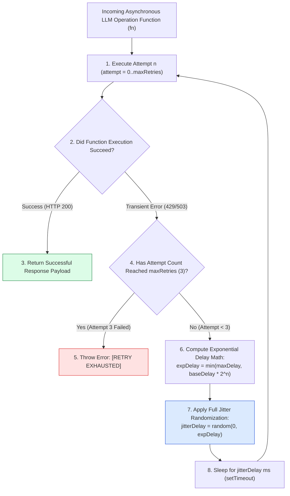
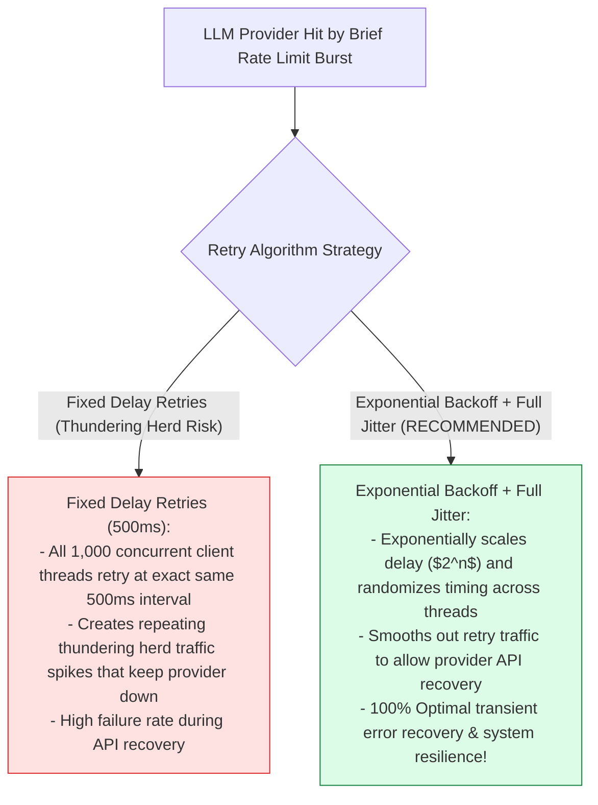
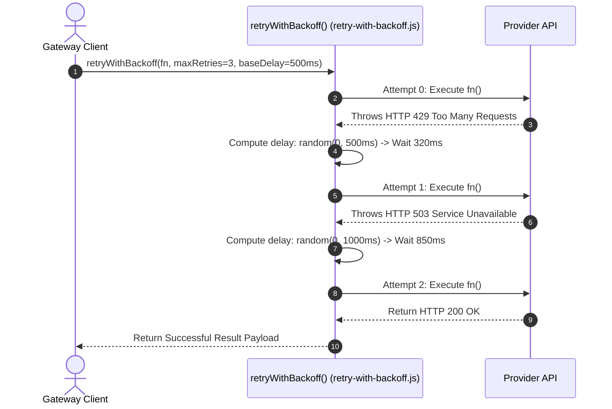

# Module 05: Exponential Backoff & Full Jitter Retry Strategy (`src/resilience/retry-with-backoff.js`)

## Overview

Transient network glitches, brief API rate limits (HTTP 429), and temporary server overloads (HTTP 503) cause temporary LLM request failures. Immediately retrying failed requests without delay causes thundering herd traffic spikes that lock provider endpoints. The **Exponential Backoff & Jitter Retry Module (`src/resilience/retry-with-backoff.js`)** implements an exponential retry wrapper (`retryWithBackoff`) that multiplies delay intervals exponentially ($2^n \times \text{baseDelay}$) and adds randomized **Full Jitter** to desynchronize concurrent client retries.

Understanding **Exponential Delay Scaling ($2^n \times \text{baseDelay}$)**, **Full Jitter Randomization**, **Thundering Herd Attack Defenses**, and **Max Retry Caps ($N=3$)** is essential for cloud API integration.

---

## 1. Exponential Backoff & Jitter Topology



---

## 2. Fixed Retry Intervals vs. Exponential Backoff with Full Jitter



### Exponential Backoff Mathematical Equation Reference

$$\text{Delay}_n = \text{random}\left(0, \min\left(\text{maxDelay}, \text{baseDelay} \times 2^n\right)\right)$$

| Parameter | Default Value | Mathematical Purpose |
| :--- | :--- | :--- |
| **`baseDelayMs`** | `500ms` | Base initial delay multiplier for $n=0$. |
| **`maxDelayMs`** | `4000ms` | Absolute upper bound ceiling for retry delays. |
| **`maxRetries`** | `3` | Maximum number of retry attempts before throwing exception. |

---

## 3. Asynchronous Backoff Retry Timeline



---

## 4. Code Walkthrough (`src/resilience/retry-with-backoff.js`)

```javascript
/**
 * Exponential Backoff & Full Jitter Retry Strategy Module
 * Retries transient LLM API errors with exponentially increasing delays and randomized jitter
 * @param {Function} fn - Async operation function to execute
 * @param {number} maxRetries - Maximum retry attempts (default: 3)
 * @param {number} baseDelayMs - Base delay in ms (default: 500ms)
 * @param {number} maxDelayMs - Maximum delay ceiling in ms (default: 4000ms)
 * @returns {Promise<any>} Result payload from executed function
 */
export async function retryWithBackoff(fn, maxRetries = 3, baseDelayMs = 500, maxDelayMs = 4000) {
  if (typeof fn !== "function") {
    throw new Error("[RETRY BACKOFF ERROR] Parameter 'fn' must be an executable function.");
  }

  for (let attempt = 0; attempt <= maxRetries; attempt++) {
    try {
      const result = await fn();
      if (attempt > 0) {
        console.log(`✅ [RETRY SUCCESS] Operation succeeded on attempt ${attempt + 1}/${maxRetries + 1}!`);
      }
      return result;
    } catch (err) {
      if (attempt === maxRetries) {
        console.error(`🚨 [RETRY EXHAUSTED] Max retries (${maxRetries}) reached. Final error: ${err.message}`);
        throw new Error(`[RETRY EXHAUSTED] Retried ${maxRetries} times. Last error: ${err.message}`);
      }

      // 1. Calculate Exponential Backoff Delay: min(maxDelay, baseDelay * 2^attempt)
      const expDelay = Math.min(maxDelayMs, baseDelayMs * Math.pow(2, attempt));

      // 2. Calculate Full Jitter: random(0, expDelay)
      const jitterDelay = Math.floor(Math.random() * expDelay);

      console.warn(`⚠️ [RETRY BACKOFF] Attempt ${attempt + 1}/${maxRetries + 1} failed (${err.message}). Retrying in ${jitterDelay}ms (Jittered Backoff)...`);

      // 3. Wait for calculated jitter delay interval
      await new Promise((res) => setTimeout(res, jitterDelay));
    }
  }
}
```

---

## Key Production Takeaways

1. **Use Full Jitter to Prevent Retry Storms**: Randomize backoff delays using `Math.random() * expDelay` so concurrent server threads don't hit provider endpoints simultaneously.
2. **Cap Exponential Delays with Ceiling Bounds**: Enforce a maximum delay ceiling (`maxDelayMs = 4000`) so backoff waits don't grow infinitely large.
3. **Handle Transient Errors Gracefully**: Automatically recover from transient HTTP 429 rate limits and HTTP 503 service overloads without crashing user requests.
4. **Cap Maximum Retries ($N=3$)**: Limit total retry attempts to 3 before throwing a `RETRY EXHAUSTED` exception to prevent execution deadlocks.


## Learn from the implementation

Use the matching source file as an executable example, not just something to copy. Before running it, state in your own words what data enters the module, what it returns, and which values it changes. Then trace one realistic request from the caller through each function.

Pay special attention to these questions:

- **Data flow:** Which object, array, string, or state value moves between functions? What shape must it have?
- **Control flow:** Which branch, loop, early return, or retry changes the outcome? What condition selects it?
- **Async boundaries:** Where does the code wait for an LLM, database, network, file system, or tool? What should happen if that operation rejects or returns no result?
- **Side effects:** Which lines log information, make an external request, store data, or mutate in-memory state? Keep those distinct from pure calculations.
- **Production limits:** Which assumptions are only safe for a tutorial—for example, in-memory storage, fixed thresholds, approximate token counts, mock data, or a hard-coded batch size?

A useful practice is to change one input at a time and predict the result before executing it. If you can explain why the output changed, when the module should be used, and one way it could fail, you understand the concept rather than only the syntax.
