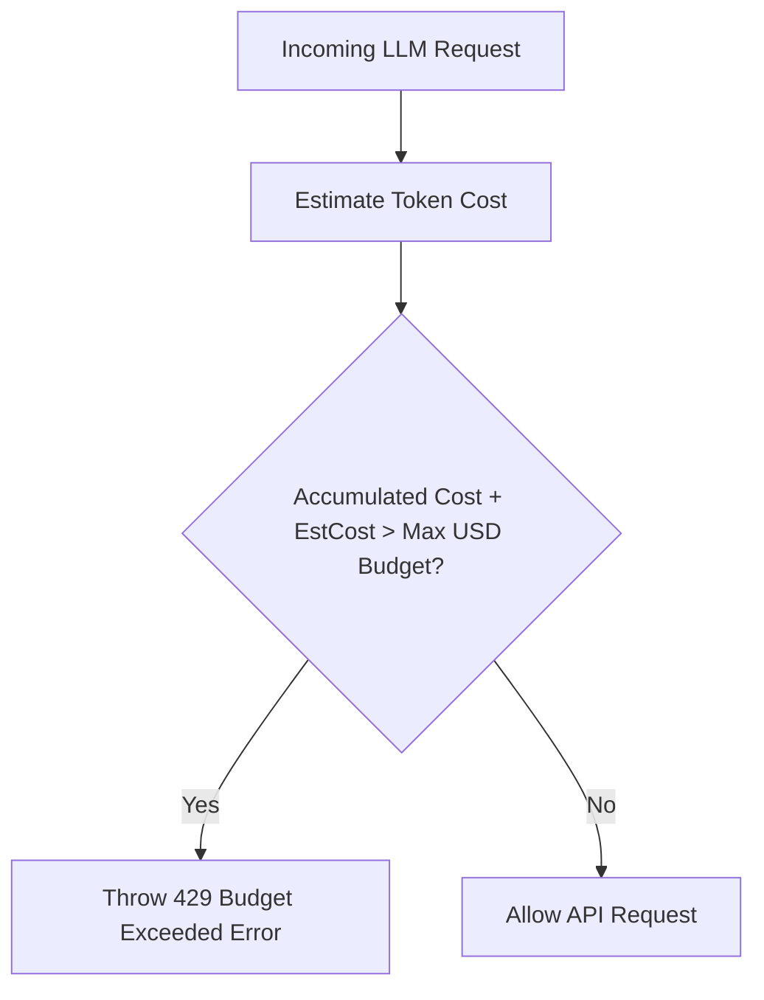

# File 06: Hard Cost & Token Budget Enforcer (`src/cost/budget-enforcer.js`)

## Overview
The **Cost Budget Enforcer** tracks cumulative token consumption and financial expenditure in USD across daily/monthly sliding windows, blocking requests when budget thresholds are breached.

---

## 1. Budget Enforcer Interception Flow



---

## 2. Budget Enforcer Implementation (`src/cost/budget-enforcer.js`)

```javascript
export class BudgetEnforcer {
    constructor(maxDailyBudgetUSD = 10.00) {
        this.maxDailyBudgetUSD = maxDailyBudgetUSD;
        this.currentSpentUSD = 0.00;
    }

    recordUsage(inputTokens, outputTokens, model = "gpt-4o-mini") {
        const rates = { input: 0.15, output: 0.60 }; // $ per 1M tokens
        const costUSD = (inputTokens / 1_000_000 * rates.input) + (outputTokens / 1_000_000 * rates.output);
        
        this.currentSpentUSD += costUSD;
        console.log(`[BUDGET ENFORCER] Spent +$${costUSD.toFixed(6)}. Daily Total: $${this.currentSpentUSD.toFixed(4)} / $${this.maxDailyBudgetUSD}`);

        if (this.currentSpentUSD >= this.maxDailyBudgetUSD) {
            throw new Error(`[BUDGET EXCEEDED] Daily expenditure cap of $${this.maxDailyBudgetUSD} reached.`);
        }
    }

    canProceed() {
        return this.currentSpentUSD < this.maxDailyBudgetUSD;
    }
}
```

---

## Key Takeaways
1. Hard financial safety barrier protecting production billing accounts.
2. Tracks real-time cost accumulation across token consumption models.
