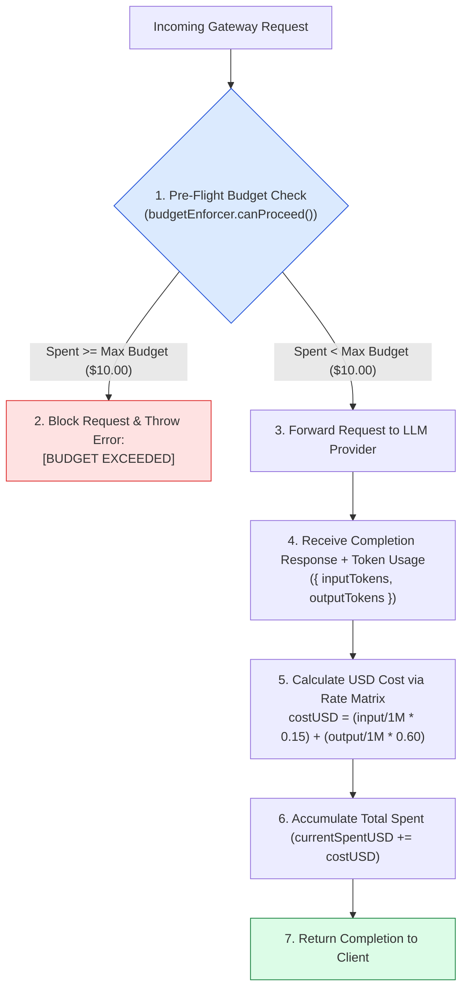
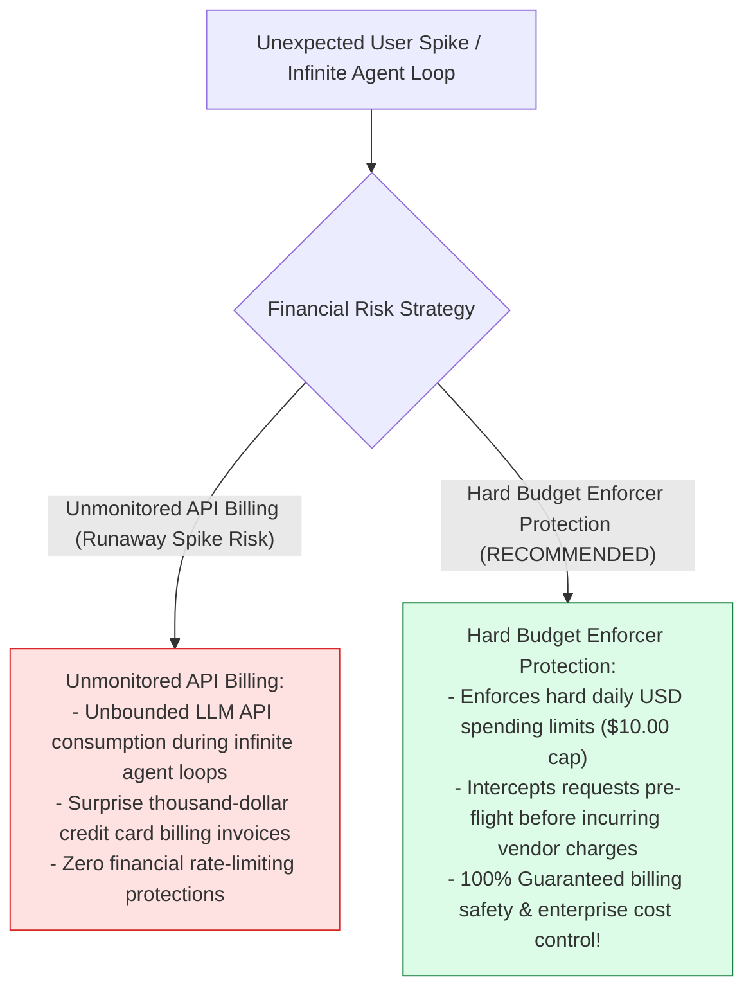
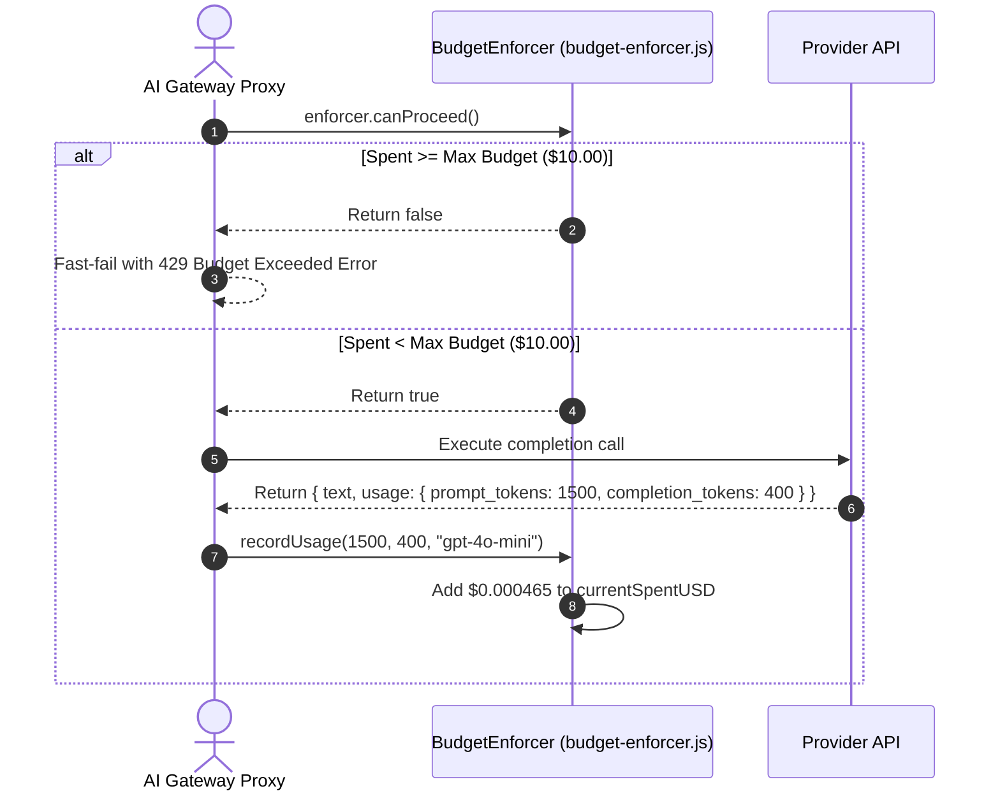

# Module 06: Hard Cost & Token Budget Enforcer (`src/cost/budget-enforcer.js`)

## Overview

Unmonitored LLM API usage in production can quickly cause runaway cloud billing spikes if recursive agent loops or traffic surges go unchecked. The **Hard Cost & Token Budget Enforcer (`src/cost/budget-enforcer.js`)** implements an active financial gatekeeper (`BudgetEnforcer`) that tracks cumulative token consumption and computes USD expenditure across sliding daily windows. When accumulated costs breach the hard daily budget limit (e.g. $\$10.00$), subsequent API calls are intercepted and blocked before incurring vendor charges.

Understanding **USD Expenditure Rate Calculations**, **Pre-Flight Financial Gate Checks (`canProceed`)**, **Token Pricing Rate Matrices**, and **Runaway Billing Protection** is essential for AI cost engineering.

---

## 1. Budget Enforcer Interception Topology



---

## 2. Unmonitored Billing Risk vs. Hard Budget Enforcer Protection



### LLM Token Rate Matrix Specification (per 1 Million Tokens)

| LLM Model Engine | Input Token Rate (USD / 1M) | Output Token Rate (USD / 1M) | Financial Purpose |
| :--- | :--- | :--- | :--- |
| **`gpt-4o-mini`** | $\$0.15$ | $\$0.60$ | High-speed, cost-efficient default model. |
| **`gpt-4o`** | $\$2.50$ | $\$10.00$ | High-reasoning flagship model. |
| **`gemini-1.5-flash`** | $\$0.075$ | $\$0.30$ | Ultra-low cost high-context Flash model. |

---

## 3. Asynchronous Budget Accounting Sequence



---

## 4. Code Walkthrough (`src/cost/budget-enforcer.js`)

```javascript
/**
 * Hard Cost & Token Budget Enforcer Module
 * Tracks real-time token consumption and enforces daily USD spending limits
 */
export class BudgetEnforcer {
  /**
   * Initializes BudgetEnforcer with daily budget limit
   * @param {number} maxDailyBudgetUSD - Maximum daily spending limit in USD (default: $10.00)
   */
  constructor(maxDailyBudgetUSD = 10.00) {
    this.maxDailyBudgetUSD = maxDailyBudgetUSD;
    this.currentSpentUSD = 0.00;
    this.lastResetDate = new Date().toDateString();

    console.log(`⚡ [BUDGET ENFORCER] Initialized with daily expenditure cap: $${maxDailyBudgetUSD.toFixed(2)} USD`);
  }

  /**
   * Checks if daily window reset is needed and returns whether requests can proceed
   * @returns {boolean} True if current spent < max budget, else false
   */
  canProceed() {
    this._checkDailyReset();
    const allowed = this.currentSpentUSD < this.maxDailyBudgetUSD;
    if (!allowed) {
      console.warn(`🚨 [BUDGET GATE BLOCKED] Current spent ($${this.currentSpentUSD.toFixed(4)}) exceeds max daily budget ($${this.maxDailyBudgetUSD.toFixed(2)}).`);
    }
    return allowed;
  }

  /**
   * Records token consumption and updates cumulative USD spent
   * @param {number} inputTokens - Number of input prompt tokens
   * @param {number} outputTokens - Number of output completion tokens
   * @param {string} model - LLM model identifier string (default: "gpt-4o-mini")
   */
  recordUsage(inputTokens = 0, outputTokens = 0, model = "gpt-4o-mini") {
    this._checkDailyReset();

    // Rates in USD per 1 Million Tokens
    const ratesMap = {
      "gpt-4o-mini": { input: 0.15, output: 0.60 },
      "gpt-4o": { input: 2.50, output: 10.00 },
      "gemini-1.5-flash": { input: 0.075, output: 0.30 }
    };

    const rates = ratesMap[model] || ratesMap["gpt-4o-mini"];
    const costUSD = (inputTokens / 1_000_000) * rates.input + (outputTokens / 1_000_000) * rates.output;

    this.currentSpentUSD += costUSD;

    console.log(`💰 [BUDGET ENFORCER] Recorded Usage: ${inputTokens} in / ${outputTokens} out (${model}) | +$${costUSD.toFixed(6)} USD | Total Daily Spent: $${this.currentSpentUSD.toFixed(4)} / $${this.maxDailyBudgetUSD.toFixed(2)}`);

    if (this.currentSpentUSD >= this.maxDailyBudgetUSD) {
      console.error(`🚨 [BUDGET EXCEEDED BREACH] Daily cap of $${this.maxDailyBudgetUSD.toFixed(2)} reached!`);
      throw new Error(`[BUDGET EXCEEDED] Daily expenditure cap of $${this.maxDailyBudgetUSD.toFixed(2)} reached.`);
    }
  }

  /**
   * Private helper: Resets budget counter if day has changed
   */
  _checkDailyReset() {
    const today = new Date().toDateString();
    if (this.lastResetDate !== today) {
      console.log(`🔄 [BUDGET RESET] New day detected (${today}). Resetting spent counter from $${this.currentSpentUSD.toFixed(4)} to $0.00.`);
      this.currentSpentUSD = 0.00;
      this.lastResetDate = today;
    }
  }

  /**
   * Returns current budget status object
   */
  getStatus() {
    return {
      currentSpentUSD: Number(this.currentSpentUSD.toFixed(4)),
      maxDailyBudgetUSD: this.maxDailyBudgetUSD,
      remainingUSD: Number(Math.max(0, this.maxDailyBudgetUSD - this.currentSpentUSD).toFixed(4)),
      percentUsed: Number(((this.currentSpentUSD / this.maxDailyBudgetUSD) * 100).toFixed(2))
    };
  }
}
```

---

## Key Production Takeaways

1. **Enforce Hard USD Budget Caps**: Use `BudgetEnforcer` to set explicit daily spending limits (e.g. $\$10.00$) to protect cloud billing accounts against surprise invoices.
2. **Perform Pre-Flight Checks with `canProceed()`**: Evaluate budget limits before making API calls to prevent incurring additional charges when caps are reached.
3. **Calculate Costs via Accurate Rate Matrices**: Maintain model-specific token pricing rates (`ratesMap`) to compute financial expenditure down to micro-dollar fractions.
4. **Implement Automatic Daily Sliding Resets**: Check calendar dates automatically (`_checkDailyReset()`) to reset spending counters at midnight without requiring manual server restarts.

