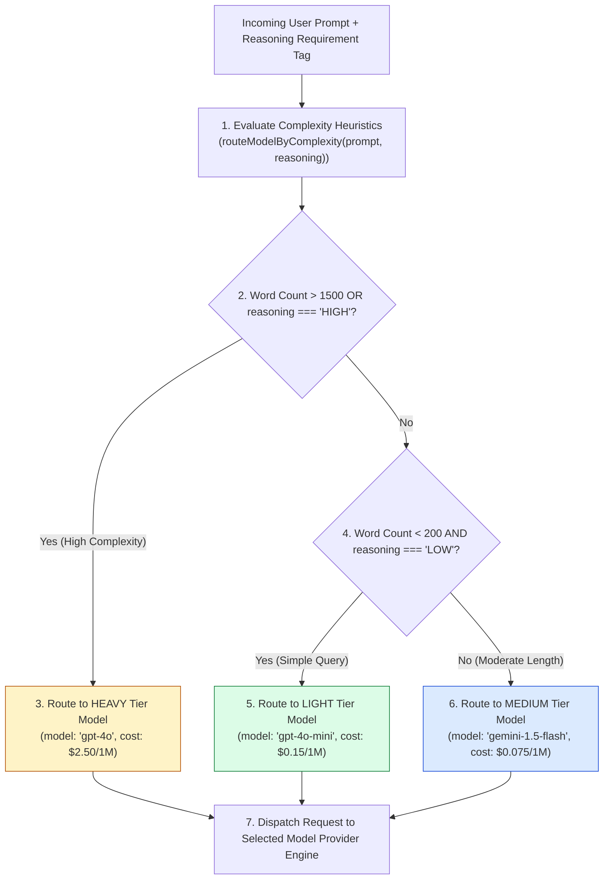
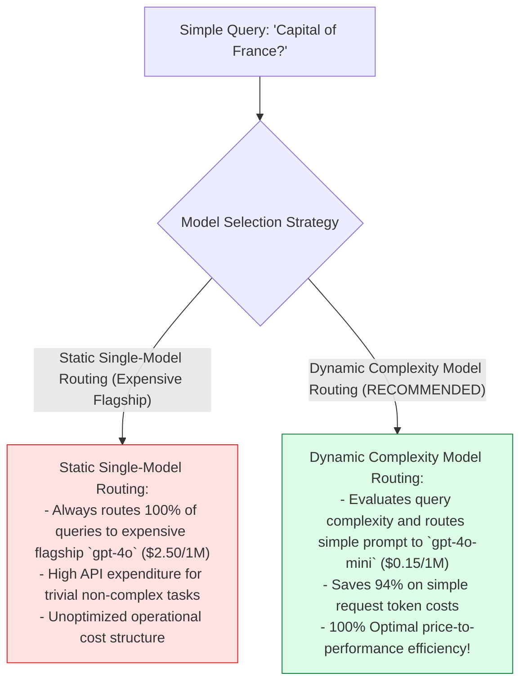
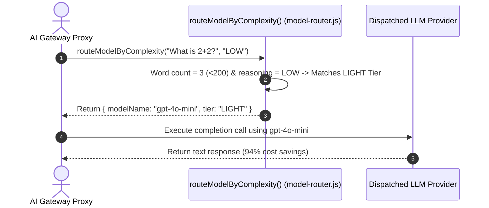

# Module 07: Dynamic Cost-Optimized Model Router (`src/cost/model-router.js`)

## Overview

Routing basic, short user queries (such as simple greetings or classification tasks) to expensive flagship models (e.g. `gpt-4o` at $\$2.50 / 1\text{M}$ input tokens) wastes operational budget. The **Cost-Optimized Model Router (`src/cost/model-router.js`)** provides a dynamic model selector (`routeModelByComplexity`) that evaluates prompt word length and explicit reasoning requirements, routing simple queries to low-cost tier models (`gpt-4o-mini`, `gemini-1.5-flash`) and reserving flagship models for heavy reasoning tasks.

Understanding **Complexity Heuristic Evaluation**, **Multi-Tier Model Routing (LIGHT vs. MEDIUM vs. HEAVY)**, **Cost Optimization Trees**, and **Token Savings Analytics** is essential for cost management.

---

## 1. Model Router Decision Topology



---

## 2. Static Single-Model Routing vs. Dynamic Complexity Model Routing



### Model Tier Classification Matrix

| Complexity Tier | Target Model Identifier | Input / Output Cost (USD / 1M) | Primary Targeted Workloads |
| :--- | :--- | :--- | :--- |
| **`LIGHT`** | `gpt-4o-mini` | $\$0.15$ / $\$0.60$ | Short prompts ($<200$ words), simple QA, entity extraction. |
| **`MEDIUM`** | `gemini-1.5-flash` | $\$0.075$ / $\$0.30$ | Medium documents, RAG context search, summaries. |
| **`HEAVY`** | `gpt-4o` | $\$2.50$ / $\$10.00$ | Long prompts ($>1500$ words), code generation, complex math. |

---

## 3. Asynchronous Model Routing Sequence



---

## 4. Code Walkthrough (`src/cost/model-router.js`)

```javascript
/**
 * Dynamic Cost-Optimized Model Router Module
 * Evaluates prompt length and reasoning tags to route queries to appropriate model tiers
 * @param {string} prompt - User prompt text string
 * @param {string} requiredReasoning - Required reasoning tag ("LOW" | "MEDIUM" | "HIGH")
 * @returns {Object} Router payload object ({ modelName, tier, estimatedSavingsPercent })
 */
export function routeModelByComplexity(prompt = "", requiredReasoning = "LOW") {
  if (!prompt || typeof prompt !== "string") {
    console.warn("⚠️ [MODEL ROUTER] Empty prompt received. Defaulting to 'gpt-4o-mini'.");
    return { modelName: "gpt-4o-mini", tier: "LIGHT", estimatedSavingsPercent: 94 };
  }

  const cleanPrompt = prompt.trim();
  const wordCount = cleanPrompt.split(/\s+/).length;
  const reasoningTag = String(requiredReasoning).toUpperCase();

  console.log(`🔀 [MODEL ROUTER] Evaluating heuristics for prompt (${wordCount} words, reasoning: ${reasoningTag})...`);

  // Rule 1: Heavy Tier Trigger (High reasoning requirement OR long context >1500 words)
  if (reasoningTag === "HIGH" || wordCount > 1500) {
    console.log("➡️ [MODEL ROUTER MATCH] High complexity detected. Selected 'gpt-4o' (HEAVY Tier).");
    return {
      modelName: "gpt-4o",
      tier: "HEAVY",
      estimatedSavingsPercent: 0
    };
  }

  // Rule 2: Light Tier Trigger (Low reasoning requirement AND short context <200 words)
  if (wordCount < 200 && reasoningTag === "LOW") {
    console.log("➡️ [MODEL ROUTER MATCH] Low complexity query. Selected 'gpt-4o-mini' (LIGHT Tier).");
    return {
      modelName: "gpt-4o-mini",
      tier: "LIGHT",
      estimatedSavingsPercent: 94
    };
  }

  // Rule 3: Medium Tier Trigger (Moderate context length or medium reasoning)
  console.log("➡️ [MODEL ROUTER MATCH] Medium complexity query. Selected 'gemini-1.5-flash' (MEDIUM Tier).");
  return {
    modelName: "gemini-1.5-flash",
    tier: "MEDIUM",
    estimatedSavingsPercent: 97
  };
}
```

---

## Key Production Takeaways

1. **Optimize Costs with Dynamic Routing**: Use `routeModelByComplexity` to select model tiers based on prompt length and task difficulty instead of hardcoding flagship models.
2. **Achieve 90%+ Cost Savings on Simple Queries**: Routing short, low-complexity prompts to `gpt-4o-mini` or `gemini-1.5-flash` slashes input token costs by up to 94%.
3. **Reserve Flagship Models for Heavy Reasoning**: Direct complex coding, multi-step math, and long-context prompts ($>1500$ words) to `gpt-4o`.
4. **Export Clean Tier Identifiers**: Return structured tier metadata (`{ modelName, tier }`) so telemetry layers can record model distribution metrics.


## Learn from the implementation

Use the matching source file as an executable example, not just something to copy. Before running it, state in your own words what data enters the module, what it returns, and which values it changes. Then trace one realistic request from the caller through each function.

Pay special attention to these questions:

- **Data flow:** Which object, array, string, or state value moves between functions? What shape must it have?
- **Control flow:** Which branch, loop, early return, or retry changes the outcome? What condition selects it?
- **Async boundaries:** Where does the code wait for an LLM, database, network, file system, or tool? What should happen if that operation rejects or returns no result?
- **Side effects:** Which lines log information, make an external request, store data, or mutate in-memory state? Keep those distinct from pure calculations.
- **Production limits:** Which assumptions are only safe for a tutorial—for example, in-memory storage, fixed thresholds, approximate token counts, mock data, or a hard-coded batch size?

A useful practice is to change one input at a time and predict the result before executing it. If you can explain why the output changed, when the module should be used, and one way it could fail, you understand the concept rather than only the syntax.
