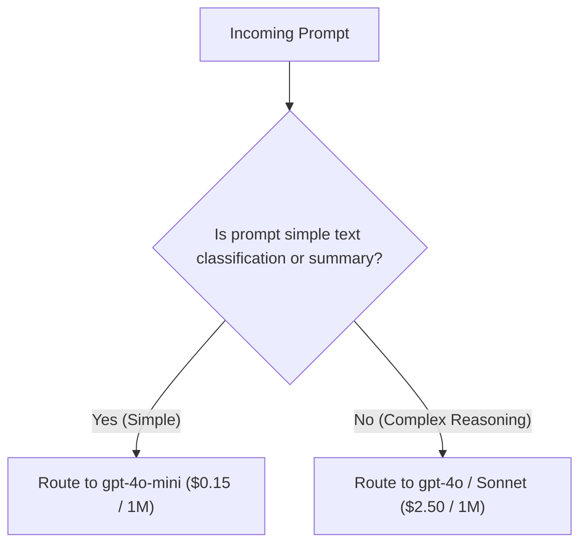

# File 07: Cost-Optimized Model Router (`src/cost/model-router.js`)

## Overview
The **Cost-Optimized Model Router** inspects prompt complexity, token length, and latency requirements, routing simple queries to lightweight fast models (`gpt-4o-mini`, `gemini-1.5-flash`) and reserving expensive models (`gpt-4o`, `claude-3-5-sonnet`) for complex reasoning tasks.

---

## 1. Model Routing Decision Tree



---

## 2. Model Router Implementation (`src/cost/model-router.js`)

```javascript
export function routeModelByComplexity(prompt, requiredReasoning = "LOW") {
    const wordCount = prompt.split(/\s+/).length;

    if (requiredReasoning === "HIGH" || wordCount > 1500) {
        console.log("[MODEL ROUTER] High complexity detected. Selected 'gpt-4o'.");
        return { modelName: "gpt-4o", tier: "HEAVY" };
    }

    if (wordCount < 200 && requiredReasoning === "LOW") {
        console.log("[MODEL ROUTER] Low complexity query. Selected 'gpt-4o-mini'.");
        return { modelName: "gpt-4o-mini", tier: "LIGHT" };
    }

    console.log("[MODEL ROUTER] Medium complexity query. Selected 'gemini-1.5-flash'.");
    return { modelName: "gemini-1.5-flash", tier: "MEDIUM" };
}
```

---

## Key Takeaways
1. Cuts API costs by up to $80\%$ by dynamically routing simple queries to lightweight tier models.
2. Evaluates prompt length and reasoning tags.
