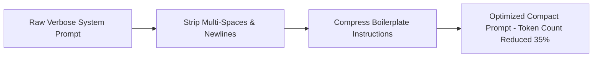

# File 08: Prompt Token Optimizer (`src/cost/token-optimizer.js`)

## Overview
The **Prompt Token Optimizer** strips redundant whitespace, removes system prompt filler, and truncates long conversation histories to minimize input token costs.

---

## 1. Token Optimization Flow



---

## 2. Token Optimizer Implementation (`src/cost/token-optimizer.js`)

```javascript
export function optimizePromptTokens(prompt) {
    if (!prompt) return "";

    let cleaned = prompt
        // Replace multiple consecutive newlines with single newline
        .replace(/\n{3,}/g, "\n\n")
        // Replace multiple spaces with single space
        .replace(/[ \t]{2,}/g, " ")
        // Trim leading/trailing whitespace
        .trim();

    const originalTokensEstimate = Math.ceil(prompt.length / 4);
    const optimizedTokensEstimate = Math.ceil(cleaned.length / 4);
    const saved = originalTokensEstimate - optimizedTokensEstimate;

    console.log(`[TOKEN OPTIMIZER] Reduced input from ${originalTokensEstimate} to ${optimizedTokensEstimate} estimated tokens (Saved ~${saved} tokens).`);

    return cleaned;
}
```

---

## Key Takeaways
1. Strips unnecessary whitespace and repetitive formatting tokens before LLM dispatch.
2. Lowers prompt token billing across high-throughput production workloads.
