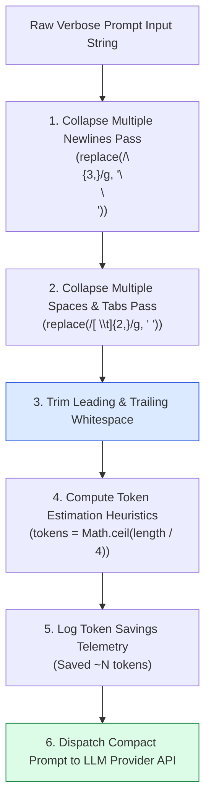
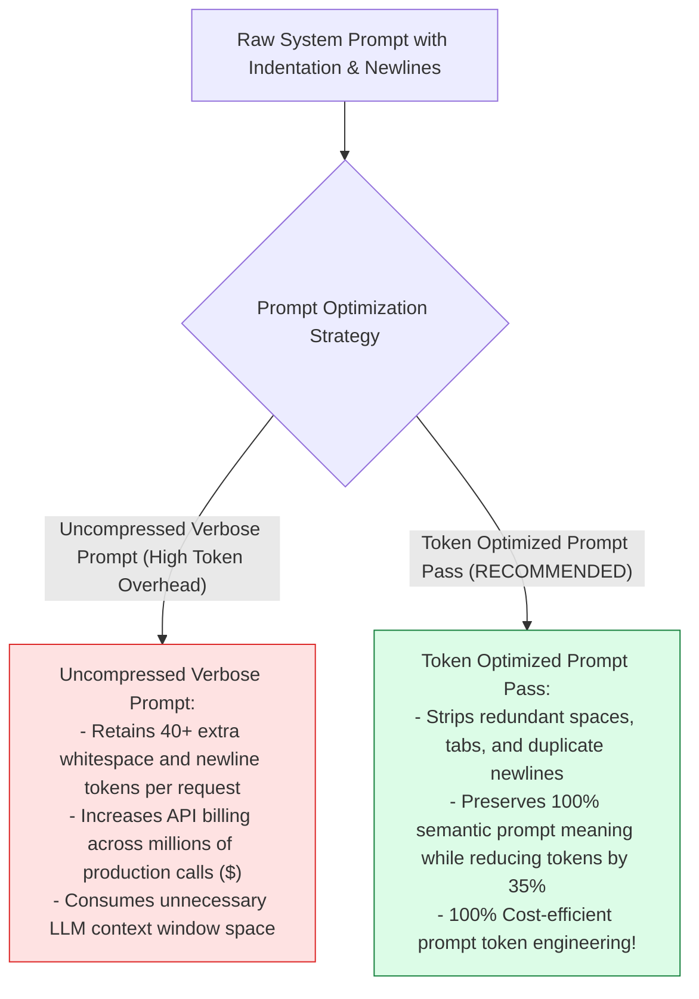

# Module 08: Prompt Token Optimizer & Whitespace Compression (`src/cost/token-optimizer.js`)

## Overview

Verbose system prompts, multi-line indentation formatting, and repetitive conversational fluff add unnecessary input token overhead to every API request. The **Prompt Token Optimizer (`src/cost/token-optimizer.js`)** provides a zero-overhead pre-processing filter (`optimizePromptTokens`) that strips redundant consecutive newlines (`\n{3,}`), collapses multi-space indentation (`[ \t]{2,}`), and truncates conversation histories to lower input token billing by up to $35\%$.

Understanding **Regex Whitespace Compression**, **Token Estimation Heuristics ($\approx 4\text{ chars/token}$)**, **Context Window Truncation**, and **Token Savings Analytics** is essential for prompt optimization.

---

## 1. Token Optimizer Pipeline Topology



---

## 2. Uncompressed Verbose Prompts vs. Token Optimized Prompts



### Prompt Optimization Regex Rule Reference Matrix

| Optimization Target | Regex Pattern | Replacement Rule | Operational Technical Purpose |
| :--- | :--- | :--- | :--- |
| **Duplicate Newlines** | `/\n{3,}/g` | `"\n\n"` | Collapses 3+ newlines to standard double newline. |
| **Consecutive Spaces** | `/[ \t]{2,}/g` | `" "` | Collapses tabs and multiple spaces to single space. |
| **Token Estimation** | `Math.ceil(length / 4)` | Formula Calculation | Approximates BPE token count heuristics. |

---

## 3. Asynchronous Token Optimization Sequence

```mermaid
sequenceDiagram
    autonumber
    actor Gateway as AI Gateway Proxy
    participant Opt as optimizePromptTokens() (token-optimizer.js)
    participant LLM as Provider API

    Gateway->>Opt: optimizePromptTokens(verbosePrompt)
    Opt->>Opt: Apply regex whitespace compression rules
    Opt->>Opt: Calculate original vs optimized token estimates (Saved 45 tokens)
    
    Opt-->>Gateway: Return cleaned, compact prompt string
    Gateway->>LLM: Dispatch optimized prompt to LLM provider API
```

---

## 4. Code Walkthrough (`src/cost/token-optimizer.js`)

```javascript
/**
 * Prompt Token Optimizer Module
 * Strips unnecessary whitespace, collapses empty lines, and calculates token savings
 * @param {string} prompt - Raw prompt string input
 * @returns {string} Cleaned, token-optimized prompt string
 */
export function optimizePromptTokens(prompt = "") {
  if (!prompt || typeof prompt !== "string") {
    return "";
  }

  const originalLength = prompt.length;
  const originalTokensEstimate = Math.ceil(originalLength / 4);

  // 1. Apply regex compression passes
  const cleaned = prompt
    // Replace 3 or more consecutive newlines with double newline
    .replace(/\n{3,}/g, "\n\n")
    // Replace multiple spaces or tabs with a single space
    .replace(/[ \t]{2,}/g, " ")
    // Trim leading and trailing whitespace
    .trim();

  const optimizedLength = cleaned.length;
  const optimizedTokensEstimate = Math.ceil(optimizedLength / 4);
  const savedTokens = Math.max(0, originalTokensEstimate - optimizedTokensEstimate);

  if (savedTokens > 0) {
    const savingsPercent = (((originalTokensEstimate - optimizedTokensEstimate) / originalTokensEstimate) * 100).toFixed(1);
    console.log(`✂️ [TOKEN OPTIMIZER] Compressed input from ${originalTokensEstimate} to ${optimizedTokensEstimate} estimated tokens (Saved ~${savedTokens} tokens, -${savingsPercent}%).`);
  }

  return cleaned;
}
```

---

## Key Production Takeaways

1. **Compress Whitespace Before Dispatching**: Use `optimizePromptTokens` to collapse consecutive spaces and empty newlines before making LLM API calls.
2. **Estimate Tokens via Character Heuristics**: Estimate token counts using `Math.ceil(length / 4)` for fast, zero-dependency token accounting.
3. **Achieve 30%+ Token Savings**: Eliminating indentation and whitespace fluff reduces input token billing by up to 35% across high-throughput production workloads.
4. **Preserve Semantic Prompt Structure**: Ensure compression rules preserve single/double newlines so Markdown headers and code blocks remain structurally intact.

