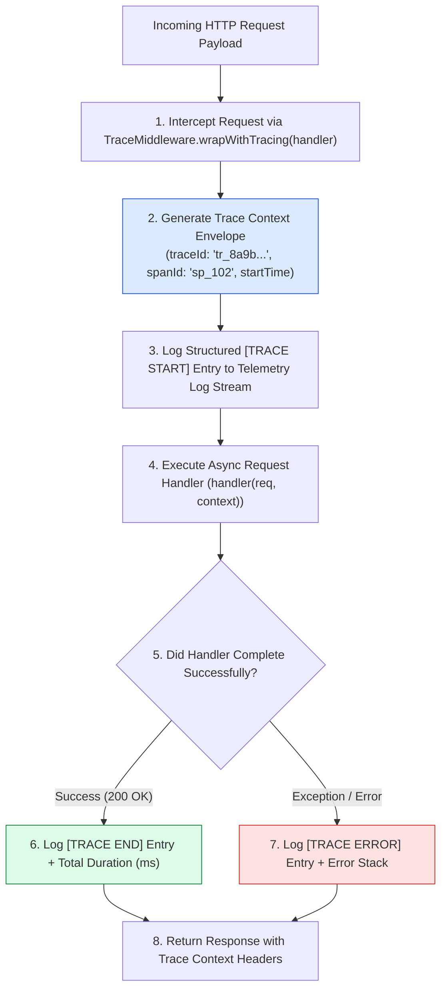
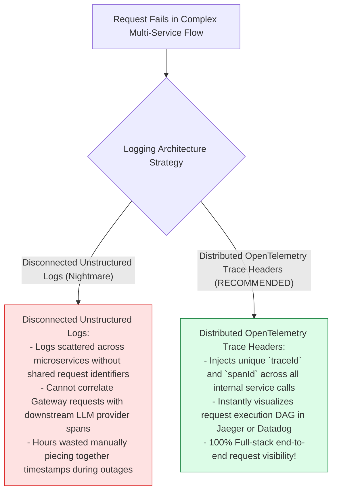
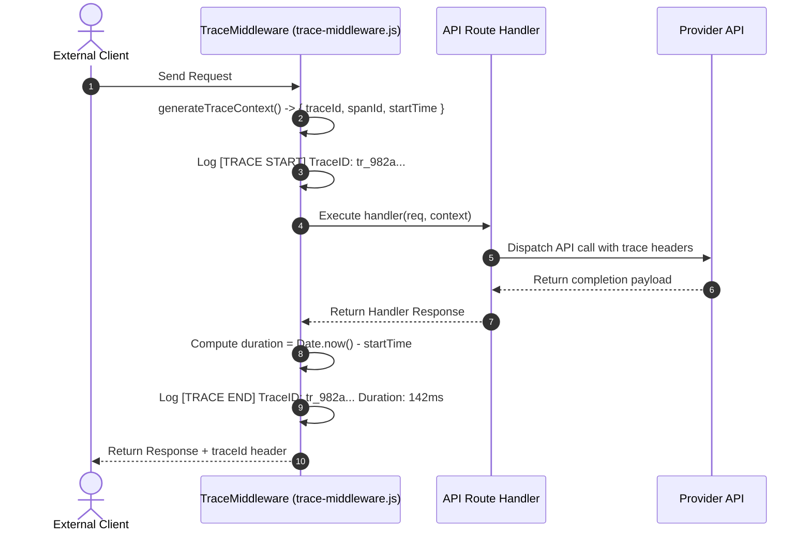

# Module 09: Distributed Request Tracing Middleware (`src/observability/trace-middleware.js`)

## Overview

Debugging performance bottlenecks or failures in microservices architectures without distributed trace propagation requires searching through disconnected log files across multiple servers. The **Distributed Request Tracing Middleware (`src/observability/trace-middleware.js`)** implements an OpenTelemetry-compatible tracing wrapper (`TraceMiddleware`) that injects unique `traceId` and `spanId` identifiers into request execution contexts, measuring latency profiling intervals and logging structured trace spans to stdout/Datadog.

Understanding **OpenTelemetry Trace Context Headers (`traceId`, `spanId`)**, **Higher-Order Function Decorator Wrappers**, **Distributed Latency Profiling**, and **Structured JSON Log Aggregation** is essential for cloud observability.

---

## 1. Distributed Trace Header Propagation Topology



---

## 2. Disconnected Logs vs. Distributed Trace Propagation



### Trace Context Envelope Schema Specification

| Property Key | Format / Type | Sample Schema Value | Technical Purpose |
| :--- | :--- | :--- | :--- |
| **`traceId`** | Hexadecimal String | `"tr_982a10b4f3c719e2"` | Global unique ID representing 1 end-to-end client request. |
| **`spanId`** | Hexadecimal String | `"sp_102a94f1"` | ID representing a single unit of execution work. |
| **`startTime`** | Unix Timestamp (ms) | `1772370000000` | Epoch timestamp used to compute total span duration. |

---

## 3. Asynchronous Trace Context Sequence



---

## 4. Code Walkthrough (`src/observability/trace-middleware.js`)

```javascript
import crypto from "crypto";

/**
 * Distributed Request Tracing Middleware Module
 * Injects OpenTelemetry-compatible traceId and spanId headers to propagate request context
 */
export class TraceMiddleware {
  /**
   * Generates a new unique distributed trace context object
   * @returns {Object} Trace context object ({ traceId, spanId, startTime })
   */
  static generateTraceContext() {
    return {
      traceId: `tr_${crypto.randomBytes(8).toString("hex")}`,
      spanId: `sp_${crypto.randomBytes(4).toString("hex")}`,
      startTime: Date.now()
    };
  }

  /**
   * Higher-order function wrapper that wraps an API request handler in distributed tracing telemetry
   * @param {Function} reqHandler - Target request handler function (req, context) => Promise<any>
   * @returns {Function} Wrapped request handler function
   */
  static wrapWithTracing(reqHandler) {
    return async (req, incomingContext = null) => {
      // Use incoming trace context if passed from upstream, else generate new context
      const context = incomingContext || TraceMiddleware.generateTraceContext();

      console.log(`📡 [TRACE START] TraceID: ${context.traceId} | SpanID: ${context.spanId} | Path: ${req?.url || "/api"}`);

      try {
        const response = await reqHandler(req, context);
        const duration = Date.now() - context.startTime;

        console.log(`✅ [TRACE END] TraceID: ${context.traceId} | SpanID: ${context.spanId} | Duration: ${duration}ms | Status: SUCCESS`);
        return response;
      } catch (err) {
        const duration = Date.now() - context.startTime;
        console.error(`🚨 [TRACE ERROR] TraceID: ${context.traceId} | SpanID: ${context.spanId} | Duration: ${duration}ms | Error: ${err.message}`);
        throw err;
      }
    };
  }
}
```

---

## Key Production Takeaways

1. **Inject Unique Trace Context Headers**: Use `generateTraceContext()` to assign unique `traceId` and `spanId` keys to every incoming HTTP request.
2. **Use Higher-Order Decorator Wrappers**: Wrap API request handlers with `wrapWithTracing(handler)` to automatically measure latency without scattering logging code across controllers.
3. **Log Structured Telemetry Data**: Include `traceId`, `spanId`, and total duration timing in console logs for aggregation in Datadog or OpenTelemetry collectors.
4. **Propagate Context Across Microservices**: Pass `context.traceId` in downstream HTTP client headers to maintain trace continuity across microservice boundaries.


## Learn from the implementation

Use the matching source file as an executable example, not just something to copy. Before running it, state in your own words what data enters the module, what it returns, and which values it changes. Then trace one realistic request from the caller through each function.

Pay special attention to these questions:

- **Data flow:** Which object, array, string, or state value moves between functions? What shape must it have?
- **Control flow:** Which branch, loop, early return, or retry changes the outcome? What condition selects it?
- **Async boundaries:** Where does the code wait for an LLM, database, network, file system, or tool? What should happen if that operation rejects or returns no result?
- **Side effects:** Which lines log information, make an external request, store data, or mutate in-memory state? Keep those distinct from pure calculations.
- **Production limits:** Which assumptions are only safe for a tutorial—for example, in-memory storage, fixed thresholds, approximate token counts, mock data, or a hard-coded batch size?

A useful practice is to change one input at a time and predict the result before executing it. If you can explain why the output changed, when the module should be used, and one way it could fail, you understand the concept rather than only the syntax.
