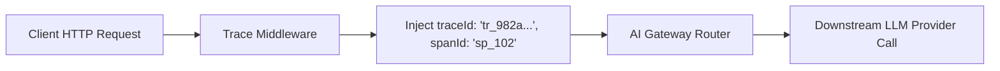

# File 09: Distributed Request Tracing Middleware (`src/observability/trace-middleware.js`)

## Overview
**Distributed Request Tracing Middleware** injects unique OpenTelemetry-compatible `traceId` and `spanId` HTTP headers, propagating request context across microservices.

---

## 1. Distributed Trace Header Propagation



---

## 2. Trace Middleware Implementation (`src/observability/trace-middleware.js`)

```javascript
import crypto from "crypto";

export class TraceMiddleware {
    static generateTraceContext() {
        return {
            traceId: `tr_${crypto.randomBytes(8).toString("hex")}`,
            spanId: `sp_${crypto.randomBytes(4).toString("hex")}`,
            startTime: Date.now()
        };
    }

    static wrapWithTracing(reqHandler) {
        return async (req) => {
            const context = this.generateTraceContext();
            console.log(`[TRACE START] TraceID: ${context.traceId} SpanID: ${context.spanId}`);
            
            try {
                const res = await reqHandler(req, context);
                const duration = Date.now() - context.startTime;
                console.log(`[TRACE END] TraceID: ${context.traceId} Completed in ${duration}ms`);
                return res;
            } catch (err) {
                console.error(`[TRACE ERROR] TraceID: ${context.traceId} Failed: ${err.message}`);
                throw err;
            }
        };
    }
}
```

---

## Key Takeaways
1. Binds unique trace IDs across asynchronous LLM request processing steps.
2. Formats logs for OpenTelemetry / Datadog aggregation.
