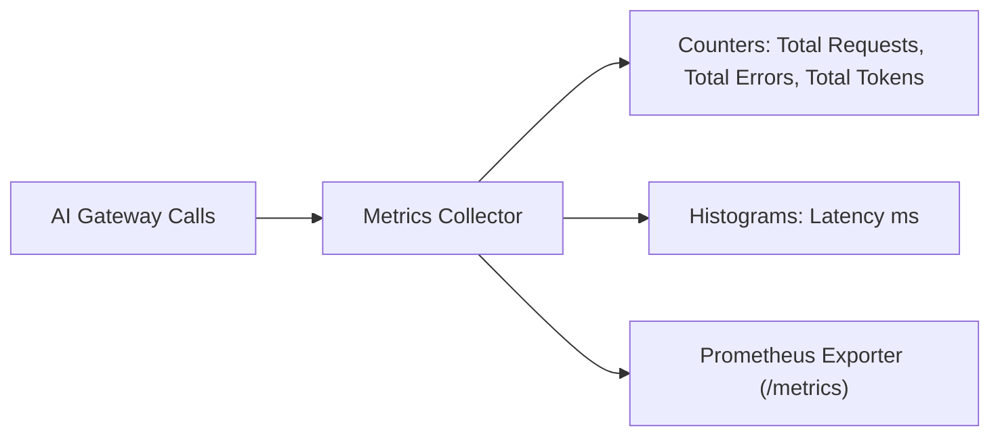

# File 10: Prometheus AI Metrics Collector (`src/observability/metrics-collector.js`)

## Overview
The **Prometheus AI Metrics Collector** collects real-time metrics (request count, latency histograms, error rates, token usage counters) for scraping by Prometheus and Grafana dashboards.

---

## 1. Metrics Telemetry Pipeline



---

## 2. Metrics Collector Implementation (`src/observability/metrics-collector.js`)

```javascript
export class AIMetricsCollector {
    constructor() {
        this.metrics = {
            totalRequests: 0,
            successfulRequests: 0,
            failedRequests: 0,
            totalTokensUsed: 0,
            totalCostUSD: 0,
            latenciesMs: []
        };
    }

    recordRequest(success, durationMs, tokens = 0, cost = 0) {
        this.metrics.totalRequests++;
        if (success) {
            this.metrics.successfulRequests++;
        } else {
            this.metrics.failedRequests++;
        }

        this.metrics.totalTokensUsed += tokens;
        this.metrics.totalCostUSD += cost;
        this.metrics.latenciesMs.push(durationMs);
    }

    getPrometheusFormat() {
        const avgLatency = this.metrics.latenciesMs.length > 0
            ? this.metrics.latenciesMs.reduce((a, b) => a + b, 0) / this.metrics.latenciesMs.length
            : 0;

        return `
# HELP ai_requests_total Total AI API requests processed
# TYPE ai_requests_total counter
ai_requests_total ${this.metrics.totalRequests}

# HELP ai_requests_failed Total failed AI requests
# TYPE ai_requests_failed counter
ai_requests_failed ${this.metrics.failedRequests}

# HELP ai_latency_avg_ms Average request latency in milliseconds
# TYPE ai_latency_avg_ms gauge
ai_latency_avg_ms ${avgLatency.toFixed(2)}

# HELP ai_tokens_total Total tokens consumed
# TYPE ai_tokens_total counter
ai_tokens_total ${this.metrics.totalTokensUsed}
`.trim();
    }
}
```

---

## Key Takeaways
1. Formats metrics in standard **Prometheus text exposition format**.
2. Tracks latency, error counts, and token throughput.
