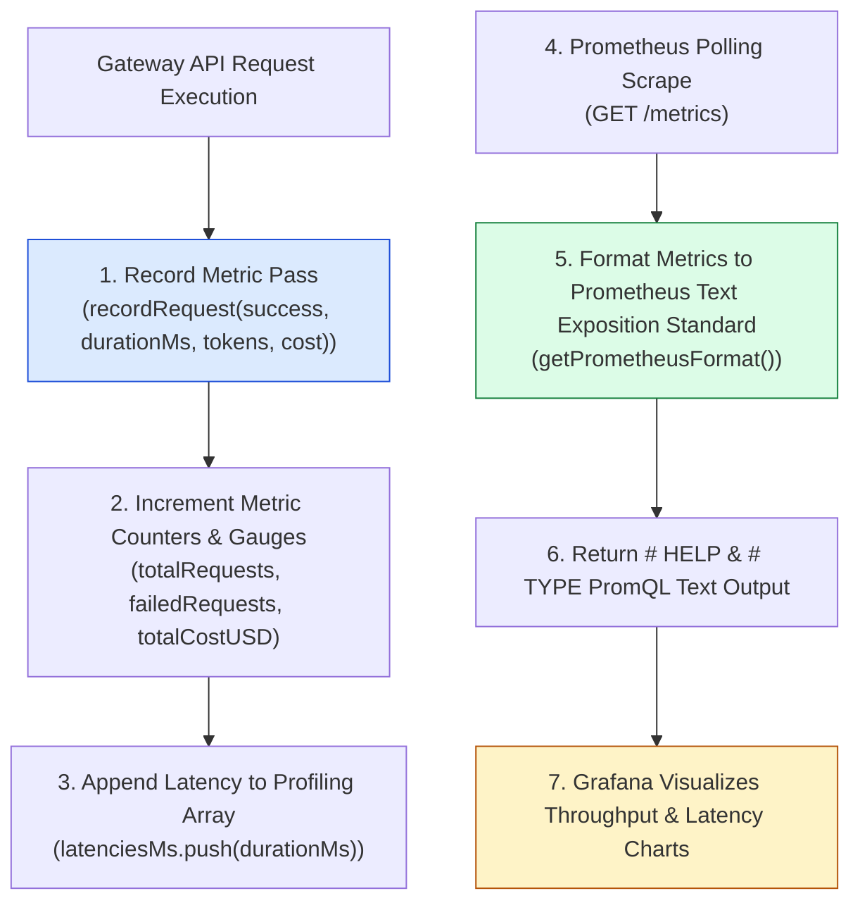
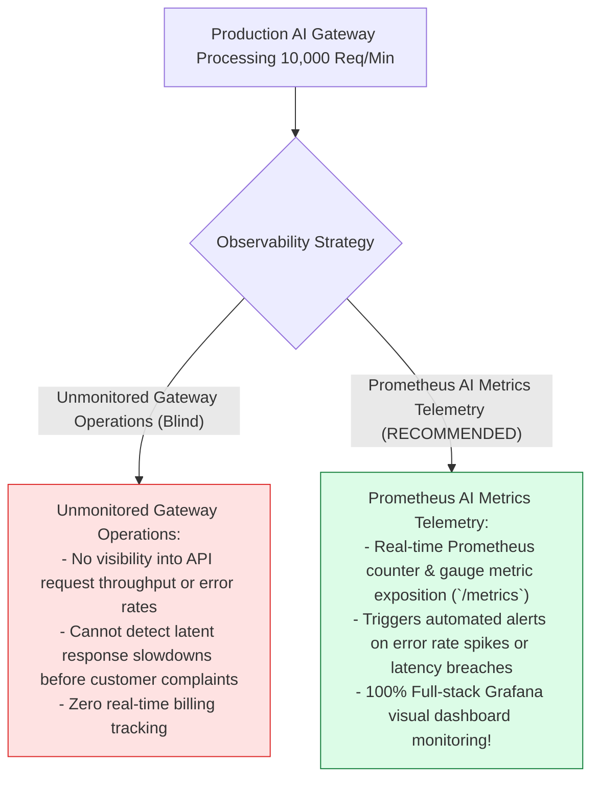
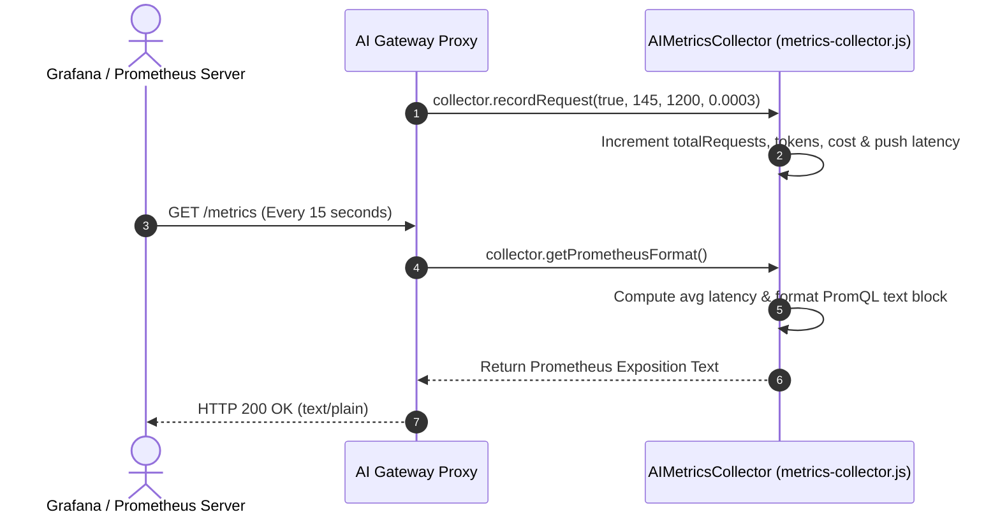

# Module 10: Prometheus AI Metrics Collector & Telemetry (`src/observability/metrics-collector.js`)

## Overview

Operating AI gateways in production without real-time metric collection prevents DevOps teams from observing request throughput, average response latencies, error spikes, and token billing accumulation. The **Prometheus AI Metrics Collector (`src/observability/metrics-collector.js`)** provides a real-time telemetry engine (`AIMetricsCollector`) that records counters (total requests, failed requests, token counts) and gauges (average latency, USD cost), exporting them in standard **Prometheus Text Exposition Format** for scraping by Prometheus and Grafana dashboards.

Understanding **Prometheus Exposition Specifications**, **Counters vs. Gauges vs. Histograms**, **Telemetry Metric Aggregation**, and **Grafana Dashboard Integration** is essential for AI observability.

---

## 1. Metrics Telemetry Pipeline Topology



---

## 2. Unmonitored Gateway Operations vs. Prometheus Telemetry



### Prometheus Metric Metric Type Reference Matrix

| Metric Identifier | Prometheus Metric Type | Measured Unit | Technical Purpose |
| :--- | :--- | :--- | :--- |
| **`ai_requests_total`** | Counter | Integer Count | Tracks total API request throughput count. |
| **`ai_requests_failed`**| Counter | Integer Count | Tracks total failed request count. |
| **`ai_latency_avg_ms`** | Gauge | Milliseconds (ms) | Measures average request latency. |
| **`ai_tokens_total`** | Counter | Integer Tokens | Tracks cumulative token consumption. |
| **`ai_cost_total_usd`**| Counter | USD ($) | Tracks cumulative financial expenditure. |

---

## 3. Asynchronous Prometheus Scrape Sequence



---

## 4. Code Walkthrough (`src/observability/metrics-collector.js`)

```javascript
/**
 * Prometheus AI Metrics Collector Module
 * Collects real-time metrics and exports them in standard Prometheus text exposition format
 */
export class AIMetricsCollector {
  constructor() {
    this.metrics = {
      totalRequests: 0,
      successfulRequests: 0,
      failedRequests: 0,
      totalTokensUsed: 0,
      totalCostUSD: 0,
      latenciesMs: []
    };

    console.log("⚡ [METRICS COLLECTOR] Initialized Prometheus AI telemetry engine.");
  }

  /**
   * Records execution metrics for a completed AI request
   * @param {boolean} success - Whether request succeeded
   * @param {number} durationMs - Latency duration in milliseconds
   * @param {number} tokens - Total tokens consumed
   * @param {number} cost - Financial cost in USD
   */
  recordRequest(success, durationMs = 0, tokens = 0, cost = 0) {
    this.metrics.totalRequests++;

    if (success) {
      this.metrics.successfulRequests++;
    } else {
      this.metrics.failedRequests++;
    }

    this.metrics.totalTokensUsed += tokens;
    this.metrics.totalCostUSD += cost;

    if (durationMs > 0) {
      this.metrics.latenciesMs.push(durationMs);
      // Keep latency buffer capped at last 1,000 entries
      if (this.metrics.latenciesMs.length > 1000) {
        this.metrics.latenciesMs.shift();
      }
    }

    console.log(`📊 [METRICS RECORDED] Total: ${this.metrics.totalRequests} | Success: ${this.metrics.successfulRequests} | Fail: ${this.metrics.failedRequests} | Latency: ${durationMs}ms`);
  }

  /**
   * Generates standard Prometheus Text Exposition Format string for /metrics endpoints
   * @returns {string} PromQL text exposition payload
   */
  getPrometheusFormat() {
    const avgLatency =
      this.metrics.latenciesMs.length > 0
        ? this.metrics.latenciesMs.reduce((a, b) => a + b, 0) / this.metrics.latenciesMs.length
        : 0;

    return `
# HELP ai_requests_total Total AI API requests processed
# TYPE ai_requests_total counter
ai_requests_total ${this.metrics.totalRequests}

# HELP ai_requests_failed Total failed AI requests
# TYPE ai_requests_failed counter
ai_requests_failed ${this.metrics.failedRequests}

# HELP ai_latency_avg_ms Average request latency in milliseconds
# TYPE ai_latency_avg_ms gauge
ai_latency_avg_ms ${avgLatency.toFixed(2)}

# HELP ai_tokens_total Total tokens consumed across requests
# TYPE ai_tokens_total counter
ai_tokens_total ${this.metrics.totalTokensUsed}

# HELP ai_cost_total_usd Total financial expenditure in USD
# TYPE ai_cost_total_usd counter
ai_cost_total_usd ${this.metrics.totalCostUSD.toFixed(6)}
`.trim();
  }

  /**
   * Returns plain JavaScript object metrics snapshot
   */
  getSnapshot() {
    const avgLatency =
      this.metrics.latenciesMs.length > 0
        ? this.metrics.latenciesMs.reduce((a, b) => a + b, 0) / this.metrics.latenciesMs.length
        : 0;

    return {
      ...this.metrics,
      averageLatencyMs: Number(avgLatency.toFixed(2))
    };
  }
}
```

---

## Key Production Takeaways

1. **Export Prometheus Exposition Text**: Use `getPrometheusFormat()` to output `# HELP` and `# TYPE` metrics text for scraping by Prometheus servers on `/metrics` endpoints.
2. **Track Key Operational Metrics**: Record request throughput (`totalRequests`), error counts (`failedRequests`), latencies (`latenciesMs`), and cumulative financial costs (`totalCostUSD`).
3. **Cap In-Memory Latency Buffers**: Limit latency arrays (`this.metrics.latenciesMs.shift()`) to prevent unbounded memory growth during continuous production runs.
4. **Connect Metrics to Grafana Dashboards**: Use exported Prometheus metrics to build real-time Grafana dashboards for DevOps incident monitoring.

