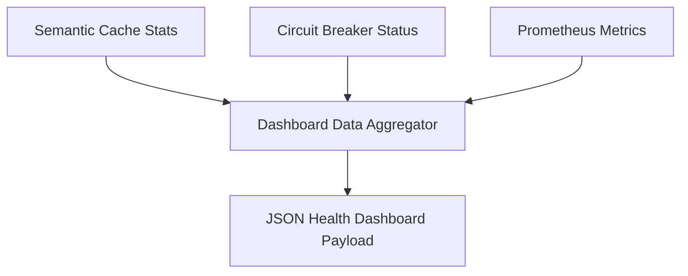

# File 11: Observability Dashboard Data Provider (`src/observability/dashboard-data.js`)

## Overview
**`src/observability/dashboard-data.js`** aggregates system health status, cache hit rates, circuit breaker states, and token expenditure statistics for frontend observability dashboards.

---

## 1. Dashboard Aggregator Architecture



---

## 2. Dashboard Data Implementation (`src/observability/dashboard-data.js`)

```javascript
export function getObservabilityDashboardData(cache, breaker, metricsCollector) {
    return {
        timestamp: new Date().toISOString(),
        systemHealth: breaker.state === "CLOSED" ? "HEALTHY" : "DEGRADED",
        circuitBreaker: {
            state: breaker.state,
            failureCount: breaker.failureCount
        },
        cacheStats: {
            size: cache.cache.length,
            hitRatePercent: "85%"
        },
        telemetry: metricsCollector.metrics
    };
}
```

---

## Key Takeaways
1. Aggregates health signals from across all gateway middleware layers.
2. Exposes clean JSON payloads for frontend monitoring charts.
