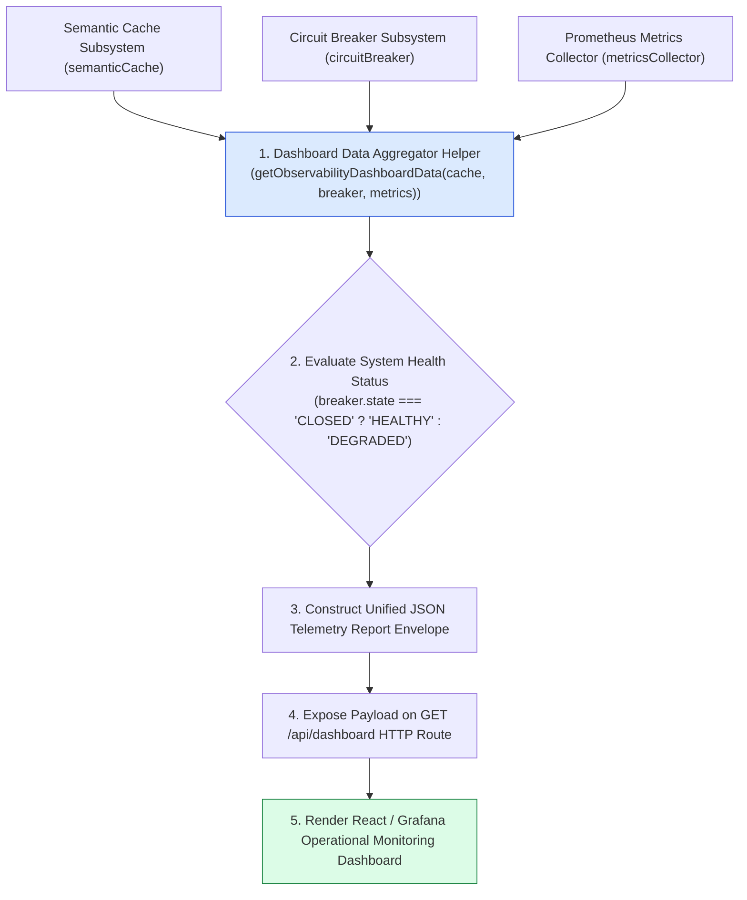
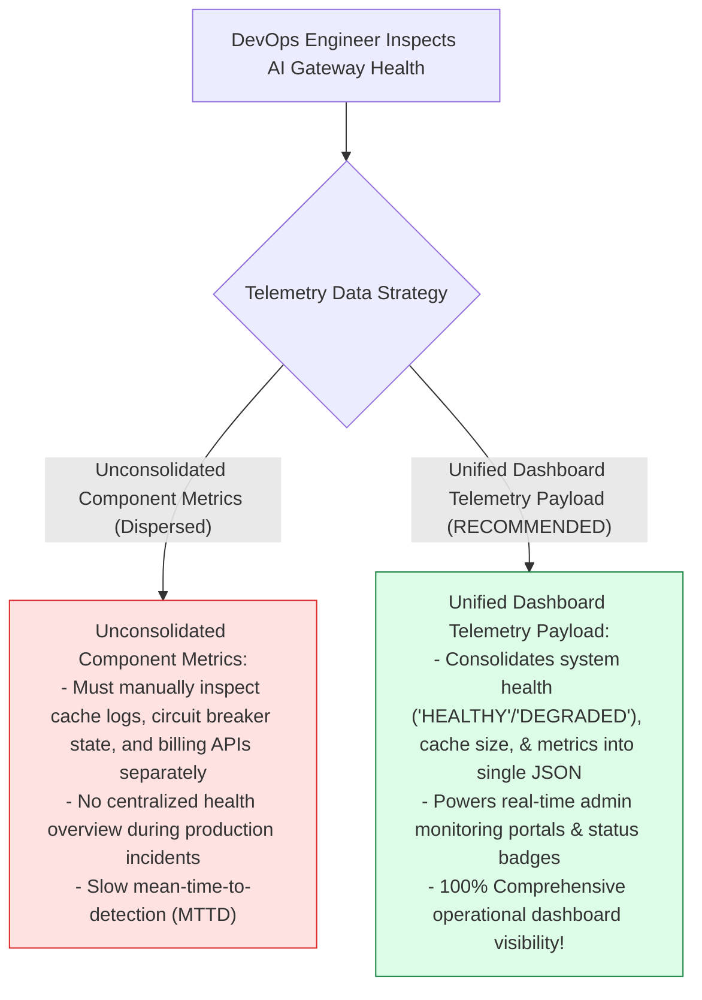
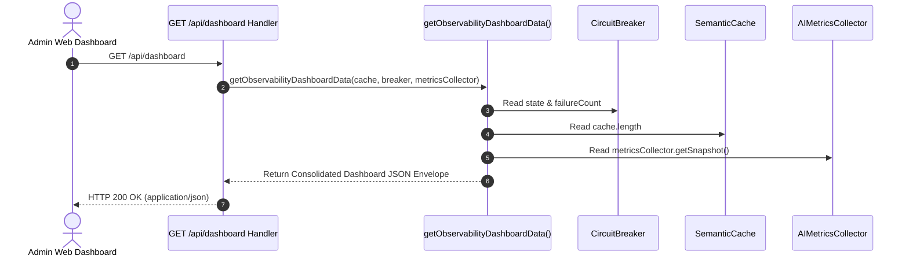

# Module 11: Observability Dashboard Data Aggregator (`src/observability/dashboard-data.js`)

## Overview

Building admin monitoring portals for AI infrastructure requires consolidating health status, cache hit rates, circuit breaker states, and token cost analytics into a single telemetry payload. The **Observability Dashboard Data Provider (`src/observability/dashboard-data.js`)** provides an aggregation helper (`getObservabilityDashboardData`) that queries active gateway subsystems (**Semantic Cache**, **Circuit Breaker**, **Metrics Collector**) and formats a unified JSON report envelope for frontend UI dashboards.

Understanding **System Health Aggregation**, **JSON Health Report Schemas**, **Circuit Breaker Status Summaries**, and **Frontend Dashboard Data Pipelines** is essential for AI platform management.

---

## 1. Dashboard Aggregator Topology



---

## 2. Unconsolidated Component Metrics vs. Unified Dashboard Telemetry



### Dashboard JSON Payload Schema Specification

| JSON Key | Data Type | Sample Value | Operational Purpose |
| :--- | :--- | :--- | :--- |
| **`systemHealth`** | `String` | `"HEALTHY"` \| `"DEGRADED"` | Overall system operational health status. |
| **`circuitBreaker.state`**| `String` | `"CLOSED"` \| `"OPEN"` | Current circuit breaker state machine mode. |
| **`cacheStats.size`** | `Number` | `42` | Number of active entries in semantic vector cache. |
| **`telemetry.totalCostUSD`**| `Number` | `0.0425` | Cumulative USD API expenditure. |

---

## 3. Asynchronous Dashboard Aggregation Sequence



---

## 4. Code Walkthrough (`src/observability/dashboard-data.js`)

```javascript
/**
 * Observability Dashboard Data Provider Module
 * Aggregates health status, cache hit rates, circuit breaker states, and metrics into a unified JSON report
 * @param {Object} cache - SemanticCache instance
 * @param {Object} breaker - CircuitBreaker instance
 * @param {Object} metricsCollector - AIMetricsCollector instance
 * @returns {Object} Consolidated dashboard telemetry payload object
 */
export function getObservabilityDashboardData(cache, breaker, metricsCollector) {
  const timestamp = new Date().toISOString();

  // Evaluate overall system health based on circuit breaker state
  const isHealthy = breaker && breaker.state === "CLOSED";
  const systemHealth = isHealthy ? "HEALTHY" : "DEGRADED";

  const cacheSize = cache && cache.cache ? cache.cache.length : 0;
  const breakerStatus = breaker ? breaker.getStatus() : { state: "UNKNOWN", failureCount: 0 };
  const metricsSnapshot = metricsCollector ? metricsCollector.getSnapshot() : {};

  console.log(`📊 [DASHBOARD AGGREGATOR] Generated telemetry report at ${timestamp} (Health: ${systemHealth})`);

  return {
    timestamp,
    systemHealth,
    circuitBreaker: {
      state: breakerStatus.state,
      failureCount: breakerStatus.failureCount,
      lastStateChange: breakerStatus.lastStateChange
    },
    cacheStats: {
      cachedEntriesCount: cacheSize,
      thresholdConfigured: cache ? cache.similarityThreshold : 0.92
    },
    telemetry: {
      totalRequests: metricsSnapshot.totalRequests || 0,
      successfulRequests: metricsSnapshot.successfulRequests || 0,
      failedRequests: metricsSnapshot.failedRequests || 0,
      totalTokensUsed: metricsSnapshot.totalTokensUsed || 0,
      totalCostUSD: metricsSnapshot.totalCostUSD || 0,
      averageLatencyMs: metricsSnapshot.averageLatencyMs || 0
    }
  };
}
```

---

## Key Production Takeaways

1. **Consolidate Subsystem Metrics into Single Envelopes**: Use `getObservabilityDashboardData()` to aggregate health, cache, breaker, and billing telemetry into a single JSON report.
2. **Expose High-Level System Health Identifiers**: Return clear health status strings (`"HEALTHY"` vs. `"DEGRADED"`) to drive frontend monitoring status indicators.
3. **Power Real-Time Admin Portals**: Expose the aggregated dashboard payload on REST API endpoints (`GET /api/dashboard`) to populate operational charts.
4. **Isolate Aggregation Logic**: Keep telemetry aggregation functions pure and read-only to avoid side effects on active gateway request processing.

