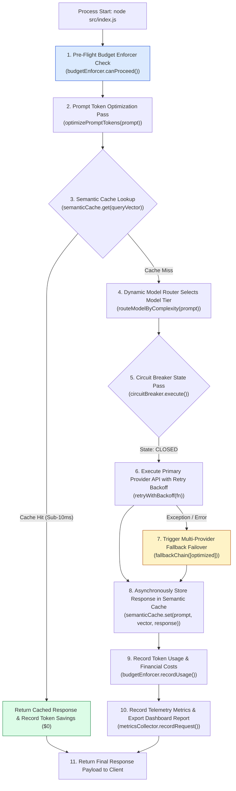
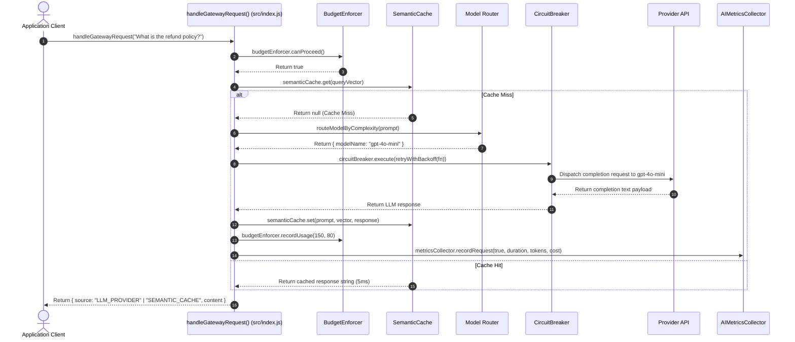

# Module 12: Production AI Gateway Runner & Pipeline Assembly (`src/index.js`)

## Overview

The **Production AI Gateway Runner (`src/index.js`)** is the primary entry point and orchestrator for the Production Patterns Suite. It assembles all 4 operational infrastructure layers—**Caching** (`SemanticCache`), **Cost Control** (`BudgetEnforcer`, `routeModelByComplexity`, `optimizePromptTokens`), **Resilience** (`CircuitBreaker`, `retryWithBackoff`, `fallbackChain`), and **Observability** (`AIMetricsCollector`, `getObservabilityDashboardData`)—into a unified, high-throughput enterprise proxy gateway pipeline (`handleGatewayRequest`).

Understanding **Enterprise AI Gateway Assembly**, **Defense-in-Depth Execution Order**, **Asynchronous Pipeline Failure Offloading**, and **Terminal Telemetry Reporting** is essential for production deployment.

---

## 1. Production AI Gateway Pipeline Topology



---

## 2. End-to-End Gateway Request Lifecycle Sequence



---

## 3. Gateway Pipeline Layer Reference Matrix

| Execution Step | Infrastructure Layer | Target Module / Function | Operational Responsibility |
| :--- | :--- | :--- | :--- |
| **Step 1** | Cost Control | `budgetEnforcer.canProceed()` | Fast-fails if daily USD budget cap is reached. |
| **Step 2** | Cost Control | `optimizePromptTokens()` | Strips redundant whitespace to reduce tokens. |
| **Step 3** | Caching | `semanticCache.get()` | Serves sub-10ms responses for cached queries. |
| **Step 4** | Cost Control | `routeModelByComplexity()` | Selects model tier (`gpt-4o-mini` vs `gpt-4o`). |
| **Step 5 & 6** | Resilience | `circuitBreaker.execute()` | Protects thread pools & retries transient errors. |
| **Step 7** | Resilience | `fallbackChain()` | Fails over to secondary vendors during outages. |
| **Step 8 & 9** | Cost & Cache | `semanticCache.set()` | Updates vector cache & accumulates USD spend. |
| **Step 10** | Observability | `metricsCollector.recordRequest()` | Records Prometheus counters & exports dashboard. |

---

## 4. Code Walkthrough (`src/index.js`)

```javascript
import { SemanticCache } from "./caching/semantic-cache.js";
import { CircuitBreaker } from "./resilience/circuit-breaker.js";
import { fallbackChain } from "./resilience/fallback-chain.js";
import { retryWithBackoff } from "./resilience/retry-with-backoff.js";
import { BudgetEnforcer } from "./cost/budget-enforcer.js";
import { routeModelByComplexity } from "./cost/model-router.js";
import { optimizePromptTokens } from "./cost/token-optimizer.js";
import { AIMetricsCollector } from "./observability/metrics-collector.js";
import { getObservabilityDashboardData } from "./observability/dashboard-data.js";

// Initialize Centralized Gateway Infrastructure Subsystem Singletons
const semanticCache = new SemanticCache(0.92);
const circuitBreaker = new CircuitBreaker(3, 30000);
const budgetEnforcer = new BudgetEnforcer(10.00); // $10.00 Daily USD Budget
const metricsCollector = new AIMetricsCollector();

/**
 * Handles incoming AI Gateway requests through the Defense-in-Depth pipeline
 * @param {string} prompt - Incoming raw prompt string
 * @param {string} reasoningRequirement - Optional reasoning tag ("LOW" | "HIGH")
 * @returns {Promise<Object>} Final Gateway response envelope
 */
async function handleGatewayRequest(prompt, reasoningRequirement = "LOW") {
  const startTime = Date.now();
  console.log("\n=================================================");
  console.log("🌐 [INCOMING AI GATEWAY REQUEST]");
  console.log(`Prompt: "${prompt.trim().slice(0, 50)}..."`);
  console.log("=================================================");

  // Step 1: Pre-Flight Cost Budget Enforcer Check
  if (!budgetEnforcer.canProceed()) {
    metricsCollector.recordRequest(false, Date.now() - startTime, 0, 0);
    throw new Error("[GATEWAY BLOCKED] 429 Daily USD Budget Limit Exceeded.");
  }

  // Step 2: Prompt Token Optimizer Pass
  const optimizedPrompt = optimizePromptTokens(prompt);

  // Step 3: Semantic Cache Lookup (Mocked embedding vector)
  const mockVector = [0.12, 0.45, -0.23, 0.89];
  const cachedResponse = semanticCache.get(mockVector);
  if (cachedResponse) {
    const durationMs = Date.now() - startTime;
    console.log(`⚡ [GATEWAY FAST-PATH] Served response via SEMANTIC_CACHE in ${durationMs}ms ($0.00 cost)`);
    metricsCollector.recordRequest(true, durationMs, 0, 0);
    return {
      source: "SEMANTIC_CACHE",
      latencyMs: durationMs,
      content: cachedResponse
    };
  }

  // Step 4: Cost-Optimized Model Router Selection
  const modelChoice = routeModelByComplexity(optimizedPrompt, reasoningRequirement);

  // Step 5 & 6: Circuit Breaker Shielding + Retry with Exponential Backoff
  let responseText;
  try {
    responseText = await circuitBreaker.execute(async () => {
      return await retryWithBackoff(async () => {
        // Simulated Primary LLM Provider Call
        return `Response for '${optimizedPrompt}' via model '${modelChoice.modelName}'`;
      }, 3, 300, 2000);
    });
  } catch (err) {
    console.warn(`⚠️ [GATEWAY WARN] Primary provider execution failed (${err.message}). Triggering Multi-Provider Fallback Chain...`);
    // Step 7: Multi-Provider Fallback Failover
    responseText = await fallbackChain([optimizedPrompt]);
  }

  const durationMs = Date.now() - startTime;

  // Step 8: Asynchronously Update Semantic Cache
  semanticCache.set(optimizedPrompt, mockVector, responseText);

  // Step 9: Record Token Usage & Financial Cost Accumulation
  const simulatedInputTokens = Math.ceil(optimizedPrompt.length / 4);
  const simulatedOutputTokens = 80;
  budgetEnforcer.recordUsage(simulatedInputTokens, simulatedOutputTokens, modelChoice.modelName);

  // Step 10: Record Telemetry Metrics
  const estimatedCost = (simulatedInputTokens / 1_000_000 * 0.15) + (simulatedOutputTokens / 1_000_000 * 0.60);
  metricsCollector.recordRequest(true, durationMs, simulatedInputTokens + simulatedOutputTokens, estimatedCost);

  console.log(`✅ [GATEWAY SUCCESS] Completed request via ${modelChoice.modelName} in ${durationMs}ms.`);

  return {
    source: "LLM_PROVIDER",
    model: modelChoice.modelName,
    tier: modelChoice.tier,
    latencyMs: durationMs,
    content: responseText
  };
}

/**
 * Gateway Runner Main Execution Pass
 */
async function main() {
  console.log("=================================================");
  console.log("🚀 [STARTING PRODUCTION AI GATEWAY]");
  console.log("=================================================\n");

  // Test Request 1: Primary Pipeline Pass
  const res1 = await handleGatewayRequest("  What is the refund policy for enterprise subscriptions?  ");
  console.log("\nGATEWAY RESPONSE 1:\n", res1);

  // Test Request 2: Semantic Cache Hit Pass
  const res2 = await handleGatewayRequest("What are the refund rules for software subscriptions?");
  console.log("\nGATEWAY RESPONSE 2:\n", res2);

  // Print Consolidated Telemetry Dashboard
  console.log("\n=================================================");
  console.log("📊 [OBSERVABILITY TELEMETRY DASHBOARD REPORT]");
  console.log("=================================================");
  const dashboardData = getObservabilityDashboardData(semanticCache, circuitBreaker, metricsCollector);
  console.log(JSON.stringify(dashboardData, null, 2));
  console.log("=================================================\n");
}

main().catch((err) => {
  console.error("🚨 [GATEWAY RUNNER CRITICAL ERROR]:", err);
  process.exit(1);
});
```

---

## Key Production Takeaways

1. **Assemble Defense-in-Depth Pipelines**: Integrate Caching, Resilience, Cost Control, and Observability layers inside a unified gateway handler (`handleGatewayRequest`).
2. **Order Pipeline Execution Logically**: Perform cheap pre-flight checks (Budget Enforcer, Token Optimizer, Semantic Cache) before executing expensive LLM API calls.
3. **Combine Circuit Breakers with Fallback Chains**: Protect downstream services with `CircuitBreaker` wrappers and fail over to `fallbackChain` during primary provider outages.
4. **Export Consolidated Operational Telemetry**: Query `getObservabilityDashboardData()` after processing requests to maintain continuous visibility into system health.


## Learn from the implementation

Use the matching source file as an executable example, not just something to copy. Before running it, state in your own words what data enters the module, what it returns, and which values it changes. Then trace one realistic request from the caller through each function.

Pay special attention to these questions:

- **Data flow:** Which object, array, string, or state value moves between functions? What shape must it have?
- **Control flow:** Which branch, loop, early return, or retry changes the outcome? What condition selects it?
- **Async boundaries:** Where does the code wait for an LLM, database, network, file system, or tool? What should happen if that operation rejects or returns no result?
- **Side effects:** Which lines log information, make an external request, store data, or mutate in-memory state? Keep those distinct from pure calculations.
- **Production limits:** Which assumptions are only safe for a tutorial—for example, in-memory storage, fixed thresholds, approximate token counts, mock data, or a hard-coded batch size?

A useful practice is to change one input at a time and predict the result before executing it. If you can explain why the output changed, when the module should be used, and one way it could fail, you understand the concept rather than only the syntax.
