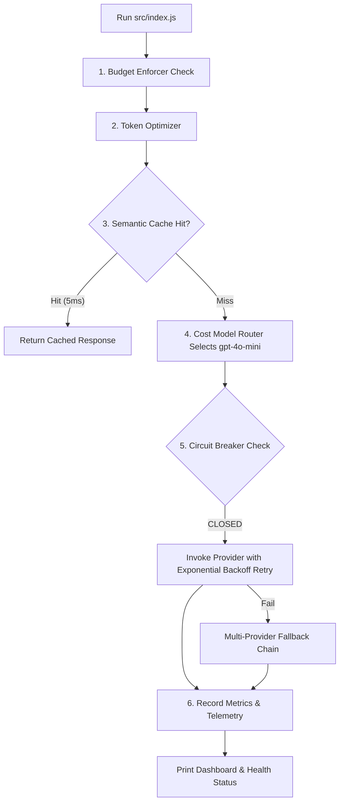

# File 12: Production AI Gateway Runner (`src/index.js`)

## Overview
**`src/index.js`** is the main entry point for Production Patterns, assembling Semantic Caching, Circuit Breakers, Model Cost Routers, Budget Enforcers, and Observability Metrics into an end-to-end **Production AI Gateway Pipeline**.

---

## 1. Production Gateway Pipeline Flow



---

## 2. Gateway Implementation (`src/index.js`)

```javascript
import { SemanticCache } from "./caching/semantic-cache.js";
import { CircuitBreaker } from "./resilience/circuit-breaker.js";
import { fallbackChain } from "./resilience/fallback-chain.js";
import { retryWithBackoff } from "./resilience/retry-with-backoff.js";
import { BudgetEnforcer } from "./cost/budget-enforcer.js";
import { routeModelByComplexity } from "./cost/model-router.js";
import { optimizePromptTokens } from "./cost/token-optimizer.js";
import { AIMetricsCollector } from "./observability/metrics-collector.js";
import { getObservabilityDashboardData } from "./observability/dashboard-data.js";

// Initialize Gateway Middleware Instances
const semanticCache = new SemanticCache();
const circuitBreaker = new CircuitBreaker();
const budgetEnforcer = new BudgetEnforcer(10.00);
const metricsCollector = new AIMetricsCollector();

async function handleGatewayRequest(prompt) {
    const startTime = Date.now();
    console.log("\n=== INCOMING AI GATEWAY REQUEST ===");

    // Step 1: Budget Enforcer
    if (!budgetEnforcer.canProceed()) {
        throw new Error("429 Daily Budget Limit Exceeded");
    }

    // Step 2: Token Optimizer
    const optimized = optimizePromptTokens(prompt);

    // Step 3: Semantic Cache Check (Mocked vector)
    const mockVector = [0.1, 0.2, 0.3, 0.4];
    const cached = semanticCache.get(mockVector);
    if (cached) {
        metricsCollector.recordRequest(true, Date.now() - startTime, 0, 0);
        return { source: "SEMANTIC_CACHE", content: cached };
    }

    // Step 4: Cost Model Router
    const modelChoice = routeModelByComplexity(optimized, "LOW");

    // Step 5: Circuit Breaker & Retry with Backoff
    let response;
    try {
        response = await circuitBreaker.execute(async () => {
            return await retryWithBackoff(async () => {
                // Simulated Provider Call
                return `Response for '${optimized}' via ${modelChoice.modelName}`;
            });
        });
    } catch (err) {
        console.warn("[GATEWAY WARN] Primary provider failed. Triggering Fallback Chain...");
        response = await fallbackChain([optimized]);
    }

    // Step 6: Cache & Metrics
    semanticCache.set(optimized, mockVector, response);
    budgetEnforcer.recordUsage(150, 80, modelChoice.modelName);
    metricsCollector.recordRequest(true, Date.now() - startTime, 230, 0.0001);

    return { source: "LLM_PROVIDER", model: modelChoice.modelName, content: response };
}

async function main() {
    const res = await handleGatewayRequest("  What is the refund policy for software subscriptions?  ");
    console.log("\nGATEWAY RESPONSE:\n", res);

    console.log("\n=== OBSERVABILITY DASHBOARD ===");
    console.log(getObservabilityDashboardData(semanticCache, circuitBreaker, metricsCollector));
}

main().catch(console.error);
```

---

## Key Takeaways
1. Combines caching, cost limits, resilience, and observability into a single enterprise AI Gateway.
2. Demonstrates end-to-end request handling with full telemetry.
