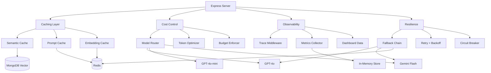
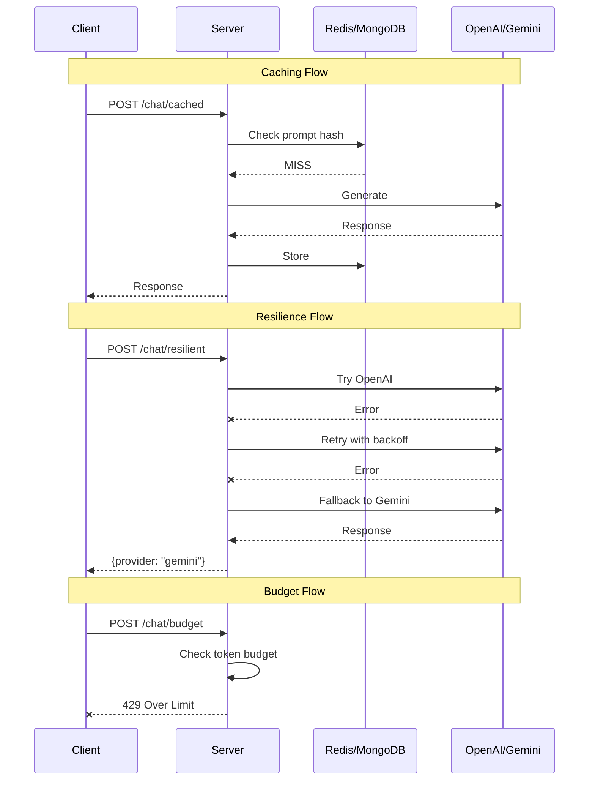

# 09 - Production Patterns

A reference library of production-ready patterns for LLM applications. Not a client project — a toolkit you pull from when building real apps.

## Architecture





## Tech Stack

- **Express** — HTTP server
- **OpenAI + Gemini** — LLM providers
- **Redis** — Prompt and embedding cache
- **MongoDB** — Semantic cache with vector search

## Setup

```bash
cp .env.example .env
# Add API keys, MONGODB_URI, REDIS_URL

# Start Redis locally
docker run -d -p 6379:6379 redis

npm install
npm run dev
```

## API Endpoints

### Caching
```bash
# Prompt cache (exact match, hash-based)
curl -X POST http://localhost:3009/chat/cached \
  -H "Content-Type: application/json" \
  -d '{"messages": [{"role": "user", "content": "What is Node.js?"}]}'

# Semantic cache (similarity-based)
curl -X POST http://localhost:3009/chat/semantic-cached \
  -H "Content-Type: application/json" \
  -d '{"query": "Explain Node.js"}'
```

### Cost Control
```bash
# Smart model routing (cheap model for easy, expensive for hard)
curl -X POST http://localhost:3009/chat/smart-route \
  -H "Content-Type: application/json" \
  -d '{"query": "Hello"}'

# Budget-enforced chat
curl -X POST http://localhost:3009/chat/budget \
  -H "Content-Type: application/json" \
  -d '{"userId": "user1", "message": "Explain quantum computing"}'

# Trim conversation history
curl -X POST http://localhost:3009/optimize/trim \
  -H "Content-Type: application/json" \
  -d '{"messages": [...], "maxTokens": 2000}'
```

### Resilience
```bash
# Resilient chat (OpenAI -> Gemini -> cache fallback)
curl -X POST http://localhost:3009/chat/resilient \
  -H "Content-Type: application/json" \
  -d '{"messages": [{"role": "user", "content": "Hello"}]}'

# Circuit breaker status
curl http://localhost:3009/circuit-breaker
curl -X POST http://localhost:3009/circuit-breaker/reset
```

### Observability
```bash
# Dashboard metrics
curl http://localhost:3009/dashboard
```

## Patterns Reference

| Pattern | File | What It Does |
|---------|------|-------------|
| Semantic Cache | `caching/semantic-cache.js` | Cache similar queries using vector similarity |
| Prompt Cache | `caching/prompt-cache.js` | Cache identical prompts using SHA-256 hash |
| Embedding Cache | `caching/embedding-cache.js` | Avoid re-embedding the same text |
| Model Router | `cost/model-router.js` | Route simple queries to cheap models |
| Token Optimizer | `cost/token-optimizer.js` | Trim history, compress prompts, summarize |
| Budget Enforcer | `cost/budget-enforcer.js` | Per-user token and cost limits |
| Trace Middleware | `observability/trace-middleware.js` | Trace every request and AI call |
| Metrics Collector | `observability/metrics-collector.js` | Collect latency, tokens, errors |
| Dashboard Data | `observability/dashboard-data.js` | Aggregate metrics for dashboards |
| Fallback Chain | `resilience/fallback-chain.js` | OpenAI -> Gemini -> cached response |
| Retry + Backoff | `resilience/retry-with-backoff.js` | Exponential backoff with jitter |
| Circuit Breaker | `resilience/circuit-breaker.js` | Stop calling a failing service |


## Learning path

Read the numbered module notes in order before changing the application. Each note explains one responsibility and points to the matching implementation. For each module, follow one input through the code, identify its output and side effects, then run a small example. This builds understanding of the system boundaries before you combine them.
