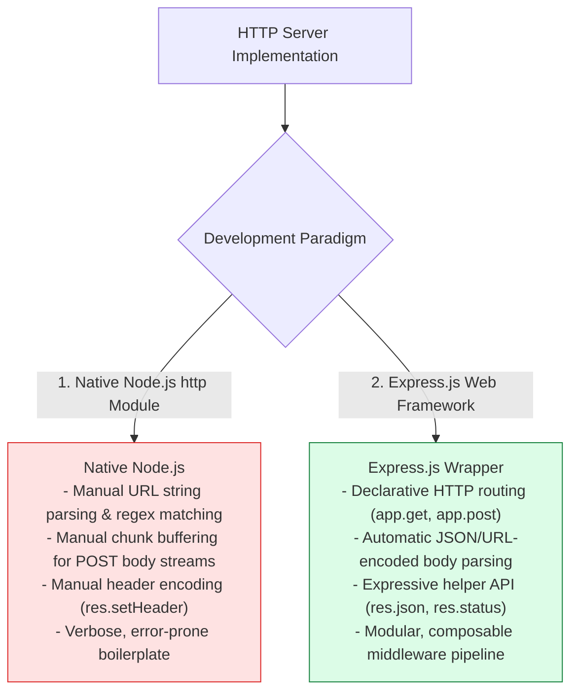
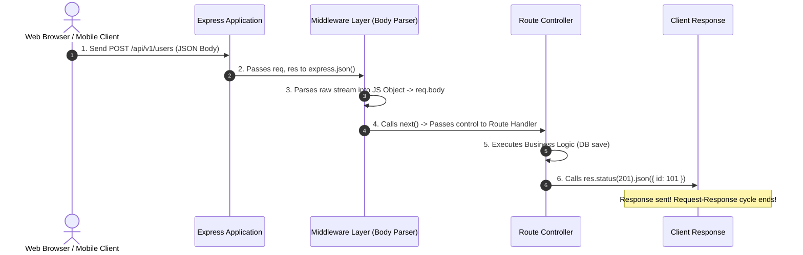

# Module 01: Express.js Core Architecture, Server Lifecycle, and HTTP Request Pipeline

## Overview

**Express.js** is the industry-standard, unopinionated, minimalist web application framework for Node.js. It simplifies web server development by providing a powerful abstraction over Node.js's native `http` module, introducing **Layered Middleware Chains**, **Declarative Routing**, and enhanced **Request/Response Helper Wrappers**.

Understanding how Express wraps `http.createServer()`, processes incoming HTTP payloads through sequential middleware layers, and terminates responses is essential for building scalable backend APIs.

---

## 1. Express.js Layered Application Architecture

```mermaid
flowchart TD
    Client[Client HTTP Request] --> NativeHTTP["Node.js Native HTTP Server (http.createServer)"]
    NativeHTTP --> ExpressApp["Express Application Instance (app = express())"]

    subgraph Express Middleware Execution Pipeline
        ExpressApp --> MW1["1. Global Middleware (Logger / CORS)"]
        MW1 -->|next()| MW2["2. Body Parser Middleware (express.json())"]
        MW2 -->|next()| MW3["3. Auth Middleware (JWT Verifier)"]
        MW3 -->|next()| Router["4. Route Handler Matching (app.get('/api/users'))"]
    end

    Router --> Res["5. Response Sentinel (res.status(200).json())"]
    Res --> ClientResponse[Client HTTP Response 200 OK]

    style ExpressApp fill:#dbeafe,stroke:#1d4ed8
    style Router fill:#dcfce7,stroke:#15803d
```

---

## 2. Native Node.js `http` vs. Express.js Framework Abstraction



### Technical Feature Comparison Matrix

| Architectural Feature | Native Node.js `http` Module | Express.js Framework |
| :--- | :--- | :--- |
| **Server Initialization** | `http.createServer((req, res) => {})` | `const app = express(); app.listen(port)` |
| **Route Matching** | Manual `if (req.url === '/users' && req.method === 'GET')` | Declarative `app.get('/users', handler)` |
| **Request Body Parsing** | Buffering `req.on('data', chunk)` stream events | Built-in `express.json()` middleware |
| **Response Output** | `res.writeHead(200); res.end(JSON.stringify(data))` | Chained `res.status(200).json(data)` |
| **Middleware Chain** | Manual function array iteration | Native `app.use()` and `next()` pipeline |

---

## 3. Express Application Request-Response Lifecycle



---

## 4. Practical Implementation Showcase: Production Server Setup

```javascript
const express = require("express");

// Initialize Express Application Instance
const app = express();
const PORT = process.env.PORT || 3000;

// 1. Global Core Middleware Registration
app.use(express.json()); // Parses incoming application/json payloads
app.use(express.urlencoded({ extended: true })); // Parses form-encoded bodies

// Custom Request Logger Middleware
app.use((req, res, next) => {
  console.log(`[${new Date().toISOString()}] ${req.method} ${req.url}`);
  next(); // Pass control to next layer in pipeline
});

// 2. Declarative Route Definitions
app.get("/health", (req, res) => {
  res.status(200).json({
    status: "UP",
    uptime: process.uptime(),
    timestamp: new Date().toISOString()
  });
});

app.post("/api/v1/echo", (req, res) => {
  res.status(201).json({
    message: "Payload received successfully",
    payload: req.body
  });
});

// 3. Fallback Route Handler (404 Not Found)
app.use((req, res) => {
  res.status(404).json({ error: "RESOURCE_NOT_FOUND", path: req.originalUrl });
});

// 4. Start HTTP Listener Server
app.listen(PORT, () => {
  console.log(`🚀 [EXPRESS SERVER] Server running on http://localhost:${PORT}`);
});
```

---

## Key Production Takeaways

1. **Express Extends Native Prototypes**: Express wraps native `http.IncomingMessage` into `req` and `http.ServerResponse` into `res`, adding utility methods while retaining compatibility with native methods.
2. **Always Control Pipeline Flow with `next()`**: Every middleware function must either call `next()` to pass control down the chain or terminate the request by sending a response (`res.send`, `res.json`).
3. **Register Body Parsers Early**: Mount `express.json()` and `express.urlencoded()` at the top of the middleware pipeline before mounting any routes that require body content.
4. **Define 404 Handlers Last**: Place fallback route handlers after all valid application routes to capture unhandled paths gracefully.

