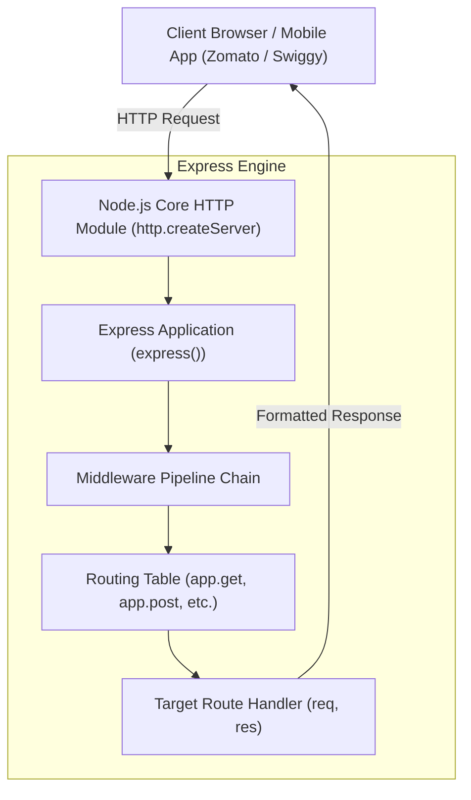

# Module 01: Express.js Introduction — From Raw HTTP to Express Framework

## Theoretical Overview & Architecture

**Express.js** is a minimalist, flexible, and unopinionated web application framework for Node.js. It sits directly on top of Node's core `http` module, abstracting away tedious low-level tasks such as manual URL parsing, header manipulation, stream consumption, and manual status code setting.



### Real-World Analogy: Amma's Dhaba Upgrade
Imagine Amma running a traditional roadside Dhaba:
- **Raw HTTP Approach**: Amma takes customer orders by hand, personally checks every item in the pantry, manually calculates prices on a paper pad, and handles individual cash change. If two customers ask for thali and biryani at the same time, she has to manually parse their verbal strings and write raw receipts.
- **Express.js Upgrade**: Amma installs an automated Point-of-Sale (POS) touch terminal. The terminal automatically parses the order (`express.json()`), routes the thali request to the kitchen (`app.get('/menu')`), and prints a standardized bill with tax included (`res.status(201).json()`).

---

## 1. Raw Node.js HTTP vs. Express.js Comparison

| Metric / Action | Raw Node.js `http` Module | Express.js Framework |
| :--- | :--- | :--- |
| **Server Setup** | `http.createServer((req, res) => { ... })` | `const app = express(); app.listen(port);` |
| **URL Routing** | Manual `if-else` checking `req.url === '/menu' && req.method === 'GET'`. | Declarative routing: `app.get('/menu', handler)`. |
| **Body Parsing** | Manual stream listening (`req.on('data')` & `req.on('end')`). | Integrated middleware: `app.use(express.json())`. |
| **Response Headers** | `res.writeHead(200, { 'Content-Type': 'application/json' });` | Automatic headers: `res.json({ items: [...] })`. |
| **Method Chaining** | Verbose multi-line statements. | Concise method chaining: `res.status(201).json(data)`. |

---

## 2. Basic Server Setup & Methods (`block1_basicServer`)

In Express, `express()` initializes an application instance. `app.use(express.json())` mounts a built-in middleware that intercepts incoming HTTP requests, checks for `Content-Type: application/json`, reads the stream chunks, parses the JSON payload, and attaches it directly to `req.body`.

```javascript
const express = require('express');
const app = express();

app.use(express.json()); // Parses incoming JSON payloads into req.body

// GET Route Registration
app.get('/menu', (req, res) => {
  // res.json automatically sets Content-Type to application/json and serializes the object
  res.json({ items: ['thali', 'biryani'] });
});

// POST Route Registration
app.post('/order', (req, res) => {
  // Access body parsed by express.json()
  res.status(201).json({ status: 'received', order: req.body });
});

const server = app.listen(0, () => {
  console.log(`Server listening on port ${server.address().port}`);
});
```

---

## 3. Express Response Helper Methods (`block2_responseMethods`)

Express decorates Node's native `http.ServerResponse` object (`res`) with high-level utility methods for formatting and terminating responses:

```mermaid
flowchart LR
    ResObj["Response Object (res)"] --> send["res.send(body)<br/>Auto-detects Type (HTML/Text/Buffer)"]
    ResObj --> json["res.json(obj)<br/>Serializes Object to JSON"]
    ResObj --> status["res.status(code)<br/>Sets HTTP Status (Chainable)"]
    ResObj --> sendStatus["res.sendStatus(code)<br/>Sets Status & Sends Status Text"]
    ResObj --> redirect["res.redirect(url)<br/>Performs HTTP 301/302 Redirect"]
    ResObj --> end["res.end()<br/>Ends Response with Empty Body (e.g. 204)"]
```

```javascript
const app = express();

// 1. res.send() - Auto-detects content type (string -> text/html)
app.get('/text', (req, res) => {
  res.send("Namaste from Amma's Dhaba!");
});

// 2. res.json() - Explicit application/json response
app.get('/json', (req, res) => {
  res.json({ framework: 'Express', version: '5.x' });
});

// 3. res.status() + res.json() - Method Chaining for Error Statuses
app.get('/not-found', (req, res) => {
  res.status(404).json({ error: 'Resource not found' });
});

// 4. res.sendStatus() - Sets status code AND sends standard status string as body
app.get('/health', (req, res) => {
  res.sendStatus(200); // Sends "OK" with 200 HTTP status
});

// 5. res.redirect() - Issues 301 (Permanent) or 302 (Temporary) redirects
app.get('/old-menu', (req, res) => {
  res.redirect(301, '/new-menu');
});

app.get('/new-menu', (req, res) => {
  res.json({ menu: 'This is the new menu!' });
});

// 6. res.end() - Terminates response stream without sending body payload
app.get('/no-content', (req, res) => {
  res.status(204).end();
});
```

---

## Key Takeaways

1. **Express Wraps Node Core**: `express()` creates an application instance that abstracts Node's raw `http` server module.
2. **Declarative Method Routing**: Express provides method-specific handlers (`app.get`, `app.post`, `app.put`, `app.delete`) matching standard HTTP verbs.
3. **Smart Response Serialization**: `res.json()` serializes objects and sets `Content-Type: application/json`, while `res.send()` inspects the data type to set appropriate headers automatically.
4. **Fluent Chaining**: Express methods return the `res` reference where appropriate, enabling chainable constructs like `res.status(404).json(...)`.
5. **Dynamic Port Binding**: Passing `0` to `app.listen(0)` allows the underlying OS to allocate an unused ephemeral port, ideal for isolated integration testing.
