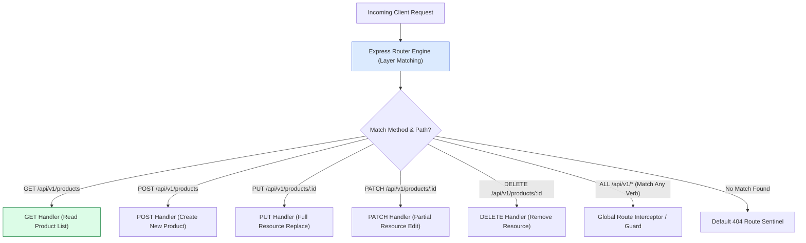
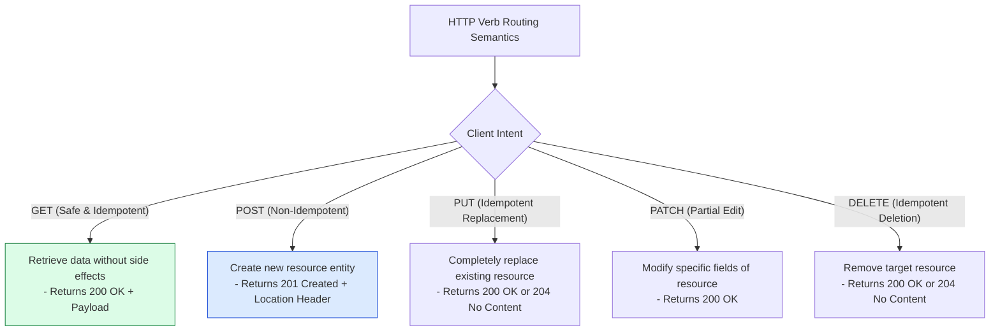
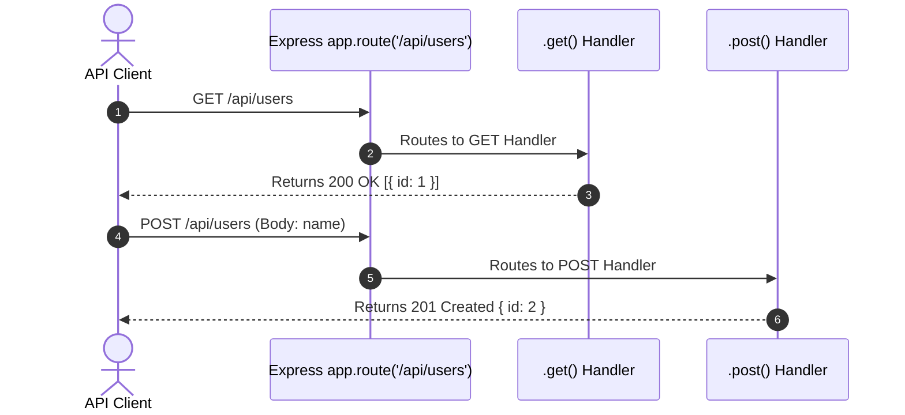

# Module 02: Express.js Routing Mechanics, HTTP Method Semantics, and Method Chaining

## Overview

**Routing** defines how an Express.js application responds to client requests targeting specific Endpoint URIs and HTTP methods (`GET`, `POST`, `PUT`, `DELETE`, `PATCH`).

Express provides a flexible routing engine supporting **Exact String Paths**, **String Pattern Matching**, **Regular Expression Routes**, and **Method Chaining via `app.route()`** to reduce path string redundancy.

---

## 1. Express Router Decision Matrix



---

## 2. HTTP Verb Semantics in Express Routing



### HTTP Verb & Route Matching Matrix

| HTTP Method | Purpose / Intent | Idempotent? | Safe? | Typical Response Code |
| :--- | :--- | :--- | :--- | :--- |
| **`GET`** | Fetch resource representation | **Yes** | **Yes** | `200 OK` |
| **`POST`** | Create new nested resource / process data | **No** | **No** | `201 Created` |
| **`PUT`** | Replace entire existing resource | **Yes** | **No** | `200 OK` / `204 No Content` |
| **`PATCH`**| Modify partial resource attributes | **No** | **No** | `200 OK` |
| **`DELETE`**| Destroy specified resource | **Yes** | **No** | `200 OK` / `204 No Content` |
| **`OPTIONS`**| CORS Preflight capabilities query | **Yes** | **Yes** | `204 No Content` |

---

## 3. Method Chaining Architecture with `app.route()`

When multiple HTTP verbs target the exact same URI endpoint path, using `app.route()` avoids duplicating path strings across code blocks:



---

## 4. Practical Implementation Showcase: Routing & Method Chaining

```javascript
const express = require("express");
const app = express();

app.use(express.json());

// 1. Basic Path Matching Routes
app.get("/users", (req, res) => {
  res.status(200).json([{ id: 1, name: "Priya Sharma" }]);
});

// 2. String Pattern Route Paths (?, +, *, ())
app.get("/ab?cd", (req, res) => {
  // Matches '/acd' or '/abcd' (b is optional)
  res.status(200).send("Matched /ab?cd pattern");
});

app.get("/ab+cd", (req, res) => {
  // Matches '/abcd', '/abbcd', '/abbbcd', etc. (one or more b's)
  res.status(200).send("Matched /ab+cd pattern");
});

// 3. Regular Expression Routes
app.get(/.*fly$/, (req, res) => {
  // Matches anything ending with 'fly' (e.g. /butterfly, /dragonfly)
  res.status(200).send("Matched Regex /.*fly$/");
});

// 4. Method Chaining via app.route()
app.route("/api/v1/products")
  .get((req, res) => {
    res.status(200).json([{ id: 101, title: "Enterprise Workstation Laptop" }]);
  })
  .post((req, res) => {
    res.status(201).json({ message: "Product created successfully", product: req.body });
  })
  .delete((req, res) => {
    res.status(200).json({ message: "All bulk products marked for deletion" });
  });

// 5. Global Route Interceptor using app.all()
app.all("/api/v1/admin/*", (req, res, next) => {
  console.log(`🔒 [ADMIN AUDIT GUARD] Intercepted ${req.method} on ${req.originalUrl}`);
  next(); // Pass to next matching admin route
});

// Start Server
app.listen(3000, () => {
  console.log("Routing Basics Server listening on port 3000");
});
```

---

## Key Production Takeaways

1. **Use `app.route()` to Group Handlers by Path**: Grouping HTTP method handlers (`.get()`, `.post()`, `.delete()`) under a single `app.route('/path')` chain reduces path typos and improves code organization.
2. **Understand PUT vs. PATCH Semantics**: Enforce `PUT` for complete resource overwrites (missing fields in payload reset to `null`) and `PATCH` for partial attribute updates.
3. **Be Cautious with Regex Route Strings**: Complex regular expressions in route definitions can degrade route-matching performance under high QPS. Prefer explicit string paths or parameter handlers.
4. **Use `app.all()` for Route-Specific Interceptors**: `app.all()` matches every HTTP verb for a given path prefix, making it ideal for path-scoped authentication or audit logging guards.

