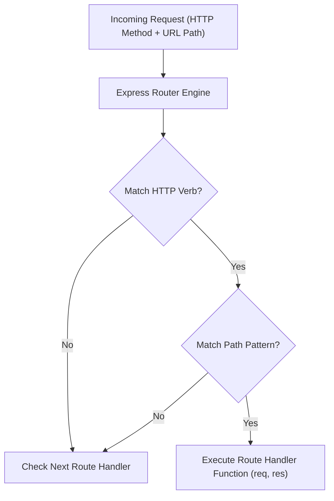

# Module 02: Routing Basics — HTTP Methods, Paths, & Method Chaining

## Theoretical Overview & Routing Mechanics

**Routing** refers to how an application's endpoints respond to client requests based on two distinct identifiers: an **HTTP Method** (GET, POST, PUT, DELETE, PATCH) and an **URL Path**.



### Real-World Analogy: BEST Bus Driver Raju
Think of BEST bus driver Raju navigating Mumbai transit routes:
- **URL Path**: The route destination identifier (e.g., `/dadar-andheri`).
- **HTTP Method**: The direction of travel:
  - **GET**: Passengers boarding to inspect the route schedule (Read-only).
  - **POST**: Adding a brand-new bus route to the depot schedule (Create).
  - **PUT**: Replacing the entire bus fleet for route `/dadar-andheri` (Full Replacement).
  - **PATCH**: Updating just the departure timing for a single stop (Partial Update).
  - **DELETE**: Decommissioning route `/dadar-andheri` entirely (Remove).

---

## 1. HTTP Verbs & CRUD Mapping (`block1_httpMethods`)

Express provides individual methods corresponding to all standard HTTP verbs:

| HTTP Method | CRUD Operation | Idempotent? | Safe? | Description |
| :--- | :--- | :--- | :--- | :--- |
| **GET** | Read | Yes | Yes | Retrieves resource representation. Must not alter server state. |
| **POST** | Create | No | No | Submits data to create a new resource. Returns `201 Created`. |
| **PUT** | Replace | Yes | No | Completely overwrites existing target resource or creates it. |
| **PATCH** | Update | No | No | Applies partial modifications to a resource. |
| **DELETE** | Remove | Yes | No | Deletes the specified target resource. Returns `204 No Content`. |

```javascript
const express = require('express');
const app = express();
app.use(express.json());

const routes = {
  1: { id: 1, name: 'Dadar-Andheri Express', direction: 'North' },
  2: { id: 2, name: 'Bandra-Kurla Shuttle', direction: 'East' }
};
let nextId = 3;

// READ (GET)
app.get('/routes', (req, res) => {
  res.json(Object.values(routes));
});

// CREATE (POST)
app.post('/routes', (req, res) => {
  const newRoute = { id: nextId++, ...req.body };
  routes[newRoute.id] = newRoute;
  res.status(201).json(newRoute);
});

// REPLACE (PUT)
app.put('/routes/:id', (req, res) => {
  const id = req.params.id;
  if (!routes[id]) return res.status(404).json({ error: 'Not found' });
  routes[id] = { id: Number(id), ...req.body };
  res.json(routes[id]);
});

// REMOVE (DELETE)
app.delete('/routes/:id', (req, res) => {
  const id = req.params.id;
  if (!routes[id]) return res.status(404).json({ error: 'Not found' });
  delete routes[id];
  res.status(204).end();
});
```

---

## 2. Express 5 Path Rules & Method Chaining (`block2_routePatterns`)

Express 5 introduced crucial path syntax updates powered by `path-to-regexp` v6:
1. **No Optional Parameter Syntax (`?`)**: Optional parameters like `/stops/:id?` are deprecated. Use two explicit routes instead (`/stops` and `/stops/:id`).
2. **No Inline Regex in Route Paths**: Inline regex syntax like `/bus-:number(\\d+)` is removed. Validate route parameters imperatively within the handler function.
3. **Named Wildcard Syntax**: Unnamed wildcards like `/files/*` must now be explicitly named (e.g., `/files/*filepath`).

```javascript
const app = express();

// 1. Express 5 Named Wildcard (*filepath)
app.get('/files/*filepath', (req, res) => {
  // Parsed sub-path segments land in req.params.filepath
  res.json({ filepath: req.params.filepath, type: 'wildcard' });
});

// 2. Explicit Routes for Optional Parameters
app.get('/stops', (req, res) => {
  res.json({ stops: ['Dadar', 'Andheri'], type: 'list' });
});
app.get('/stops/:id', (req, res) => {
  res.json({ stop: req.params.id, type: 'single' });
});

// 3. Parameter Validation in Handler (Replacing Inline Regex)
app.get('/bus-:number', (req, res) => {
  const num = req.params.number;
  const isDigits = num.length > 0 && !isNaN(num);
  if (!isDigits) return res.status(400).json({ error: 'Bus number must be numeric' });
  res.json({ busNumber: num, type: 'param' });
});

// 4. app.route() - Method Chaining for Single Path
app.route('/schedule')
  .get((req, res) => res.json({ action: 'list schedules', method: 'GET' }))
  .post((req, res) => res.json({ action: 'create schedule', method: 'POST' }));

// 5. app.all() - Matches ALL HTTP Verbs on Exact Path
app.all('/any-method', (req, res) => {
  res.json({ method: req.method, message: 'app.all matched!' });
});

// 6. app.use() - Prefix Matching (Matches /api, /api/users, /api/users/123)
app.use('/api', (req, res) => {
  res.json({ originalUrl: req.originalUrl, path: req.path, type: 'use-prefix' });
});
```

---

## 3. `app.all()` vs. `app.use()` Comparison

| Feature | `app.all(path, handler)` | `app.use(path, handler)` |
| :--- | :--- | :--- |
| **Path Matching** | **Exact Path Match** (`/api` matches only `/api`). | **Prefix Match** (`/api` matches `/api`, `/api/users`, etc.). |
| **HTTP Verbs** | Matches all HTTP verbs (GET, POST, PUT, etc.). | Matches all HTTP verbs. |
| **Primary Purpose** | Global security middleware or default handlers for a specific route. | Mounting sub-routers, global logger middleware, and static asset serving. |

---

## Key Takeaways

1. **CRUD Alignment**: Map domain actions directly to standard verbs: `GET` (read), `POST` (create), `PUT` (replace), `PATCH` (update), `DELETE` (remove).
2. **Express 5 Path Rules**: Avoid inline regex or optional parameter syntax; use named wildcards (`*filepath`) and handle validation inside route logic.
3. **`app.route()` Chaining**: Use `app.route('/path')` to consolidate `GET`, `POST`, `PUT`, and `DELETE` handlers for a single resource path.
4. **Exact vs. Prefix Matching**: Understand that `app.all()` matches exact paths across all verbs, whereas `app.use()` performs prefix matching across sub-paths.
