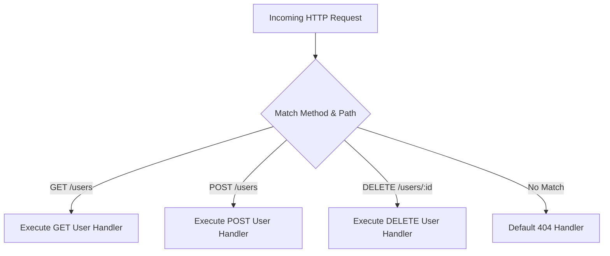

# File 02: Express.js Routing Basics (HTTP Verbs, Route Paths, Method Chaining)

## Overview
**Routing** determines how an Express application responds to client requests to specific URI paths and HTTP request methods (`GET`, `POST`, `PUT`, `DELETE`, `PATCH`). Routes can be organized using `app.route()` to chain multiple HTTP handlers onto a single endpoint path.

---

## 1. Express Routing Architecture



---

## 2. Route Path Matching & Method Chaining Implementation

```javascript
const express = require("express");
const app = express();

app.use(express.json());

// 1. Basic Route Definitions
app.get("/users", (req, res) => {
    res.status(200).json([{ id: 1, name: "Priya" }]);
});

app.post("/users", (req, res) => {
    res.status(201).json({ id: 2, name: req.body.name });
});

// 2. Chained Route Handlers via app.route()
app.route("/api/products")
    .get((req, res) => {
        res.status(200).json([{ id: 101, title: "Laptop" }]);
    })
    .post((req, res) => {
        res.status(201).json({ message: "Product created" });
    })
    .delete((req, res) => {
        res.status(200).json({ message: "All products cleared" });
    });
```

---

## Key Takeaways
1. Express routes match both the **HTTP Method** and the **URL Path**.
2. Use **`app.route('/path')`** to chain `.get()`, `.post()`, `.put()`, `.delete()` handlers together cleanly without repeating the route path string.
