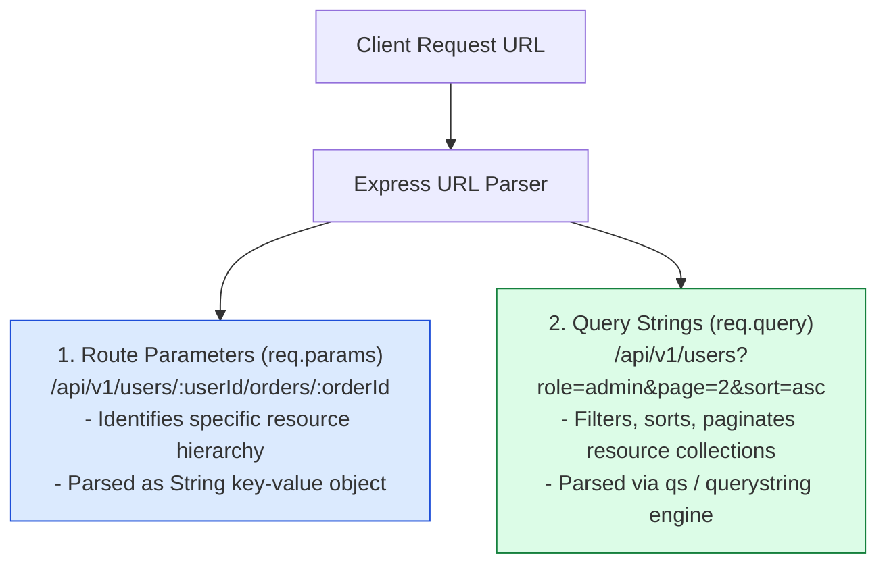
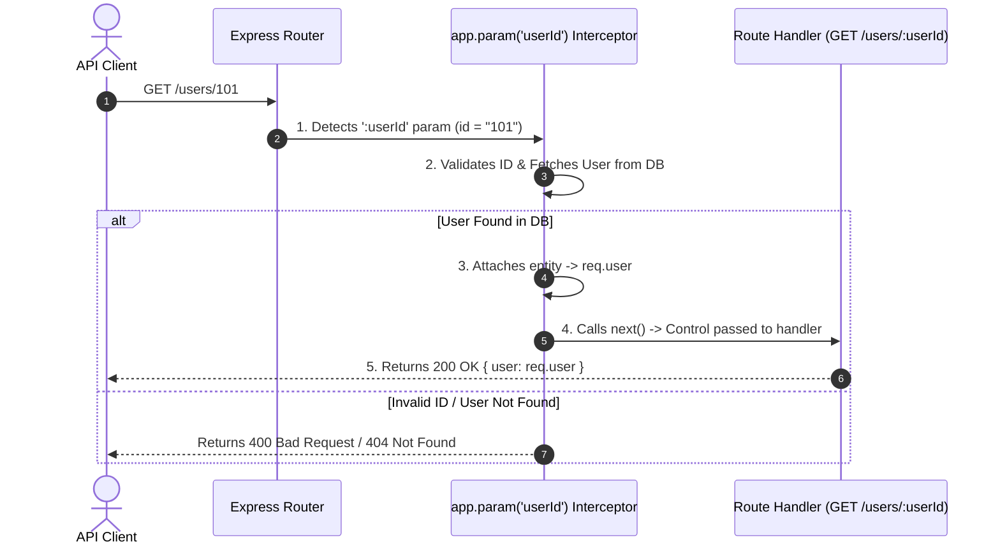
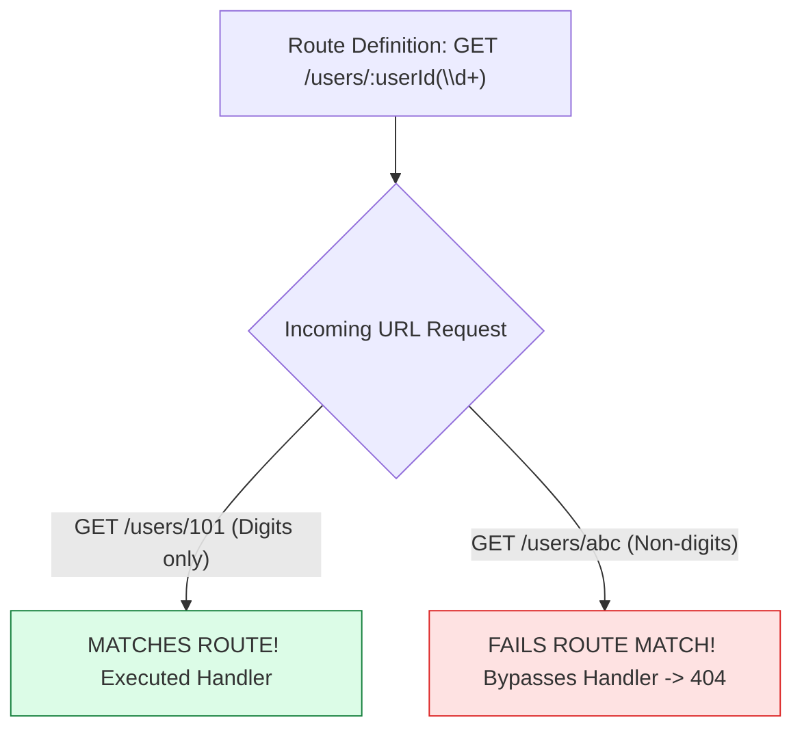

# Module 03: Route Parameters, Query Strings, and Param Interceptor Middleware

## Overview

Express applications capture dynamic client input through **Route Parameters (`req.params`)** embedded directly in the URL path hierarchy, and **Query Strings (`req.query`)** attached after the URL `?` delimiter.

Mastering the structural difference between identifying resources (Path Parameters) versus filtering/sorting resources (Query Strings), applying **Regex Parameter Constraints**, and leveraging **`app.param()` Interceptor Middleware** for entity pre-loading is essential.

---

## 1. Route Parameters vs. Query Strings Architecture



### Route Parameters vs. Query Strings Comparison Matrix

| Aspect | Route Parameters (`req.params`) | Query Strings (`req.query`) |
| :--- | :--- | :--- |
| **URL Syntax** | Embedded path segments: `/users/:id` | Suffix search params: `/users?id=101` |
| **Primary Intent** | **Resource Identification** (Locating specific entity) | **Resource Filtering / Control** (Sorting, pagination) |
| **HTTP Semantics** | Mandatory path requirement for route match | Optional parameter flags (Route matches without query) |
| **Rest API Standard** | `/users/101/orders/5` | `/orders?userId=101&status=PAID` |
| **Validation Layer** | `app.param()` or URL Regex | Joi / Zod Query Schema Validation |

---

## 2. Parameter Interceptor Middleware Flow (`app.param()`)

`app.param()` registers middleware that automatically triggers whenever a specific named route parameter (e.g. `:userId`) is present in the matched route path:



---

## 3. Regex Constrained Route Parameter Matching



---

## 4. Practical Implementation Showcase: Param Interceptor & Query Parser

```javascript
const express = require("express");
const app = express();

app.use(express.json());

// Simulated Database Repository
const mockUserDatabase = new Map([
  [101, { id: 101, name: "Priya Sharma", role: "ADMIN" }],
  [102, { id: 102, name: "Alex Chen", role: "DEVELOPER" }]
]);

// 1. Parameter Interceptor Middleware for ':userId'
app.param("userId", (req, res, next, value) => {
  console.log(`🔍 [PARAM INTERCEPTOR] Intercepted parameter userId = "${value}"`);
  
  const numericId = Number(value);
  if (isNaN(numericId) || numericId <= 0) {
    return res.status(400).json({ error: "INVALID_PARAMETER", message: "User ID must be a positive number" });
  }

  const user = mockUserDatabase.get(numericId);
  if (!user) {
    return res.status(404).json({ error: "USER_NOT_FOUND", message: `No user exists with ID ${numericId}` });
  }

  // Pre-load entity into request object!
  req.targetUser = user;
  next(); // Proceed to route handler
});

// 2. Route consuming pre-loaded param object
app.get("/api/v1/users/:userId", (req, res) => {
  // req.targetUser is guaranteed to exist and be valid!
  res.status(200).json({ success: true, user: req.targetUser });
});

// 3. Regex Constrained Route (Only matches numeric IDs)
app.get("/api/v1/orders/:orderId(\\d+)", (req, res) => {
  res.status(200).json({ orderId: Number(req.params.orderId), status: "DISPATCHED" });
});

// 4. Route consuming Query Strings for Pagination & Filtering
app.get("/api/v1/search", (req, res) => {
  const { q, page = 1, limit = 10, sort = "desc" } = req.query;

  res.status(200).json({
    query: q || null,
    pagination: {
      page: Number(page),
      limit: Number(limit)
    },
    sortOrder: sort
  });
});

// Start Server
app.listen(3000, () => {
  console.log("Route Params Server running on port 3000");
});
```

---

## Key Production Takeaways

1. **Use `app.param()` to DRY Up Database Lookups**: Intercepting dynamic IDs with `app.param()` eliminates repetitive `findById()` database fetching logic across multiple controllers.
2. **Path Params for Identification, Query Strings for Filtering**: Use path parameters (`/users/:id`) for required resource identifiers and query parameters (`/users?status=active`) for optional filters, sorting, and pagination.
3. **Always Coerce and Sanitize Input Types**: `req.params` and `req.query` values are parsed as raw Strings. Always convert numeric inputs (`Number(req.params.id)`) and validate against injection attacks before database queries.
4. **Use Regex Constraints for Precise Matching**: Constrain route parameters with regex (e.g. `:id(\\d+)` or `:uuid([0-9a-fA-F-]+)`) to prevent string paths from accidentally matching numeric endpoints.

