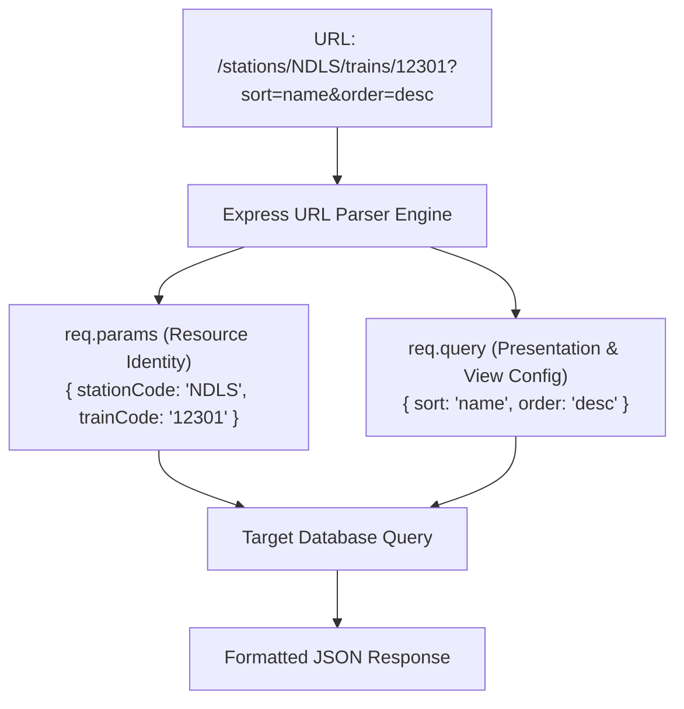

# Module 03: Route Parameters, Query Strings, & Request Validation

## Theoretical Overview & Resource Identification

In web APIs, clients must communicate both **which specific resource** they are requesting and **how** they want that resource formatted or filtered. Express provides two complementary mechanisms on the `req` object:
1. **Route Parameters (`req.params`)**: Named URL segments specified with a colon (`:paramName`) in the route path. Used to identify specific resources.
2. **Query Strings (`req.query`)**: Key-value pairs appended after a `?` in the URL (e.g. `?sort=asc&page=2`). Used to configure presentation, filtering, sorting, or pagination.



### Real-World Analogy: Indian Railway PNR Lookup
Think of Clerk Sharma at the Indian Railways ticket counter:
- **Route Parameter (`/pnr/4521389076`)**: PNR number `4521389076` uniquely identifies the exact passenger reservation record (Resource Identity).
- **Query Strings (`/trains?class=rajdhani&page=1&limit=10`)**: Filters the train display board to show only Rajdhani express trains, paginated 10 records per page (View Config).

---

## 1. Route Parameters vs. Query Strings Comparison Matrix

| Property | Route Parameters (`req.params`) | Query Strings (`req.query`) |
| :--- | :--- | :--- |
| **URL Syntax** | Embedded in path: `/trains/:id` | Appended after `?`: `/trains?class=rajdhani` |
| **Primary Purpose** | Resource Identification (**WHICH** item). | Filtering, Sorting, Pagination (**HOW** to view). |
| **Mandatory Status** | Mandatory part of the matching URL route pattern. | Optional. Missing query keys evaluate to `undefined`. |
| **Data Types** | Always parsed as `String` (Auto-decoded in Express 5). | Always parsed as `String` or `Array` (Needs explicit type casting). |
| **REST Standard** | `/resources/:id` | `/resources?filter=value&sort=key` |

---

## 2. Route Parameters & Query Strings (`block1_paramsAndQuery`)

Express 5 automatically URL-decodes parameter values (`%20` becomes a space). Query parameters are parsed into key-value strings; numbers must be explicitly converted using `parseInt()`.

```javascript
const express = require('express');
const app = express();

const catalog = {
  1: { id: 1, name: 'Rajdhani Express', from: 'NDLS', to: 'BCT', class: 'rajdhani' },
  2: { id: 2, name: 'Shatabdi Express', from: 'NDLS', to: 'CDG', class: 'shatabdi' }
};

// 1. Single Route Parameter (Resource Identification)
app.get('/trains/:id', (req, res) => {
  const train = catalog[req.params.id];
  if (!train) return res.status(404).json({ error: `Train ${req.params.id} not found` });
  res.json(train);
});

// 2. Query Strings for Filtering & Pagination
app.get('/trains', (req, res) => {
  const { class: trainClass, page = '1', limit = '10' } = req.query;
  let results = Object.values(catalog);
  
  if (trainClass) results = results.filter((t) => t.class === trainClass);

  // Cast string query values to integers
  const pageNum = parseInt(page, 10);
  const limitNum = parseInt(limit, 10);
  const start = (pageNum - 1) * limitNum;

  res.json({
    total: results.length,
    page: pageNum,
    limit: limitNum,
    data: results.slice(start, start + limitNum)
  });
});
```

---

## 3. Multiple Parameters, Validation, & Combination (`block2_validationAndMultipleParams`)

Route parameters can be nested to reflect hierarchical resource relationships (e.g. `/stations/:stationCode/trains/:trainCode`). Parameter inputs must be validated to ensure system safety.

```javascript
const app = express();

const stations = {
  NDLS: {
    name: 'New Delhi',
    trains: {
      12301: { code: '12301', name: 'Rajdhani Express' },
      12002: { code: '12002', name: 'Shatabdi Express' }
    }
  }
};

// 1. Multiple Nested Route Parameters
app.get('/stations/:stationCode/trains/:trainCode', (req, res) => {
  const { stationCode, trainCode } = req.params;
  const station = stations[stationCode];
  if (!station) return res.status(404).json({ error: `Station '${stationCode}' not found` });
  
  const train = station.trains[trainCode];
  if (!train) return res.status(404).json({ error: `Train '${trainCode}' not at '${stationCode}'` });
  
  res.json({ station: station.name, train });
});

// 2. Custom Parameter Validation Helper Function
function isPositiveInt(str) {
  if (str.length === 0) return false;
  for (let i = 0; i < str.length; i++) {
    if (str[i] < '0' || str[i] > '9') return false;
  }
  return parseInt(str, 10) > 0;
}

app.get('/pnr/:pnrNumber', (req, res) => {
  const { pnrNumber } = req.params;
  if (!isPositiveInt(pnrNumber)) {
    return res.status(400).json({
      error: 'pnrNumber must be a positive integer',
      received: pnrNumber
    });
  }
  res.json({ pnrNumber: parseInt(pnrNumber, 10), status: `PNR #${pnrNumber} confirmed` });
});

// 3. Combining Resource Params + Presentation Query Options
app.get('/stations/:stationCode/trains', (req, res) => {
  const { stationCode } = req.params;
  const { sort = 'name', order = 'asc' } = req.query;
  const station = stations[stationCode];
  if (!station) return res.status(404).json({ error: `Station '${stationCode}' not found` });

  let trains = Object.values(station.trains);
  trains.sort((a, b) => {
    const cmp = a[sort] < b[sort] ? -1 : a[sort] > b[sort] ? 1 : 0;
    return order === 'desc' ? -cmp : cmp;
  });

  res.json({ station: station.name, sort, order, trains });
});
```

---

## Key Takeaways

1. **Params Identify, Queries Configure**: Use `req.params` for identifying specific resources (`/trains/12301`) and `req.query` for modifying the view (`?sort=asc&limit=10`).
2. **Explicit Type Casting**: Both `req.params` and `req.query` values are strings. Convert numeric strings to numbers (`parseInt(val, 10)`) before arithmetic or database lookups.
3. **Express 5 Decoding**: Express 5 automatically decodes URL-encoded parameter strings (`%20` $\to$ space).
4. **Defensive Validation**: Always validate route parameters inside handlers or validation middleware before using them to query underlying data stores.
