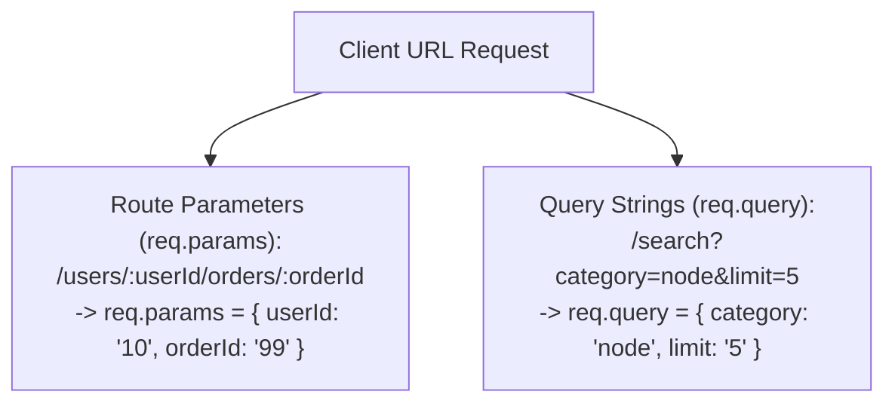

# File 03: Route Parameters and Query Strings

## Overview
Express captures dynamic URL path segments using **Route Parameters (`req.params`)** and URL search parameters using **Query Strings (`req.query`)**. Route parameters can be validated automatically using **`app.param()`** middleware.

---

## 1. Route Parameters vs Query Strings



---

## 2. Dynamic Params & `app.param()` Pre-loading Implementation

```javascript
const express = require("express");
const app = express();

// 1. Pre-loading & Validating Param Middleware via app.param()
app.param("userId", (req, res, next, id) => {
    console.log(`[PARAM INTERCEPTOR] Pre-loading user for ID: ${id}`);
    const numericId = Number(id);
    if (isNaN(numericId)) {
        return res.status(400).json({ error: "Invalid User ID parameter" });
    }
    req.user = { id: numericId, name: "Priya" }; // Attach loaded user to request!
    next();
});

// 2. Route using Dynamic Route Parameters
app.get("/users/:userId", (req, res) => {
    res.status(200).json({ user: req.user });
});

// 3. Route using Query Parameters
app.get("/search", (req, res) => {
    const { q, sort = "asc" } = req.query;
    res.status(200).json({ query: q, sortOrder: sort });
});
```

---

## Key Takeaways
1. Access route parameters via **`req.params`** (`/users/:id`).
2. Access URL query parameters via **`req.query`** (`/search?q=express`).
3. Use **`app.param('paramName', fn)`** to intercept, validate, and pre-load database objects for dynamic URL parameters.
