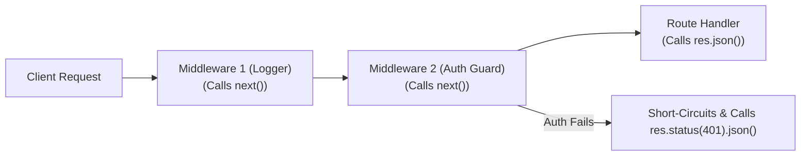

# File 04: Middleware Fundamentals and Pipeline Architecture

## Overview
**Middleware** functions are the core architectural building blocks of Express.js. A middleware function receives the `req` (Request), `res` (Response), and `next` function reference, allowing it to execute code, mutate request/response objects, end the request cycle, or pass control to the next middleware in the pipeline.

---

## 1. Middleware Execution Pipeline



---

## 2. Custom Middleware Pipeline Implementation

```javascript
const express = require("express");
const app = express();

// 1. Application-Level Logger Middleware
const loggerMiddleware = (req, res, next) => {
    req.requestTime = Date.now();
    console.log(`[${new Date().toISOString()}] ${req.method} ${req.url}`);
    next(); // MANDATORY: Pass control to next middleware!
};

// 2. Authentication Guard Middleware
const authGuard = (req, res, next) => {
    const token = req.headers["authorization"];
    if (token === "Bearer secret123") {
        req.user = { id: 101, role: "admin" };
        next();
    } else {
        // Short-circuit pipeline
        res.status(401).json({ error: "UNAUTHORIZED", message: "Invalid token" });
    }
};

app.use(loggerMiddleware);

// Protected Endpoint with Middleware Chain
app.get("/api/admin/dashboard", authGuard, (req, res) => {
    res.status(200).json({ message: `Welcome Admin ${req.user.id}` });
});
```

---

## Key Takeaways
1. Middleware functions **MUST call `next()`** to pass control to the next handler, or end the request with `res.send()` / `res.json()`.
2. Middleware can mutate `req` (e.g. attaching `req.user`), making data available to downstream handlers.
3. Order matters: Middleware registered first with `app.use()` executes first in the pipeline.
