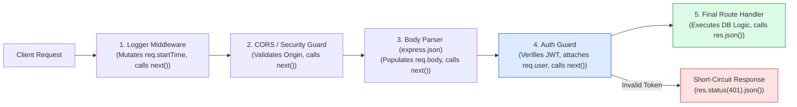
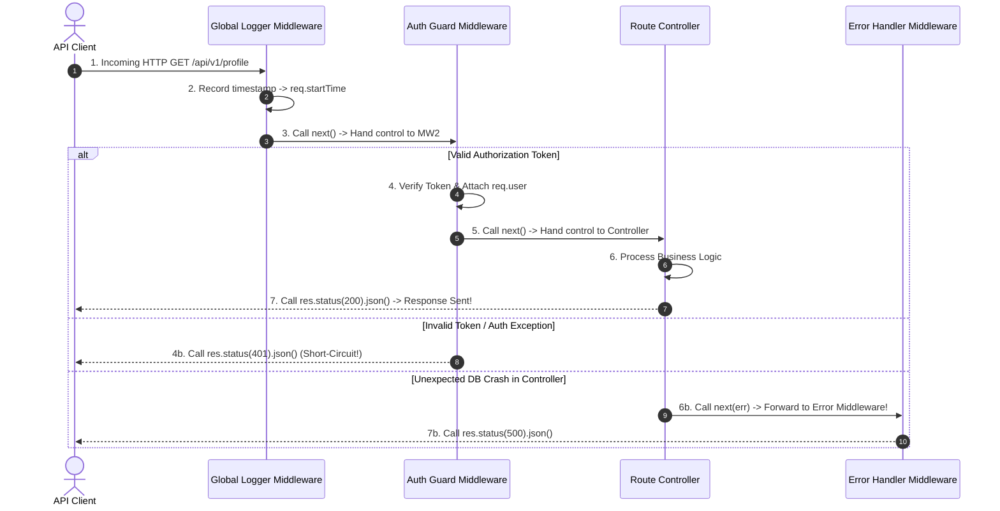
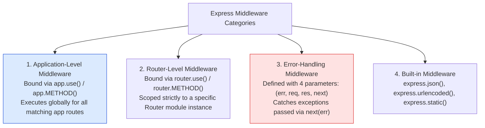

# Module 04: Middleware Fundamentals, Execution Chains, and Pipeline Architecture

## Overview

**Middleware** functions are the primary architectural building blocks of Express.js. A middleware function receives the `req` (Request), `res` (Response), and `next` function reference in its signature: `(req, res, next)`.

Middleware can inspect request payloads, mutate request/response objects, short-circuit execution by sending early responses, or pass control down the execution chain by calling `next()`.

Understanding **Pipeline Execution Order**, **Request Object Mutation (`req.user`)**, **Short-Circuiting**, and **Error Propagation via `next(err)`** is essential.

---

## 1. Express Middleware Pipeline Architecture



---

## 2. Middleware Execution Lifecycle & `next()` Control Flow



---

## 3. Middleware Taxonomy Matrix



### Middleware Category Comparison Matrix

| Middleware Category | Mounting Syntax | Parameter Count | Primary Purpose |
| :--- | :--- | :--- | :--- |
| **Application-Level** | `app.use(fn)` | `3 (req, res, next)` | Global logging, CORS, body parsing |
| **Router-Level** | `router.use(fn)` | `3 (req, res, next)` | Modular feature guards (e.g. `/api/v1/admin/*`) |
| **Route-Specific** | `app.get('/path', fn, handler)` | `3 (req, res, next)` | Specific route validation or authentication |
| **Error-Handling** | `app.use((err, req, res, next) => {})` | **`4 (err, req, res, next)`** | Global exception handling & error responses |

---

## 4. Practical Implementation Showcase: Composable Middleware Pipeline

```javascript
const express = require("express");
const app = express();

app.use(express.json());

// 1. Application-Level Logger & Timing Middleware
const requestLogger = (req, res, next) => {
  req.requestTime = Date.now();
  console.log(`▶ [REQUEST INGEST] ${req.method} ${req.originalUrl}`);

  // Intercept response finish event to calculate total latency
  res.on("finish", () => {
    const duration = Date.now() - req.requestTime;
    console.log(`  ✓ [RESPONSE SENT] ${req.method} ${req.originalUrl} -> Status ${res.statusCode} (${duration}ms)`);
  });

  next(); // Mandatory: Pass control to next layer in pipeline!
};

// 2. Authentication Guard Middleware with Short-Circuit Capability
const requireAuthentication = (req, res, next) => {
  const authHeader = req.headers["authorization"];

  if (!authHeader || !authHeader.startsWith("Bearer ")) {
    // SHORT-CIRCUIT PIPELINE: Return early response, do NOT call next()!
    return res.status(401).json({
      error: "UNAUTHORIZED",
      message: "Missing or malformed Authorization Bearer header"
    });
  }

  const token = authHeader.split(" ")[1];
  if (token !== "valid_secret_token_123") {
    return res.status(403).json({ error: "FORBIDDEN", message: "Invalid or expired access token" });
  }

  // Mutate Request Object by attaching user payload
  req.user = { id: 101, name: "Priya Sharma", role: "ADMIN" };
  next(); // Pass control to downstream handler
};

// 3. Register Global Middleware
app.use(requestLogger);

// 4. Mount Protected Route Chain
app.get("/api/v1/profile", requireAuthentication, (req, res) => {
  // Access data populated by upstream middleware!
  res.status(200).json({
    success: true,
    user: req.user
  });
});

// Start Server
app.listen(3000, () => {
  console.log("Middleware Fundamentals Server running on port 3000");
});
```

---

## Key Production Takeaways

1. **Always Call `next()` or Send a Response**: Every path branch in a middleware function must explicitly call `next()` or terminate the HTTP cycle using a `res` method (`res.json()`, `res.send()`). Hanging requests occur when a branch omits both.
2. **Order of Registration Determines Execution Order**: Express executes middleware sequentially in the exact order they are registered via `app.use()`. Global parsers and loggers must be registered before route handlers.
3. **Mutate `req` Object for Cross-Cutting Data**: Pass contextual data downstream (authenticated user, request ID, start time) by mutating `req` properties (e.g. `req.user = user`).
4. **Pass Async Errors to `next(err)`**: In Express 4.x, asynchronous errors occurring inside `Promise` catches or `async/await` blocks must be passed explicitly to `next(err)` to trigger 4-parameter error handlers.

