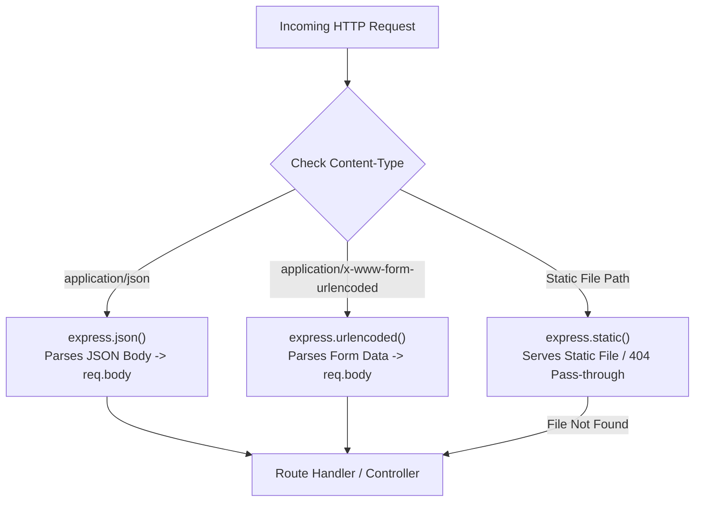

# Module 05: Express Built-in Middleware — Body Parsing & Static Assets

## Theoretical Overview & Built-In Parsers

Express ships with core built-in middleware to handle the three most common web server tasks without requiring external npm dependencies:
1. **`express.json()`**: Parses incoming payloads with `Content-Type: application/json`.
2. **`express.urlencoded()`**: Parses incoming payloads with `Content-Type: application/x-www-form-urlencoded` (HTML forms).
3. **`express.static()`**: Serves static files (HTML, CSS, JS, images, PDFs) directly from a specified directory.



### Real-World Analogy: Swiggy Order Processing Engine
Imagine Swiggy's central order receiving hub:
- **`express.json()`**: Processes mobile app orders sent as clean JSON payloads from Android/iOS devices.
- **`express.urlencoded()`**: Processes partner restaurant registration forms submitted via standard web forms.
- **`express.static()`**: Delivers restaurant logo images, promo banners, and static help documents directly from storage without executing complex backend code.

---

## 1. Built-In Middleware Technical Comparison

| Middleware | Target Content-Type | Default Output | Key Configuration Options |
| :--- | :--- | :--- | :--- |
| **`express.json()`** | `application/json` | Populates `req.body` with parsed JS object/array. | `limit` (e.g. `'100kb'`), `strict` (only objects/arrays), `reviver`. |
| **`express.urlencoded()`** | `application/x-www-form-urlencoded` | Populates `req.body` with parsed form keys. | `extended: true` (uses `qs` for nested objects), `limit`, `depth`. |
| **`express.static()`** | GET/HEAD requests matching static files. | Writes raw file stream directly to `res`. | `maxAge`, `index`, `dotfiles`, `etag`, `lastModified`. |
| **`express.text()`** | `text/plain` | Populates `req.body` with raw string. | `limit`, `defaultCharset`. |
| **`express.raw()`** | `application/octet-stream` | Populates `req.body` with a `Buffer`. | `limit`. |

---

## 2. Body Parsing Configuration (`block1_bodyParsing`)

Without body-parsing middleware mounted, `req.body` will evaluate to `undefined`. Setting `extended: true` in `express.urlencoded()` delegates parsing to the `qs` library, enabling rich nested object creation (e.g., `address[city]=Mumbai` $\to$ `{ address: { city: 'Mumbai' } }`).

```javascript
const express = require('express');
const app = express();

// 1. Mount JSON Body Parser with 50kb Size Cap
app.use(express.json({ limit: '50kb' }));

// 2. Mount URL-Encoded Form Parser (extended: true allows nested objects via 'qs')
app.use(express.urlencoded({ extended: true, limit: '50kb' }));

// JSON Order Endpoint
app.post('/orders/json', (req, res) => {
  res.json({ received: 'json', body: req.body });
});

// Form-Encoded Endpoint (Handles both flat & nested form inputs)
app.post('/orders/form', (req, res) => {
  res.json({ received: 'urlencoded', body: req.body });
});
```

---

## 3. Static Assets Serving (`block2_staticFiles`)

`express.static()` serves static assets from a designated root directory. Mounting it under a virtual path prefix (e.g., `/static`) organizes asset URLs. If a requested URL does not match a file in the directory, `express.static()` calls `next()` to pass control down to subsequent dynamic routes.

```javascript
const express = require('express');
const fs = require('fs');
const path = require('path');
const app = express();

const publicDir = path.join(__dirname, 'public');

// Mount Static Middleware under Virtual Path Prefix '/static'
app.use('/static', express.static(publicDir, {
  dotfiles: 'ignore',  // Block requests to hidden files (e.g. .secret, .env)
  index: 'index.html', // Serve index.html by default for directory requests
  maxAge: '1h',        // Set Cache-Control HTTP header (max-age=3600)
  etag: true,          // Generate ETag HTTP headers for browser caching validation
}));

// Coexisting Dynamic API Route
app.get('/api/status', (req, res) => {
  res.json({ status: 'operational' });
});
```

---

## Key Takeaways

1. **Mandatory for Body Access**: You must mount `express.json()` or `express.urlencoded()` for Express to parse incoming payload streams into `req.body`.
2. **`extended: true` vs. `false`**: Always pass `extended: true` to `express.urlencoded()` to support rich, nested object parsing via the `qs` library.
3. **Payload Protection**: Always specify a payload size limit (`limit: '100kb'`) to defend your server against Denial of Service (DoS) memory exhaustion attacks.
4. **Security for Static Assets**: Configure `dotfiles: 'ignore'` in `express.static()` options to prevent accidental exposure of dotfiles (`.env`, `.secret`).
5. **Non-Blocking Static Fallback**: If `express.static()` cannot find a matching file, it seamlessly calls `next()` to let dynamic API handlers handle the request.
