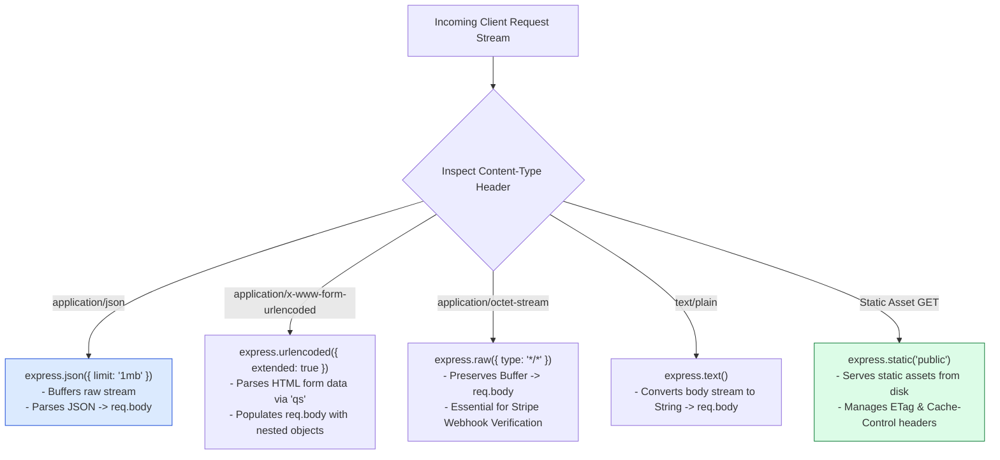
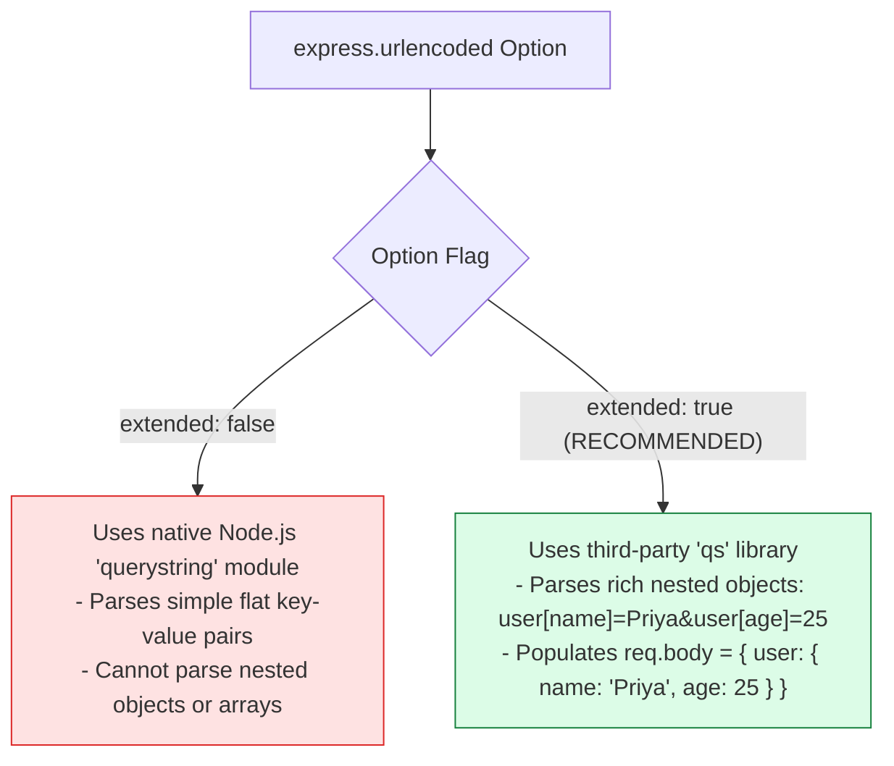
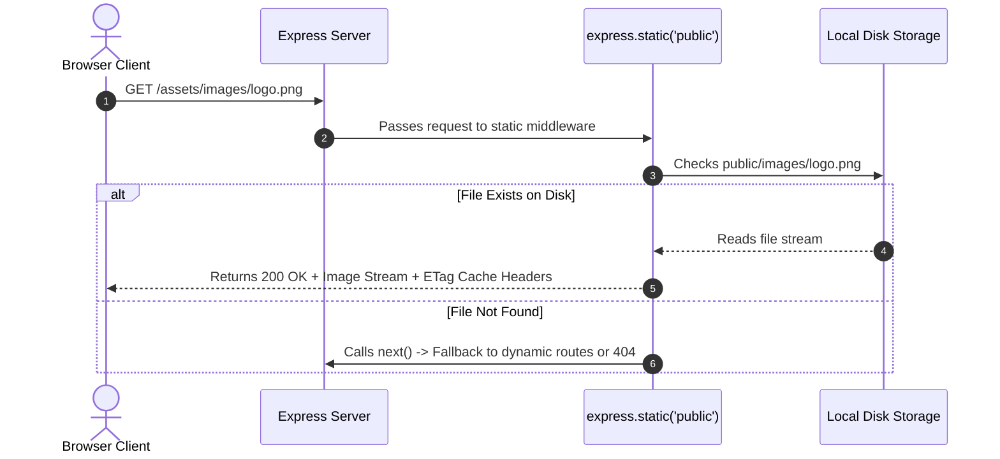

# Module 05: Express Built-in Middleware Options, Body Parsers, and Static File Serving

## Overview

Express includes essential built-in middleware out of the box to handle common web tasks without requiring external libraries: **`express.json()`**, **`express.urlencoded()`**, **`express.raw()`**, **`express.text()`**, and **`express.static()`**.

Understanding body parser options like payload size guards (`limit: '1mb'`), extended form parsing (`extended: true` vs `false`), raw buffer handling for webhook signature verification, and static asset directory mounting is essential.

---

## 1. Built-in Middleware Processing Pipeline



---

## 2. URL-Encoded Form Data Parser: `extended: true` vs `extended: false`



### Built-in Middleware Feature Matrix

| Middleware Function | Target `Content-Type` Header | Resulting `req.body` Data Type | Key Configuration Options |
| :--- | :--- | :--- | :--- |
| **`express.json()`** | `application/json` | Parsed JavaScript Object | `limit`, `strict`, `reviver`, `type` |
| **`express.urlencoded()`** | `application/x-www-form-urlencoded` | Parsed Key-Value Object | `extended: true` (`qs`), `limit`, `parameterLimit` |
| **`express.raw()`** | `application/octet-stream` | `Buffer` instance | `limit`, `type: 'application/octet-stream'` |
| **`express.text()`** | `text/plain` | Primitive `String` | `limit`, `defaultCharset`, `type` |
| **`express.static()`** | GET requests for disk files | Binary File Stream (Response) | `maxAge`, `etag`, `index`, `dotfiles` |

---

## 3. Static File Server Architecture (`express.static()`)



---

## 4. Practical Implementation Showcase: Comprehensive Built-in Middleware

```javascript
const express = require("express");
const path = require("path");
const app = express();

// 1. JSON Body Parser with Payload Limit Guard (Prevents Denial of Service)
app.use(express.json({ limit: "500kb", strict: true }));

// 2. URL-Encoded Form Parser (extended: true for nested objects)
app.use(express.urlencoded({ extended: true, limit: "1mb" }));

// 3. Raw Body Parser (Mounted specifically for Webhooks requiring raw buffer signatures)
app.use("/api/v1/webhooks/stripe", express.raw({ type: "application/json" }));

// 4. Static Asset Mount (Public directory mounted under /static Virtual Path)
app.use("/static", express.static(path.join(__dirname, "public"), {
  maxAge: "1d",     // Cache static assets for 1 day
  etag: true,       // Generate ETag validation headers
  dotfiles: "ignore"// Ignore hidden files like .env
}));

// Route handling form submission with nested objects
app.post("/submit-profile", (req, res) => {
  console.log("Parsed URL-Encoded Form Body:", req.body);
  res.status(200).json({
    message: "Profile form processed",
    receivedData: req.body
  });
});

// Route handling webhook with raw Buffer payload
app.post("/api/v1/webhooks/stripe", (req, res) => {
  const isBuffer = Buffer.isBuffer(req.body);
  console.log(`Webhook Received. Payload is Buffer: ${isBuffer}`);
  res.status(200).send("Webhook Received");
});

// Start Server
app.listen(3000, () => {
  console.log("Built-in Middleware Server running on port 3000");
});
```

---

## Key Production Takeaways

1. **Always Set Payload Size Limits**: Set `limit: '100kb'` or `limit: '1mb'` on `express.json()` and `express.urlencoded()` to defend against memory exhaustion DoS attacks via huge request bodies.
2. **Use `extended: true` for `express.urlencoded()`**: Always pass `{ extended: true }` to leverage the `qs` library, enabling rich nested object parsing from complex HTML forms.
3. **Use `express.raw()` for Webhook Verification**: Services like Stripe or GitHub require verifying signatures against the *unparsed raw buffer body*. Mount `express.raw()` before `express.json()` on webhook endpoints.
4. **Use Absolute Paths with `express.static()`**: Always construct static directory paths using `path.join(__dirname, 'public')` to prevent path resolution failures when starting Node processes from different working directories.

