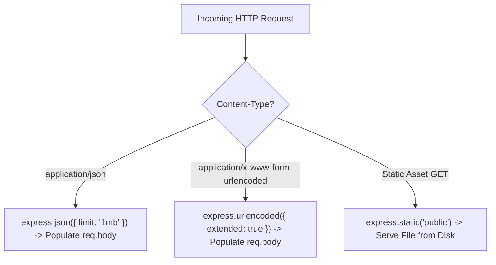

# File 05: Express Built-in Middleware (json, urlencoded, static)

## Overview
Express includes essential built-in middleware functions out of the box: **`express.json()`** (parses JSON request bodies), **`express.urlencoded()`** (parses URL-encoded form submissions), and **`express.static()`** (serves static files).

---

## 1. Built-in Middleware Processing Pipeline



---

## 2. Built-in Middleware Implementation

```javascript
const express = require("express");
const path = require("path");

const app = express();

// 1. JSON Body Parser (Limits payload size to 1MB)
app.use(express.json({ limit: "1mb" }));

// 2. URL-Encoded Form Data Parser (extended: true uses 'qs' library for nested objects)
app.use(express.urlencoded({ extended: true }));

// 3. Static File Server
app.use("/assets", express.static(path.join(__dirname, "public")));

// Route Handling Form Submissions
app.post("/submit-form", (req, res) => {
    console.log("Parsed Form Body:", req.body);
    res.status(200).json({ status: "Form received", data: req.body });
});
```

---

## Key Takeaways
1. **`express.json()`** is required to read JSON payloads sent in `POST`, `PUT`, `PATCH` requests.
2. Pass **`extended: true`** to `express.urlencoded()` to support rich nested objects and arrays in form data.
3. Use **`express.static(directory)`** to serve images, CSS, and JS files cleanly.
