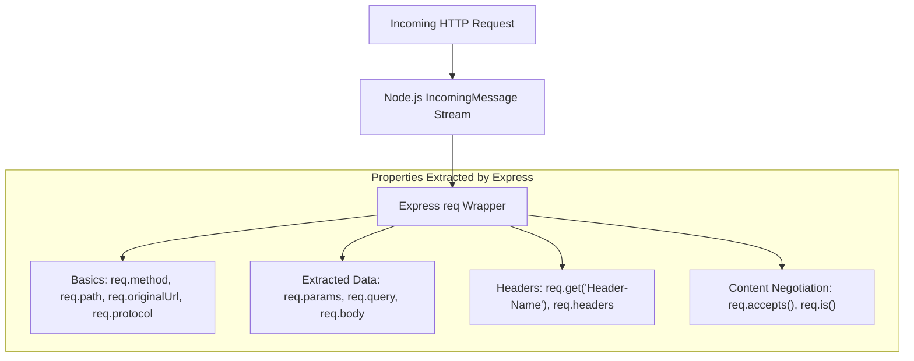
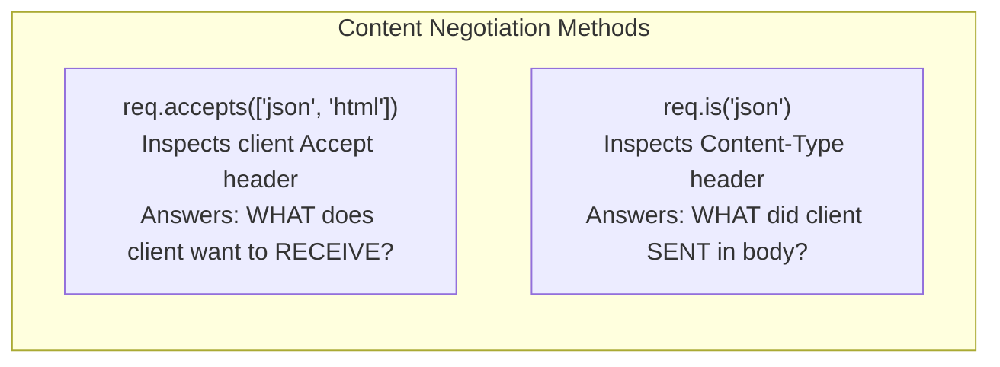

# Module 06: Express Request Object (`req`) — Properties, Headers, & Content Negotiation

## Theoretical Overview & `req` Object Architecture

In Express.js, the **Request object (`req`)** is an enhanced wrapper around Node's native `http.IncomingMessage`. It represents the HTTP request initiated by a client and contains properties for inspecting query parameters, route parameters, request body payloads, HTTP headers, client IP addresses, cookies, and content negotiation directives.



### Real-World Analogy: Police Station FIR Intake Form
Think of SHO Pandey taking down a formal First Information Report (FIR) at a Delhi police station:
- **`req.method` & `req.path`**: Identifies the type of incident being reported (e.g. `POST /complaints`).
- **`req.get('X-FIR-Priority')`**: Checks the urgency tag stamped on the file folder (case-insensitive header inspection).
- **`req.accepts('json')`**: Checks whether the complainant wants a digital copy sent via JSON or a physical printed receipt (`text/html`).
- **`req.is('json')`**: Verifies if the evidence attached to the file is digital JSON or raw physical text.

---

## 1. Primary `req` Properties Reference Matrix

| Property / Method | Returns | Description & Example |
| :--- | :--- | :--- |
| **`req.method`** | `String` | The HTTP request method (e.g. `'GET'`, `'POST'`, `'PUT'`). |
| **`req.path`** | `String` | The URL path component without query strings (e.g. `'/inspect/42'`). |
| **`req.originalUrl`** | `String` | The full original URL including query strings (e.g. `'/inspect/42?sort=name'`). |
| **`req.params`** | `Object` | Object containing dynamic route parameters defined in path (e.g. `{ id: '42' }`). |
| **`req.query`** | `Object` | Object containing query string key-value pairs (e.g. `{ sort: 'name' }`). |
| **`req.body`** | `Object` / `String` | Parsed request payload body populated by body-parser middleware. |
| **`req.get(headerName)`** | `String` | Retrieves specified HTTP header value (**case-insensitive**, e.g., `req.get('Content-Type')`). |
| **`req.protocol`** | `String` | Returns HTTP protocol string (`'http'` or `'https'`). |
| **`req.hostname`** | `String` | Returns hostname derived from `Host` header (e.g. `'127.0.0.1'`). |

---

## 2. Inspecting Request Properties (`block1`)

`req.get('Header-Name')` provides case-insensitive header retrieval (e.g., `req.get('x-fir-priority')` and `req.get('X-FIR-Priority')` return identical values).

```javascript
const express = require('express');
const app = express();

app.use(express.json());

// Inspecting URL parameters, query parameters, and custom headers
app.get('/inspect/:id', (req, res) => {
  res.json({
    basics: {
      method: req.method,           // 'GET'
      path: req.path,               // '/inspect/42'
      originalUrl: req.originalUrl, // '/inspect/42?sort=name'
      protocol: req.protocol,       // 'http'
      hostname: req.hostname,       // '127.0.0.1'
    },
    extracted: {
      query: req.query,             // { sort: 'name' }
      params: req.params,           // { id: '42' }
    },
    headerInfo: {
      customHeader: req.get('X-FIR-Priority'), // Case-insensitive lookup
    },
  });
});

// Inspecting POST body payloads and Content-Type header
app.post('/complaints', (req, res) => {
  res.json({
    receivedBody: req.body,
    contentType: req.get('Content-Type'),
  });
});
```

---

## 3. Content Negotiation: `req.accepts()` & `req.is()` (`block2`)

Content negotiation allows clients and servers to agree on the data format used for transmission:
- **`req.accepts(types)`**: Checks if the client accepts specified MIME types based on the incoming `Accept` header. Returns the best match string, or `false` if none match.
- **`req.is(type)`**: Checks if the incoming request payload matches a specific MIME type based on the `Content-Type` header. Returns the matched string or `false`.



```javascript
const app = express();
app.use(express.json());
app.use(express.text());

// 1. req.accepts() - Determines optimal output format based on client Accept header
app.get('/evidence', (req, res) => {
  const preferred = req.accepts(['json', 'html', 'text']);
  
  if (preferred === 'json') {
    return res.json({ preferred, acceptsXml: req.accepts('xml') !== false });
  }
  if (preferred === 'html') {
    return res.type('html').send('<pre>Evidence report</pre>');
  }
  res.type('text').send('Evidence report (text)');
});

// 2. req.is() - Validates incoming payload MIME type based on Content-Type header
app.post('/evidence', (req, res) => {
  res.json({
    isJson: req.is('json'),       // Returns 'json' or false
    isText: req.is('text/*'),     // Supports wildcard sub-types
    bodyReceived: req.body,
  });
});
```

---

## Key Takeaways

1. **Full URL Visibility**: `req.path` gives the route path without queries, whereas `req.originalUrl` provides the unparsed original URL path and query string.
2. **Parsed Payloads**: `req.params` and `req.query` are automatically populated by Express; `req.body` requires appropriate parsing middleware (`express.json()`).
3. **Case-Insensitive Header Extraction**: Use `req.get('Header-Name')` to retrieve HTTP headers cleanly without worrying about casing.
4. **Client Preference Matching**: Use `req.accepts()` to negotiate response formatting based on the client's `Accept` header.
5. **Incoming Body Verification**: Use `req.is()` to verify incoming payload content types before parsing or executing business logic.
