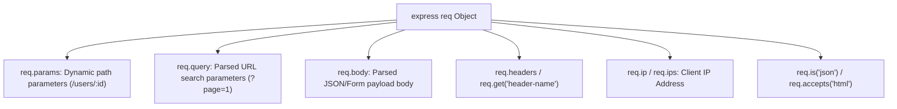

# File 06: Express Request Object (req) Deep Dive

## Overview
The Express **`req` (Request)** object represents the HTTP request coming from the client, enhancing Node's native `http.IncomingMessage` with properties like `req.params`, `req.query`, `req.body`, `req.headers`, `req.ip`, `req.get()`, and `req.is()`.

---

## 1. Request Object Properties Architecture



---

## 2. Request Object Inspection Implementation

```javascript
const express = require("express");
const app = express();

app.use(express.json());

app.post("/api/inspect/:category", (req, res) => {
    // 1. Inspecting Request Metadata
    const userAgent = req.get("User-Agent");
    const isJson = req.is("application/json");
    
    console.log("Category Param:", req.params.category);
    console.log("Query String:", req.query);
    console.log("Request Body:", req.body);
    console.log("Client IP:", req.ip);
    console.log("User-Agent Header:", userAgent);

    res.status(200).json({
        category: req.params.category,
        query: req.query,
        body: req.body,
        isJson,
        clientIp: req.ip
    });
});
```

---

## Key Takeaways
1. Use **`req.get('Header-Name')`** to retrieve case-insensitive request headers.
2. Use **`req.is('type')`** to check if the incoming request `Content-Type` matches a specific MIME type.
3. Access parsed client IP addresses via **`req.ip`** (enable `app.set('trust proxy', true)` when running behind load balancers like Nginx).
