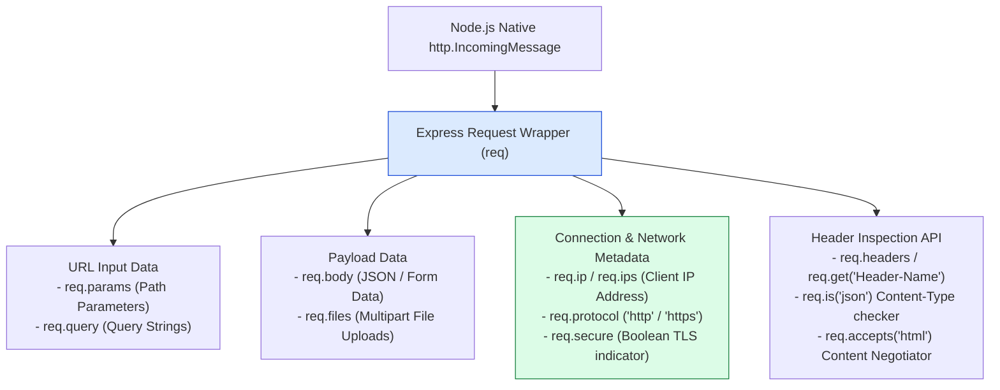
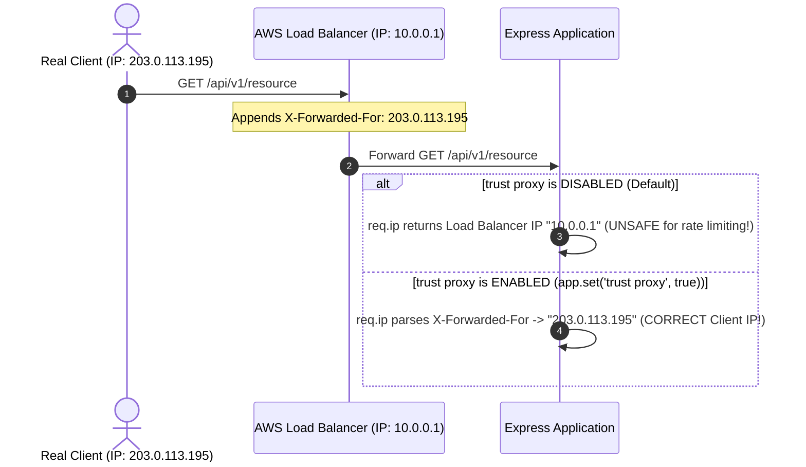
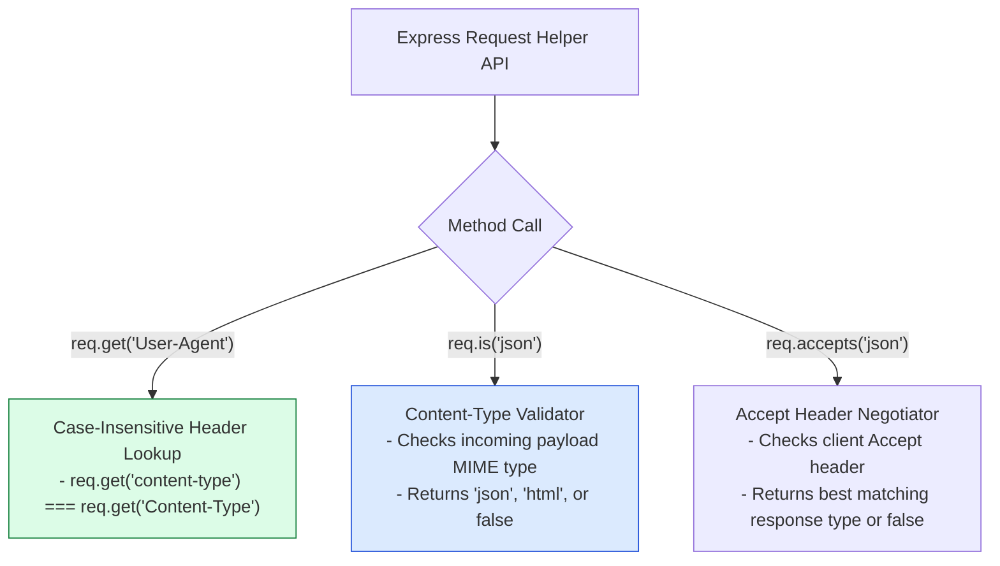

# Module 06: Express Request (`req`) Object Architecture and Inspection API

## Overview

The Express **`req` (Request)** object represents the incoming HTTP request stream sent by a client. It wraps Node.js's native `http.IncomingMessage` prototype, decorating it with high-level properties (`req.params`, `req.query`, `req.body`, `req.headers`, `req.ip`) and helper methods (`req.get()`, `req.is()`, `req.accepts()`).

Mastering request metadata extraction, content-type negotiation, and reverse proxy IP address resolution (`trust proxy`) is essential for building production APIs.

---

## 1. Express Request (`req`) Object Taxonomy Architecture



---

## 2. Reverse Proxy Client IP Resolution Architecture (`trust proxy`)

When Express runs behind a Reverse Proxy or Load Balancer (Nginx, AWS ALB, Cloudflare), `req.ip` returns the proxy server's internal IP address unless `trust proxy` is enabled:



---

## 3. Content Negotiation & Header Inspection API Matrix



### Express Request Property API Matrix

| Property / Method | Data Type / Return | Description & Primary Use Case |
| :--- | :--- | :--- |
| **`req.params`** | Object | Parsed path parameters (`/users/:id` -> `{ id: '101' }`) |
| **`req.query`** | Object | Parsed URL query parameters (`?page=2` -> `{ page: '2' }`) |
| **`req.body`** | Object / Buffer / String | Parsed body payload (populated by body-parser middleware) |
| **`req.get(name)`** | String \| undefined | Case-insensitive header lookup (`req.get('Authorization')`) |
| **`req.ip`** | String | Client IP address (respects `X-Forwarded-For` if `trust proxy` set) |
| **`req.protocol`** | String | Request protocol (`http` or `https`) |
| **`req.secure`** | Boolean | `true` if connection is TLS/SSL encrypted (`req.protocol === 'https'`) |
| **`req.is(type)`** | String \| false | Checks if incoming `Content-Type` matches specified MIME type |
| **`req.accepts(types)`** | String \| false | Returns best acceptable response format based on `Accept` header |

---

## 4. Practical Implementation Showcase: Request Inspection API

```javascript
const express = require("express");
const app = express();

// Enable Trust Proxy when deployed behind Nginx / AWS ALB
app.set("trust proxy", true);

app.use(express.json());

// Request Inspector Endpoint
app.post("/api/v1/inspect/:category", (req, res) => {
  // 1. Header Inspection using req.get() (Case-insensitive)
  const userAgent = req.get("User-Agent");
  const authHeader = req.get("authorization");
  const clientHost = req.get("host");

  // 2. Content-Type Inspection using req.is()
  const isJsonPayload = req.is("application/json");

  // 3. Content Negotiation using req.accepts()
  const prefersJson = req.accepts("json");
  const prefersHtml = req.accepts("html");

  // Log Request Diagnostics
  console.log("=== INCOMING REQUEST DIAGNOSTICS ===");
  console.log(`Path Category Param: ${req.params.category}`);
  console.log(`Query String Params:`, req.query);
  console.log(`Client IP Address  : ${req.ip} (Protocol: ${req.protocol}, Secure: ${req.secure})`);
  console.log(`User-Agent Header  : ${userAgent}`);

  if (!prefersJson && prefersHtml) {
    return res.status(406).send("<h1>406 Not Acceptable: Client accepts HTML only</h1>");
  }

  res.status(200).json({
    diagnostics: {
      category: req.params.category,
      queryParams: req.query,
      bodyPayload: req.body,
      isJsonPayload,
      clientIp: req.ip,
      protocol: req.protocol,
      isSecure: req.secure,
      host: clientHost,
      userAgent
    }
  });
});

// Start Server
app.listen(3000, () => {
  console.log("Request Object Server running on port 3000");
});
```

---

## Key Production Takeaways

1. **Enable `app.set('trust proxy', true)` Behind Load Balancers**: Always enable proxy trust when deploying behind Nginx, Cloudflare, or AWS ALB so that `req.ip` and `req.protocol` accurately reflect the original client's IP address and HTTPS protocol.
2. **Use `req.get()` for Case-Insensitive Header Retrieval**: Never access `req.headers['authorization']` directly with strict case assumptions. `req.get('authorization')` or `req.get('Authorization')` handles case normalization automatically.
3. **Validate Incoming Payload Types with `req.is()`**: Use `req.is('json')` inside route handlers or middleware to ensure incoming `POST`/`PUT` requests supply the expected `Content-Type` before processing.
4. **Leverage `req.accepts()` for Content Negotiation**: Use `req.accepts(['json', 'html', 'xml'])` to build APIs capable of returning JSON for API clients and HTML/XML for browser legacy clients dynamically.

