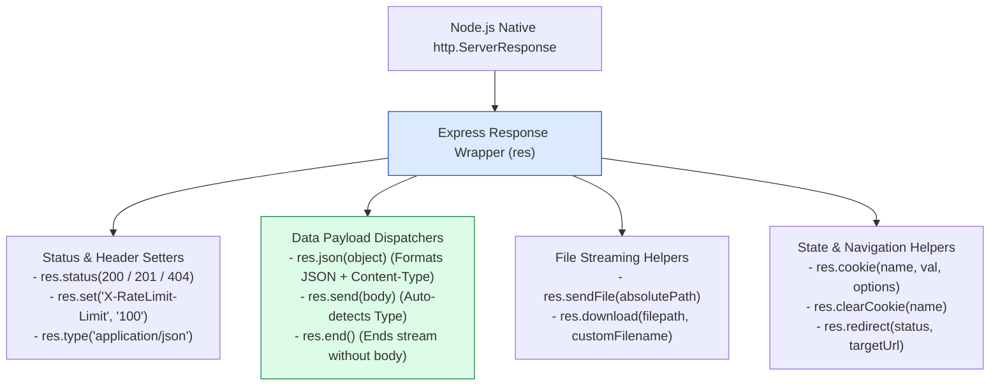
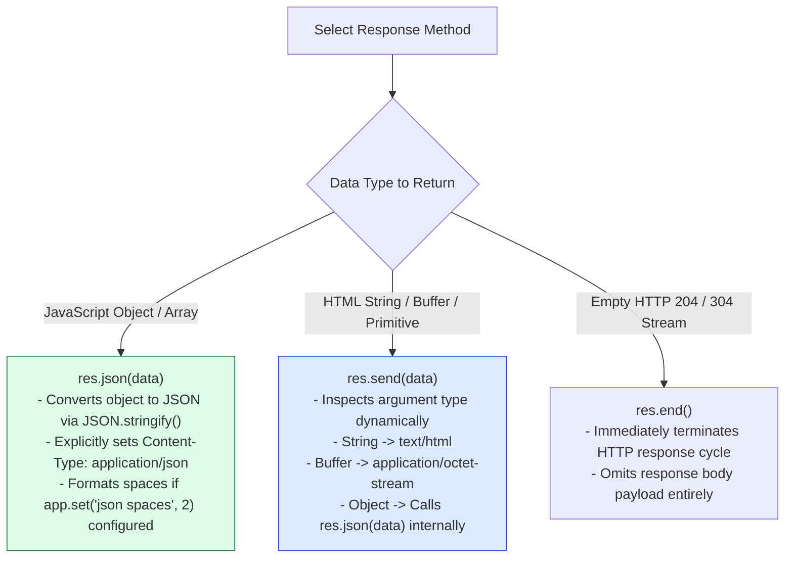

# Module 07: Express Response (`res`) Object Architecture, Chaining, and Output Helpers

## Overview

The Express **`res` (Response)** object represents the HTTP response stream sent back to a client. Wrapping Node.js's native `http.ServerResponse`, Express enhances `res` with chainable utility methods (`res.status()`, `res.json()`, `res.send()`, `res.sendFile()`, `res.download()`, `res.redirect()`, `res.cookie()`).

Understanding response method chaining, the differences between `res.send()` vs `res.json()`, stream-based file transfers, and HTTP response header/cookie management is essential.

---

## 1. Express Response (`res`) Object API Architecture



---

## 2. Response Payload Methods Comparison: `res.send()` vs. `res.json()` vs. `res.end()`



### Express Response Helper Comparison Matrix

| Response Method | Parameter Types | Automatic `Content-Type` Header | Primary Production Use Case |
| :--- | :--- | :--- | :--- |
| **`res.json(obj)`** | Object, Array, String, Number | `application/json; charset=utf-8` | REST API JSON endpoints |
| **`res.send(body)`** | Buffer, String, Object, Array | Dynamic (`text/html`, `application/json`, etc.) | General HTML string / buffer delivery |
| **`res.sendFile(path)`**| Absolute file path | Auto-detected from file extension (MIME) | Streaming static files / HTML single-page apps |
| **`res.download(path)`**| Absolute path, optional name | `application/octet-stream` + `Content-Disposition` | Browser attachment file downloads |
| **`res.redirect(url)`** | Status code (optional), URL | `text/plain` + `Location: /target-url` | Web redirects (301 Permanent / 302 Found) |
| **`res.end()`** | None / Buffer | None | Terminating empty 204 No Content responses |

---

## 3. File Transfer Stream Architecture (`res.sendFile` vs `res.download`)

```mermaid
sequenceDiagram
    autonumber
    actor Client as Browser Client
    participant App as Express Controller
    participant FS as Disk File System

    alt Render in Browser (res.sendFile)
        Client->>App: GET /view/document.pdf
        App->>FS: Streams document.pdf
        FS-->>Client: Returns 200 OK (Content-Type: application/pdf) -> Rendered inline!
    else Prompt Save File (res.download)
        Client->>App: GET /download/report
        App->>FS: Streams report.pdf
        FS-->>Client: Returns 200 OK + Header Content-Disposition: attachment; filename="report.pdf" -> Browser Save Dialog!
    end
```

---

## 4. Practical Implementation Showcase: Comprehensive Response API

```javascript
const express = require("express");
const path = require("path");
const app = express();

app.use(express.json());

// 1. Chained Status & JSON Response
app.get("/api/v1/users/:id", (req, res) => {
  const userId = Number(req.params.id);

  if (userId !== 101) {
    // Chain status(404) with json error payload
    return res.status(404).json({
      error: "USER_NOT_FOUND",
      message: `No active user found with ID ${userId}`
    });
  }

  // Set custom response headers before sending JSON
  res.set("X-API-Version", "v1.2.0");
  res.status(200).json({ id: 101, name: "Priya Sharma", role: "ENGINEER" });
});

// 2. Cookie Setting & Clearing Endpoint
app.post("/api/v1/auth/session", (req, res) => {
  // Set HttpOnly, Secure Session Cookie
  res.cookie("sessionId", "sess_991823ab88172", {
    httpOnly: true,
    secure: process.env.NODE_ENV === "production",
    sameSite: "strict",
    maxAge: 3600000 // 1 hour TTL
  });

  res.status(201).json({ message: "Session established and cookie attached" });
});

// 3. File Download Response Prompt
app.get("/api/v1/reports/monthly", (req, res) => {
  const reportPath = path.join(__dirname, "public", "report.pdf");

  // Prompts browser file download with custom target filename
  res.download(reportPath, "Financial_Report_2026.pdf", (err) => {
    if (err) {
      console.error("File Transfer Interrupted:", err.message);
      if (!res.headersSent) {
        res.status(500).json({ error: "FILE_TRANSFER_FAILED" });
      }
    }
  });
});

// 4. HTTP Redirection Endpoint
app.get("/legacy-login", (req, res) => {
  // 301 Permanent Redirect to modern auth endpoint
  res.redirect(301, "/api/v1/auth/session");
});

// Start Server
app.listen(3000, () => {
  console.log("Response Object Server running on port 3000");
});
```

---

## Key Production Takeaways

1. **Use `res.status(code).json(payload)` for REST APIs**: Explicitly chaining `.status(code)` before `.json()` ensures clean, readable, self-documenting controller code.
2. **Prevent "Cannot set headers after they are sent to the client"**: Once a response dispatcher (`res.json()`, `res.send()`, `res.redirect()`) executes, return immediately (`return res.json()`) to prevent subsequent code paths from invoking a second response.
3. **Use `res.download()` for File Downloads**: `res.download()` automatically attaches the `Content-Disposition: attachment` header, instructing user browsers to prompt a save dialog rather than rendering the file inline.
4. **Enforce `HttpOnly` and `SameSite` on `res.cookie()`**: Always configure `httpOnly: true` (prevents XSS cookie theft) and `sameSite: 'strict'` or `'lax'` (prevents CSRF attacks) when setting authentication cookies.

