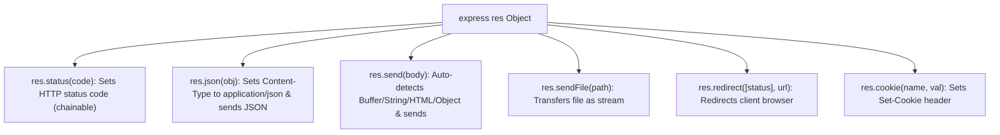

# File 07: Express Response Object (res) Deep Dive

## Overview
The Express **`res` (Response)** object represents the HTTP response sent back to the client, providing helper methods like `res.json()`, `res.status()`, `res.send()`, `res.sendFile()`, `res.redirect()`, `res.cookie()`, and `res.location()`.

---

## 1. Express Response Helpers Taxonomy



---

## 2. Response Object Implementation

```javascript
const express = require("express");
const path = require("path");

const app = express();

// 1. JSON API Response with Status Code Chaining
app.get("/api/v1/user", (req, res) => {
    res.status(200).json({ id: 101, name: "Priya" });
});

// 2. File Download / Transfer Response
app.get("/download/report", (req, res) => {
    const reportPath = path.join(__dirname, "report.pdf");
    res.download(reportPath, "Monthly_Report.pdf", (err) => {
        if (err) console.error("Download Error:", err.message);
    });
});

// 3. HTTP Redirection
app.get("/old-url", (req, res) => {
    res.redirect(301, "/new-url"); // Permanent 301 Redirect
});

app.get("/new-url", (req, res) => {
    res.status(200).send("<h1>Welcome to New URL!</h1>");
});
```

---

## Key Takeaways
1. Prefer **`res.status(code).json(payload)`** for building structured JSON REST APIs.
2. Use **`res.download(filepath, filename)`** to prompt browser file downloads automatically.
3. Call **`res.redirect(status, url)`** to perform HTTP redirects cleanly.
