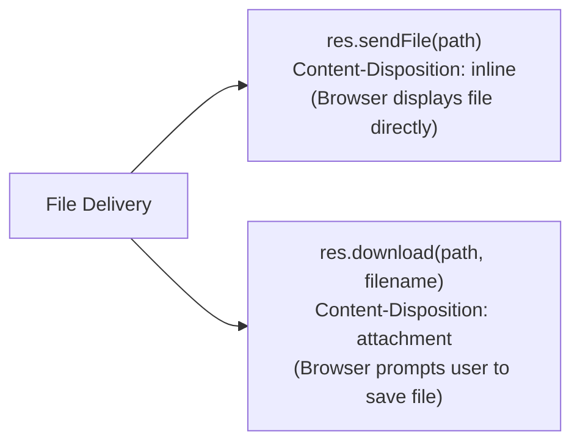

# Module 07: Express Response Object (`res`) — Statuses, Headers, Files, & Negotiation

## Theoretical Overview & `res` Object Mechanics

The **Response object (`res`)** wraps Node's native `http.ServerResponse` object. It provides helper methods to set HTTP status codes, configure response headers, serialize JSON payloads, issue HTTP redirects, stream static files, and handle server-driven content negotiation.

```mermaid
flowchart TD
    RouteHandler["Route Handler Code"] --> ResMethods["Express Response Methods (res)"]
    
    subgraph Response Helper Taxonomy
        ResMethods --> StatusMethods["Status & Serialization<br/>res.status(201).json(data)<br/>res.sendStatus(204)"]
        ResMethods --> HeaderMethods["Header Control<br/>res.set('X-Header', 'val')<br/>res.type('html')"]
        ResMethods --> RedirectMethods["Redirects<br/>res.redirect(301, '/target')"]
        ResMethods --> NegotiationMethods["Content Negotiation<br/>res.format({ 'application/json': fn })"]
        ResMethods --> FileMethods["File Delivery<br/>res.sendFile(path)<br/>res.download(path, filename)"]
    end
    
    Response Helper Taxonomy --> HTTPClient["Client Stream Output"]
```

### Real-World Analogy: Kumhar Ramu's Pottery Workshop
Think of Kumhar Ramu packaging artisanal clay pots at his workshop:
- **`res.json({ item: 'matka' })`**: Boxing a terracotta pot in a standard labeled cardboard box for easy inspection (JSON output).
- **`res.set('X-Finish', 'glazed')`**: Stamping a special fragility seal or quality tag on the package exterior (Response Headers).
- **`res.format()`**: Inspecting whether the customer requested a physical brass pot (`application/json`) or a paper certificate (`text/html`) before handing it over (Content Negotiation).
- **`res.download(file)`**: Handing the customer a sealed export manifest meant specifically to be taken home and stored in their file cabinet (`Content-Disposition: attachment`).

---

## 1. Primary `res` Methods Reference Matrix

| Method | Behavior | Content-Type Header | Use Case |
| :--- | :--- | :--- | :--- |
| **`res.json(obj)`** | Serializes JS object/array to JSON string. | `application/json` | REST API responses. |
| **`res.status(code)`** | Sets HTTP status code. Returns `res` for method chaining. | N/A (Does not send response). | `res.status(201).json(data)` |
| **`res.sendStatus(code)`** | Sets status code AND sends standard status string as body. | `text/plain` | `res.sendStatus(204)` |
| **`res.send(body)`** | Auto-detects data type (String $\to$ HTML, Object $\to$ JSON, Buffer $\to$ Octet). | Inferred automatically. | Quick HTML/text responses. |
| **`res.set(field, val)`** | Sets response header(s). | N/A | `res.set('X-Powered-By', 'Express')` |
| **`res.redirect(url)`** | Issues HTTP 302 (default) or specified 301/307 redirect. | `text/html` | Route migration, auth redirects. |
| **`res.format(map)`** | Selects handler based on incoming client `Accept` header. | Matches selected format. | Multi-format endpoints (JSON/HTML). |
| **`res.sendFile(path)`** | Streams file directly to client for inline viewing. | Auto-detected via extension. | Displaying PDFs/Images. |
| **`res.download(path, name)`** | Sets `Content-Disposition: attachment`. Forces file download. | Auto-detected via extension. | Exporting CSVs/Invoices. |

---

## 2. Status Codes, JSON, & Serialization (`block1`)

`res.status()` only sets the status code on the response object—it does **not** terminate or send the HTTP response by itself. You must chain it with `.json()`, `.send()`, or `.end()`.

```javascript
const express = require('express');
const app = express();

// 1. Standard JSON API Response (200 OK)
app.get('/api/item', (req, res) => {
  res.json({ name: 'Terracotta matka', price: 250 });
});

// 2. Chaining Status Code with JSON (201 Created)
app.get('/api/created', (req, res) => {
  res.status(201).json({ message: 'Order created', id: 'ord-99' });
});

// 3. One-step Status + Body (204 No Content)
app.delete('/api/item/:id', (req, res) => {
  res.sendStatus(204); // Sends 204 status with no body payload
});

// 4. Smart Body Serialization (res.send)
app.get('/api/text', (req, res) => {
  res.send("Shaped with care on the potter's wheel"); // Sets Content-Type: text/html
});
```

---

## 3. Headers, Redirects, & Content Negotiation (`block2`)

`res.format()` performs server-driven content negotiation by evaluating the incoming `Accept` header against a map of MIME types. If no match is found, Express invokes the `default` fallback callback or sends a `406 Not Acceptable` error.

```javascript
const app = express();

// 1. Header Manipulation: res.set(), res.append()
app.get('/api/headers-demo', (req, res) => {
  res.set('X-Workshop', 'Kumhar-Ramu');
  res.append('X-Finish', 'glazed');
  res.append('X-Finish', 'painted'); // Appends multi-value header
  res.json({ xFinish: res.get('X-Finish') });
});

// 2. HTTP Redirects: 302 Temporary vs 301 Permanent
app.get('/old-catalog', (req, res) => res.redirect('/new-catalog')); // 302 Default
app.get('/legacy', (req, res) => res.redirect(301, '/modern'));        // 301 Permanent
app.get('/new-catalog', (req, res) => res.send('New pottery catalog'));
app.get('/modern', (req, res) => res.send('Modern workshop'));

// 3. Server-Driven Content Negotiation via res.format()
app.get('/api/pot', (req, res) => {
  res.format({
    'application/json': () => res.json({ title: 'Surahi', medium: 'terracotta' }),
    'text/html': () => res.send('<h1>Surahi</h1><p>terracotta</p>'),
    default: () => res.status(406).send('Not Acceptable'),
  });
});
```

---

## 4. File Delivery: `res.sendFile()` vs. `res.download()` (`block3`)



```javascript
const path = require('path');
const app = express();

const blueprintPath = path.join(__dirname, 'blueprint.txt');
const inventoryCsvPath = path.join(__dirname, 'inventory.csv');

// 1. Stream file for inline browser viewing (Inline Display)
app.get('/view/blueprint', (req, res) => {
  res.sendFile(blueprintPath);
});

// 2. Force browser file download with custom filename (Attachment)
app.get('/download/data', (req, res) => {
  res.download(inventoryCsvPath, 'pottery-inventory.csv');
});
```

---

## Key Takeaways

1. **`res.status()` Requires Termination**: `res.status(code)` returns the `res` object for chaining; you must follow it with `.json()`, `.send()`, or `.end()`.
2. **`res.json()` for APIs**: Always use `res.json()` for REST APIs to ensure correct JSON serialization and `Content-Type: application/json` headers.
3. **`res.sendFile()` vs. `res.download()`**: Use `res.sendFile()` when you want the browser to render the file inline (e.g. PDFs, images) and `res.download()` when you want to force a file download prompt.
4. **Negotiation via `res.format()`**: Use `res.format()` to serve multiple representations (JSON, HTML, CSV) from a single endpoint depending on client requirements.
