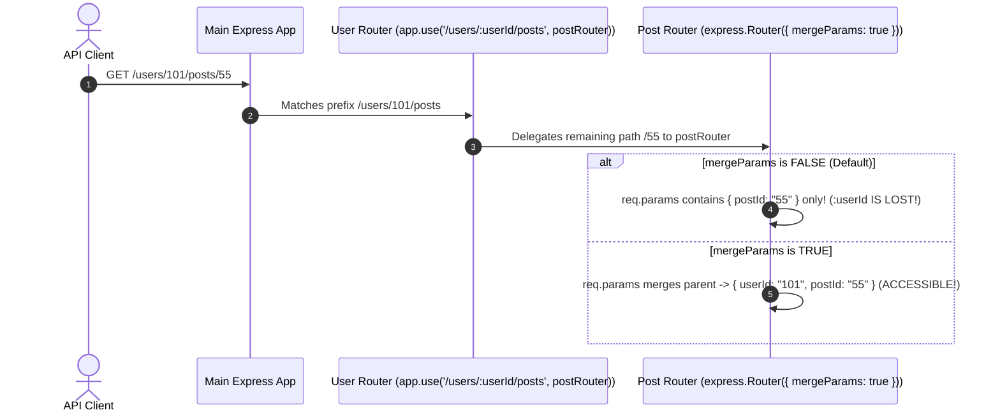
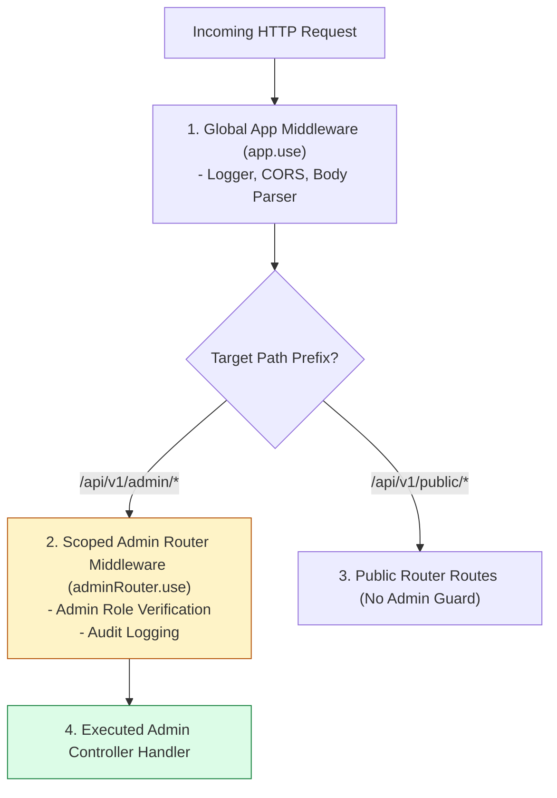

# Module 08: Express Router (`express.Router()`) Architecture, Nested Routing, and Modular Code Organization

## Overview

The **`express.Router`** class creates modular, isolated, mountable route handler instances. Often referred to as a **"Mini-Application"**, an `express.Router()` instance possesses its own middleware pipeline, route definitions, and error handlers, allowing developers to structure complex applications into clean, domain-driven modules.

Mastering modular router mounting (`app.use('/base', router)`), scoped router middleware, and **`mergeParams: true`** for accessing parent parameters in nested routes is essential.

---

## 1. Modular Sub-Router Mounting Architecture

```mermaid
flowchart TD
    MainApp["Main Application (app = express())"] --> MountingLayer["Base Path Router Mounts"]

    MountingLayer -->|app.use('/api/v1/users', userRouter)| UserModule["User Domain Router (userRouter)"]
    MountingLayer -->|app.use('/api/v1/orders', orderRouter)| OrderModule["Order Domain Router (orderRouter)"]
    MountingLayer -->|app.use('/api/v1/auth', authRouter)| AuthModule["Auth Domain Router (authRouter)"]

    subgraph Scoped User Router Domain
        UserModule --> U1["GET / -> Fetch Users List"]
        UserModule --> U2["POST / -> Create User Entity"]
        UserModule --> U3["GET /:userId -> Fetch Single User"]
    end

    style MainApp fill:#dbeafe,stroke:#1d4ed8
    style UserModule fill:#dcfce7,stroke:#15803d
```

---

## 2. Nested Route Parameter Inheritance (`mergeParams: true`)

By default, child sub-routers cannot access path parameters defined in the parent router mount path unless **`express.Router({ mergeParams: true })`** is configured:



---

## 3. Scoped Router Middleware vs. Application-Level Middleware



### Router Configuration Options Matrix

| Router Option | Default Value | Description & Purpose |
| :--- | :--- | :--- |
| **`mergeParams`** | `false` | When set to `true`, merges `req.params` from parent router mount path into child router. Essential for nested resource paths (`/users/:userId/comments`). |
| **`caseSensitive`** | `false` | When set to `true`, enforces strict case matching (`/Users` !== `/users`). |
| **`strict`** | `false` | When set to `true`, enforces strict trailing slash rules (`/users/` !== `/users`). |

---

## 4. Practical Implementation Showcase: Modular & Nested Routers

### Nested Post Sub-Router (`routes/postRouter.js`)
```javascript
const express = require("express");

// CRITICAL: mergeParams: true allows accessing parent :userId from user router!
const postRouter = express.Router({ mergeParams: true });

// GET /api/v1/users/:userId/posts
postRouter.get("/", (req, res) => {
  const { userId } = req.params; // Inherited from parent mount path!
  res.status(200).json({
    userId: Number(userId),
    posts: [
      { postId: 55, title: "Deep Dive into Express Router" },
      { postId: 56, title: "Mastering Node.js Performance" }
    ]
  });
});

module.exports = postRouter;
```

### Main User Router (`routes/userRouter.js`)
```javascript
const express = require("express");
const postRouter = require("./postRouter");
const userRouter = express.Router();

// Router-Scoped Interceptor Middleware
userRouter.use((req, res, next) => {
  console.log(`👤 [USER DOMAIN ROUTER] Request URL: ${req.originalUrl}`);
  next();
});

// User Domain Handlers
userRouter.get("/", (req, res) => {
  res.status(200).json([{ id: 101, name: "Priya Sharma" }]);
});

// Mount Nested Child Post Router under /:userId/posts
userRouter.use("/:userId/posts", postRouter);

module.exports = userRouter;
```

### Main Application Entry Point (`server.js`)
```javascript
const express = require("express");
const userRouter = require("./routes/userRouter");

const app = express();
app.use(express.json());

// Mount User Domain Router under /api/v1/users
app.use("/api/v1/users", userRouter);

// Start Listener
app.listen(3000, () => {
  console.log("Modular Express Router Server running on port 3000");
});
```

---

## Key Production Takeaways

1. **Adopt Domain-Driven Folder Organization**: Group routes, controllers, and domain middleware inside dedicated sub-directories (`routes/userRoutes.js`, `controllers/userController.js`) using `express.Router()`.
2. **Set `mergeParams: true` for Nested Routes**: Always pass `{ mergeParams: true }` when creating child routers for nested resources (`/users/:userId/orders/:orderId`) to preserve parent parameter context.
3. **Use Scoped Router Middleware**: Attach domain-specific guards (e.g., `adminRouter.use(verifyAdminRole)`) directly to the router instance so authentication logic stays isolated to target routes.
4. **Keep Route Definitions Thin**: Avoid placing complex business logic directly inside router files. Delegate route handler callbacks to external Controller modules (`userController.getUserById`).

