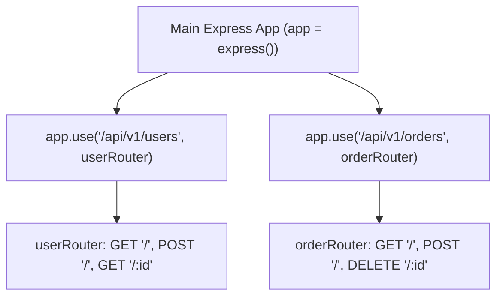

# File 08: Express Router Module and Modular Code Organization

## Overview
The **`express.Router`** class creates modular, mountable route handlers. A `Router` instance is a complete mini-application capable of defining its own isolated middleware and sub-routes, cleanly separating route logic across dedicated files.

---

## 1. Modular Sub-Router Mounting Architecture



---

## 2. Sub-Router Module Implementation

### User Router (`routes/userRoutes.js`)
```javascript
const express = require("express");
const router = express.Router();

// Isolated Router Middleware
router.use((req, res, next) => {
    console.log("[USER ROUTER INTERCEPTOR] Path:", req.url);
    next();
});

router.get("/", (req, res) => {
    res.status(200).json([{ id: 1, name: "Priya" }]);
});

router.get("/:id", (req, res) => {
    res.status(200).json({ id: req.params.id, name: "Priya" });
});

module.exports = router;
```

### Main Application (`server.js`)
```javascript
const express = require("express");
const userRouter = require("./routes/userRoutes");

const app = express();
app.use(express.json());

// Mount Sub-Router under /api/v1/users
app.use("/api/v1/users", userRouter);

app.listen(3000, () => console.log("Server running on port 3000"));
```

---

## Key Takeaways
1. **`express.Router()`** decomposes monolithic routing applications into modular, maintainable domain files.
2. Mount sub-routers under a base URL path using **`app.use('/base-path', router)`**.
3. Routers can attach isolated, scoped middleware that applies strictly to their own sub-routes.
