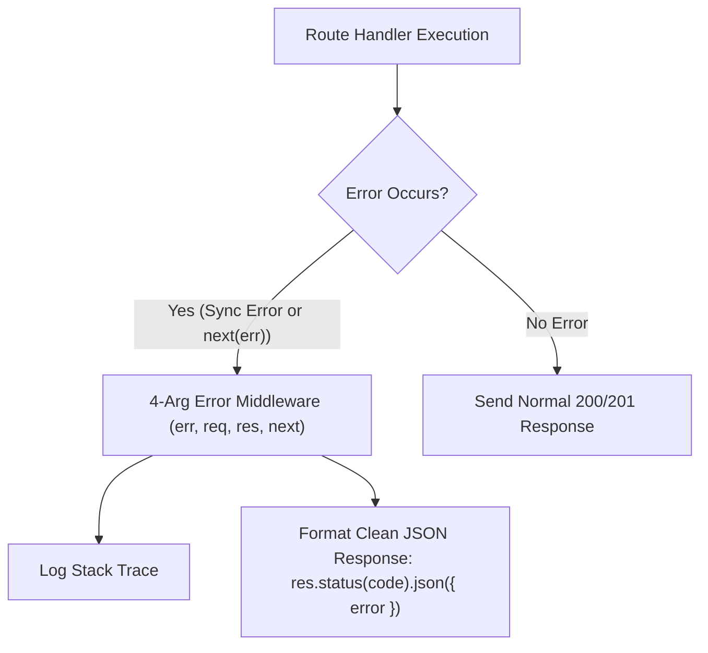

# File 09: Error Handling in Express.js

## Overview
Express provides built-in mechanisms for catching and handling errors. Centralized error handling is accomplished using special **4-argument Error Middleware functions `(err, req, res, next)`**, catching both synchronous errors and asynchronous promise rejections.

---

## 1. Centralized Error Handling Pipeline



---

## 2. Centralized Error Middleware Implementation

```javascript
const express = require("express");
const app = express();

app.use(express.json());

// Custom Operational Error Class
class AppError extends Error {
    constructor(message, statusCode) {
        super(message);
        this.statusCode = statusCode;
        this.status = `${statusCode}`.startsWith("4") ? "fail" : "error";
        this.isOperational = true;
    }
}

// Route Triggering Error
app.get("/api/v1/error-test", (req, res, next) => {
    // Pass error to next(err) to trigger error middleware!
    const err = new AppError("Resource not found", 404);
    next(err);
});

// Centralized 4-Argument Error Handling Middleware (Registered LAST!)
app.use((err, req, res, next) => {
    const statusCode = err.statusCode || 500;
    const status = err.status || "error";

    console.error(`[EXPRESS ERROR LOG] ${err.stack}`);

    res.status(statusCode).json({
        status,
        error: err.message,
        ...(process.env.NODE_ENV === "development" && { stack: err.stack })
    });
});
```

---

## Key Takeaways
1. Express Error Middleware **MUST have exactly 4 arguments: `(err, req, res, next)`**.
2. Register Error Middleware **LAST**, after all other `app.use()` and route definitions.
3. Pass errors from async route handlers by calling **`next(err)`** or using `express-async-errors`.
