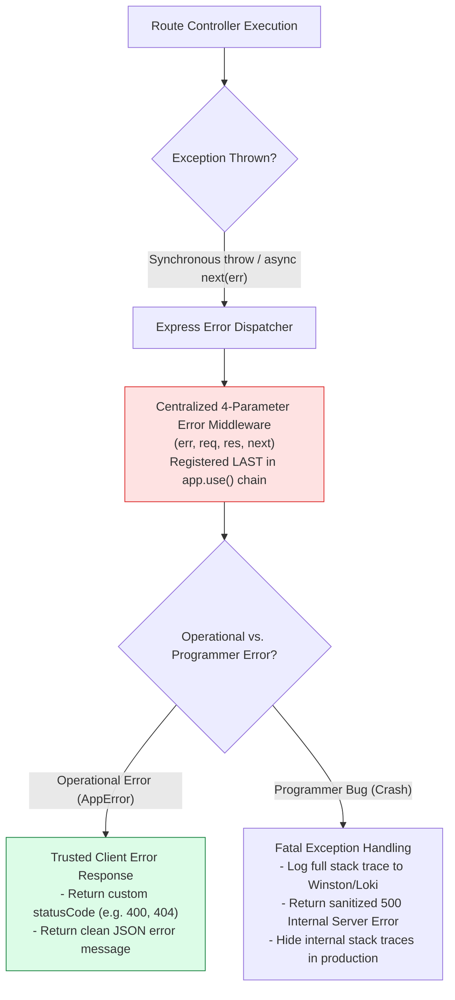
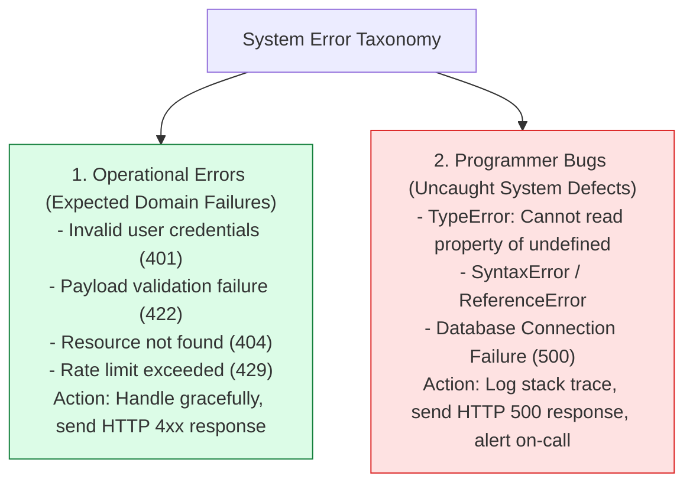

# Module 09: Centralized Error Handling Architecture, Operational Errors, and Async Propagation

## Overview

Error handling is a critical architectural requirement in Express.js. Express features a dedicated **4-Parameter Error Handling Middleware** signature: **`(err, req, res, next)`**.

Understanding **Operational Errors** (e.g. invalid user input, 404s, database validation failures) vs. **Programmer Bugs** (e.g. `TypeError`, unhandled null pointer exceptions), propagating async errors via **`next(err)`**, and constructing standardized JSON error payloads is essential.

---

## 1. Express Centralized Error Handling Pipeline



---

## 2. Express 4.x vs. Express 5.x Asynchronous Error Propagation

In **Express 4.x**, rejected promises inside async functions must be caught and passed to `next(err)`. In **Express 5.x**, rejected promises are caught automatically:

```mermaid
sequenceDiagram
    autonumber
    actor Client as API Client
    participant Controller as Async Controller (async (req, res, next) => {})
    participant ErrorMW as Error Middleware (err, req, res, next)

    Client->>Controller: GET /api/users/999
    Controller->>Controller: await User.findById(999) (Throws DB Exception!)
    
    alt Express 4.x Engine (Manual catch or express-async-errors)
        Controller->>Controller: try { ... } catch(err) { next(err); }
        Controller->>ErrorMW: next(err) called -> Triggers Error Middleware!
    else Express 5.x Engine (Native Promise Support)
        Controller->>ErrorMW: Rejected Promise caught automatically by Express 5!
    end

    ErrorMW-->>Client: Returns 500 Internal Server Error JSON
```

---

## 3. Operational vs. Programmer Error Classification Matrix



---

## 4. Practical Implementation Showcase: Centralized Error Handler

```javascript
const express = require("express");
const app = express();

app.use(express.json());

// 1. Custom Operational AppError Class
class AppError extends Error {
  constructor(message, statusCode) {
    super(message);
    this.statusCode = statusCode;
    this.status = `${statusCode}`.startsWith("4") ? "fail" : "error";
    this.isOperational = true; // Flag identifying trusted operational errors

    Error.captureStackTrace(this, this.constructor);
  }
}

// 2. Async Wrapper Middleware (For Express 4.x compatibility)
const catchAsync = (fn) => {
  return (req, res, next) => {
    fn(req, res, next).catch(next); // Forwards rejected promises to next(err)
  };
};

// 3. Route Handlers Demonstrating Errors
app.get("/api/v1/users/:id", catchAsync(async (req, res, next) => {
  const userId = Number(req.params.id);

  if (userId <= 0) {
    // Trigger operational 400 Bad Request Error
    throw new AppError("User ID must be a positive integer", 400);
  }

  if (userId === 999) {
    // Trigger operational 404 Not Found Error
    throw new AppError("Requested user resource does not exist", 404);
  }

  res.status(200).json({ id: userId, name: "Priya Sharma" });
}));

// 4. Catch-All Unhandled Route Handler (404)
app.use((req, res, next) => {
  next(new AppError(`Cannot find path ${req.originalUrl} on this server`, 404));
});

// 5. Centralized 4-Parameter Error Handling Middleware (MUST BE REGISTERED LAST!)
app.use((err, req, res, next) => {
  err.statusCode = err.statusCode || 500;
  err.status = err.status || "error";

  console.error(`🚨 [EXPRESS ERROR LOG] ${err.name}: ${err.message}`);
  if (!err.isOperational) {
    console.error(err.stack); // Log full stack trace for programmer bugs
  }

  // Response Payload Sanitization (Hide stack traces in production)
  res.status(err.statusCode).json({
    status: err.status,
    error: {
      message: err.isOperational ? err.message : "Internal Server Error",
      statusCode: err.statusCode
    },
    ...(process.env.NODE_ENV === "development" && { stack: err.stack })
  });
});

// Start Server
app.listen(3000, () => {
  console.log("Centralized Error Handling Server running on port 3000");
});
```

---

## Key Production Takeaways

1. **Error Middleware MUST Have 4 Parameters**: Express identifies error middleware strictly by function arity (`fn.length === 4`). You must declare `(err, req, res, next)` even if `next` is not explicitly invoked inside the function body.
2. **Register Error Middleware LAST**: Error handling middleware must be registered after all route handlers and application middleware (`app.use()`) so it catches errors forwarded from upstream routes.
3. **Differentiate Operational Errors from Programmer Bugs**: Mark trusted domain exceptions with `isOperational = true` on a custom `AppError` class, allowing error handlers to return clean HTTP 4xx responses without exposing internal server stack traces.
4. **Wrap Async Handlers in Express 4.x**: In Express 4.x, unhandled promise rejections inside `async` route handlers will hang the request or trigger unhandled rejection crashes unless wrapped in a `catchAsync` helper or converted to `next(err)`.

