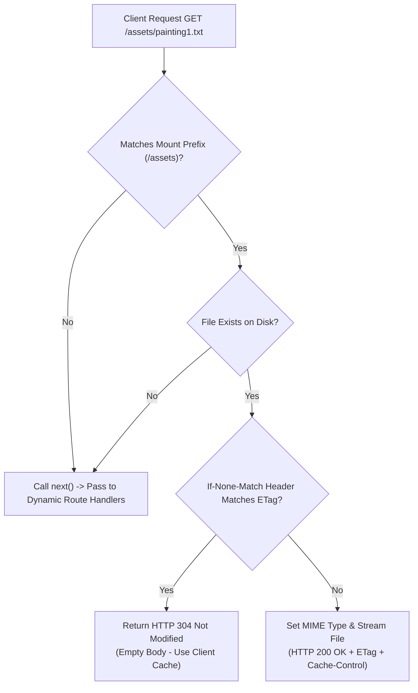

# Module 10: Static File Serving — Assets, Caching, & Security Configurations

## Theoretical Overview & Asset Delivery Pipeline

Serving static files (images, CSS, JavaScript, HTML documents) is a primary requirement for web applications. Express provides `express.static()`, a built-in middleware function based on the low-level `serve-static` module, to handle static file streaming directly from disk.



### Real-World Analogy: National Gallery of Modern Art (NGMA Delhi)
Think of Curator Meera organizing exhibition halls at NGMA Delhi:
- **Exhibition Halls (`express.static(dir)`)**: Rooms where artwork is hung on display for visitors to inspect freely.
- **Virtual Path Prefixes (`app.use('/assets', ...)`)**: Signage directing visitors down the "Modern Art Wing" (`/assets`) to reach the painting storage room (`uploadsDir`).
- **Cache Tags (`maxAge: '1h'`)**: Instructions on the gallery guide telling tour buses to keep their map for 1 hour before asking for a new one.
- **Dotfile Security (`dotfiles: 'deny'`)**: Locked velvet ropes keeping visitors away from staff-only utility closets containing hidden files (`.env`, `.secret`).

---

## 1. `express.static()` Options Reference Matrix

| Option Property | Supported Values | Default | Purpose & Description |
| :--- | :--- | :--- | :--- |
| **`dotfiles`** | `'ignore'`, `'deny'`, `'allow'` | `'ignore'` | Controls handling of hidden dotfiles (e.g. `.env`, `.git`). `'deny'` returns 404/403. |
| **`extensions`** | `Array` (e.g. `['html', 'htm']`) | `false` | Fallback file extensions. Resolves `/about` to `/about.html`. |
| **`index`** | `String` or `Boolean` | `'index.html'` | Default index filename served when a directory path is requested. |
| **`maxAge`** | `Number` (ms) or `String` (`'1h'`) | `0` | Sets `Cache-Control: public, max-age=<seconds>` header for browser caching. |
| **`etag`** | `Boolean` | `true` | Enables generation of `ETag` HTTP headers for conditional validation. |
| **`lastModified`** | `Boolean` | `true` | Sets `Last-Modified` HTTP header based on file stats. |

---

## 2. Basic Static File Serving (`block1`)

When `express.static()` encounters a URL request that does not match any file on disk, it does **not** fail—it silently invokes `next()` to let subsequent dynamic API route handlers process the request.

```javascript
const express = require('express');
const path = require('path');
const app = express();

const publicDir = path.join(__dirname, 'public');

// 1. Mount Static Middleware at Root Level
app.use(express.static(publicDir));

// 2. Dynamic Route Coexists Seamlessly
app.get('/api/info', (req, res) => {
  res.json({ gallery: 'NGMA Delhi', version: 1 });
});

// Requests to GET / serve public/index.html automatically
// Requests to GET /nonexistent.txt fall through static middleware to trigger 404
```

---

## 3. Options, Virtual Prefixes, & Conditional 304 Caching (`block2`)

Mounting static middleware under a virtual path prefix (e.g. `/assets` or `/vendor`) allows mapping logical URL endpoints to different physical directories on disk.

```javascript
const app = express();

// 1. Main Public Assets with Security & Caching Options
app.use(express.static(publicDir, {
  dotfiles: 'deny',            // Block hidden files (.secret, .env, .git)
  extensions: ['html', 'htm'], // GET /about automatically serves about.html
  index: 'index.html',         // Directory default file
  maxAge: '1h',                // Set Cache-Control: public, max-age=3600
  etag: true,
  lastModified: true,
}));

// 2. Virtual Path Prefix for Uploaded Assets (/assets -> uploadsDir)
app.use('/assets', express.static(uploadsDir, { maxAge: '30m' }));

// 3. Long-term Caching for Third-Party Vendor Libraries
app.use('/vendor', express.static(vendorDir, { maxAge: '7d' }));
```

### Conditional HTTP 304 Not Modified Flow
When a browser re-requests a static file using the `If-None-Match` header containing a previously received `ETag`, Express calculates the current file's ETag:
- **ETag Matches**: Express immediately terminates with `HTTP 304 Not Modified` (0 byte body), saving network bandwidth.
- **ETag Differs**: Express streams the updated file payload with `HTTP 200 OK`.

---

## Key Takeaways

1. **Automated Header Management**: `express.static()` automatically inspects file extensions to set appropriate `Content-Type`, `ETag`, and `Last-Modified` HTTP headers.
2. **Passthrough on Miss**: If a requested file does not exist in the specified directory, static middleware silently passes control to the next route or middleware via `next()`.
3. **Security via Dotfile Guard**: Always configure `dotfiles: 'deny'` in production to prevent unintended exposure of sensitive configuration files (`.env`, `.git`).
4. **Virtual Prefix Mounting**: Use `app.use('/prefix', express.static(dir))` to mount static directories under clean URL namespaces.
5. **Bandwidth Savings via ETags**: Browsers send `If-None-Match` validation headers on repeated asset requests, allowing Express to return instant `304 Not Modified` responses.
