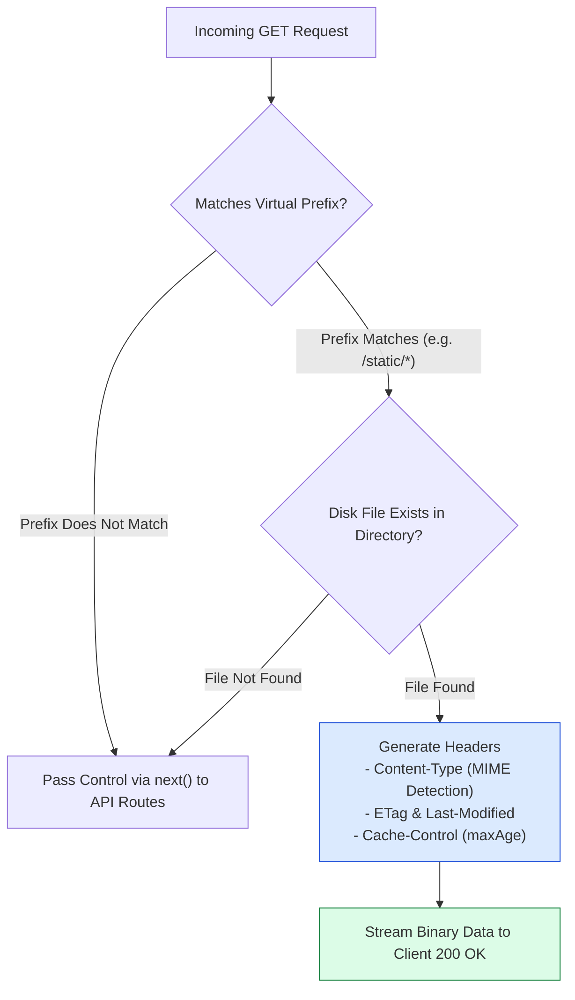
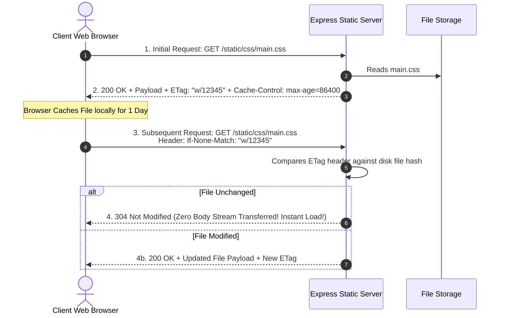

# Module 10: Serving Static Files, Virtual Path Prefixing, and HTTP Caching

## Overview

Serving static assets (images, CSS stylesheets, client-side JS bundles, fonts) directly from disk is a core responsibility of web applications. Express provides **`express.static(root, [options])`**, a high-performance built-in middleware based on the `serve-static` library.

Mastering **Absolute Path Construction**, **Virtual Path Prefixing**, **HTTP Browser Caching Options (`maxAge`, `etag`, `lastModified`)**, and **Security Configuration (`dotfiles: 'ignore'`)** is essential.

---

## 1. Static Asset Request Execution Pipeline



---

## 2. HTTP Cache Validation Flow (`ETag` & `304 Not Modified`)



---

## 3. Virtual Path Prefixing Architecture

Mounting static directories under virtual URL prefixes isolates file paths from disk file directory names:


### Static Middleware Options Configuration Matrix

| Configuration Option | Default Value | Description & Production Guidance |
| :--- | :--- | :--- |
| **`dotfiles`** | `"ignore"` | Determines how hidden dotfiles (`.env`, `.git`) are handled. Options: `"ignore"` (returns 404), `"deny"` (returns 403), `"allow"`. Always set to `"ignore"`. |
| **`etag`** | `true` | Enables HTTP ETag generation for cache validation. |
| **`maxAge`** | `0` | Sets `Cache-Control` header `max-age` in milliseconds or string syntax (e.g. `'1d'`, `'1y'`). |
| **`lastModified`** | `true` | Sets `Last-Modified` header based on file OS modification time. |
| **`index`** | `"index.html"` | Default directory index file name. Set to `false` to disable automatic directory index serving. |

---

## 4. Practical Implementation Showcase: Production Static Server

```javascript
const express = require("express");
const path = require("path");
const app = express();

// Configure Enterprise Static Server Options
const productionStaticOptions = {
  dotfiles: "ignore",             // Ignore hidden dotfiles (.env, .git)
  etag: true,                     // Enable ETag generation
  extensions: ["html", "htm"],    // Fallback extensions if omitted in URL
  index: "index.html",            // Default directory index
  maxAge: "7d",                   // Cache-Control max-age header (7 days)
  lastModified: true,             // Attach Last-Modified header
  setHeaders: (res, filePath) => {
    // Custom header injection based on file type
    if (filePath.endsWith(".css") || filePath.endsWith(".js")) {
      res.setHeader("Cache-Control", "public, max-age=31536000, immutable");
    }
  }
};

// 1. Root Static Directory Mount
app.use(express.static(path.join(__dirname, "public"), productionStaticOptions));

// 2. Virtual Path Prefix Mount (/assets -> uploads directory)
app.use("/assets", express.static(path.join(__dirname, "uploads"), productionStaticOptions));

// 3. Fallback Route Handler (If static file not found on disk)
app.get("/api/v1/status", (req, res) => {
  res.status(200).json({ status: "API Server Operational" });
});

// Start Server
app.listen(3000, () => {
  console.log("Production Static File Server running on port 3000");
});
```

---

## Key Production Takeaways

1. **Always Use `path.join(__dirname, 'public')`**: Avoid relative string paths like `'./public'`. Absolute paths constructed with `path.join(__dirname, ...)` ensure correct file resolution regardless of process launch directory.
2. **Mount Under Virtual Path Prefixes**: Always mount static assets under clear virtual URL prefixes (e.g., `app.use('/static', express.static(...))`) to prevent accidental collision with dynamic API endpoints.
3. **Configure Aggressive Caching for Hashed Bundles**: Set `maxAge: '1y'` and `immutable` headers for client JavaScript and CSS bundles that incorporate content hashes (e.g. `main.a89f1c.js`).
4. **Enforce `dotfiles: 'ignore'`**: Ensure `dotfiles` option is set to `'ignore'` or `'deny'` to prevent malicious clients from inspecting hidden configuration files (`.env`, `.git`).

