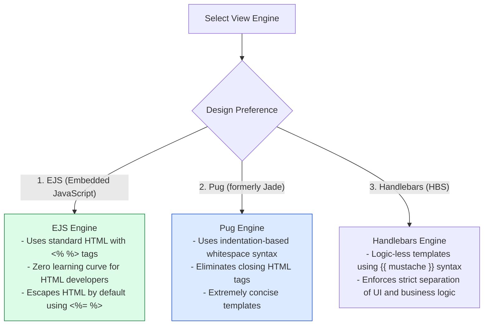
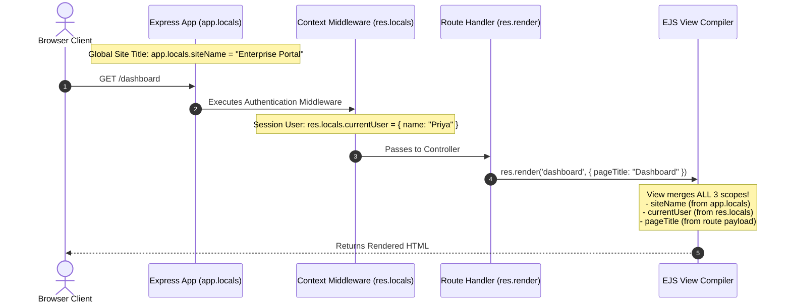

# Module 11: Server-Side Template Rendering, View Engines, and Security Sanitization

## Overview

Express supports dynamic **Server-Side Template Engine Rendering** (EJS, Pug, Handlebars) via **`app.set('view engine')`** and **`res.render('viewName', data)`**. Template engines compile layout files containing template tags on the server, injecting dynamic data payloads before returning pure HTML strings to the client browser.

Understanding view engine setup, **`app.locals` vs `res.locals`** variable propagation, template caching in production, and **XSS (Cross-Site Scripting) Automatic Escaping Guards** is essential.

---

## 1. Server-Side Rendering (SSR) Execution Architecture

```mermaid
flowchart TD
    ClientReq[Browser GET Request /profile] --> ExpressRoute[Express Route Handler]

    ExpressRoute --> FetchDB[Fetch Model Payload from Database]
    FetchDB --> ResRender["res.render('profile', { user })"]

    subgraph Template Engine Compiler (EJS / Pug)
        ResRender --> MergeLocals[Merge app.locals + res.locals + Route Data]
        MergeLocals --> LoadDiskView[Read Template File from /views/profile.ejs]
        LoadDiskView --> CompileAST[Compile Template AST & Auto-Escape HTML]
    end

    CompileAST --> FinalHTML[Return Compiled HTML Stream 200 OK]
    FinalHTML --> ClientReq

    style ResRender fill:#dbeafe,stroke:#1d4ed8
    style CompileAST fill:#dcfce7,stroke:#15803d
```

---

## 2. Template Engine Feature Matrix: EJS vs. Pug vs. Handlebars



### Template Engine Feature Comparison

| View Engine | Template Extension | Syntax Philosophy | Auto-Escape XSS Syntax | Primary Use Case |
| :--- | :--- | :--- | :--- | :--- |
| **EJS** | `.ejs` | Standard HTML + JS `<%= %>` | `<%= variable %>` | Rapid Node.js SSR web apps |
| **Pug** | `.pug` | Minimalist Whitespace / Ident | `p= variable` | Concise clean template markup |
| **Handlebars** | `.hbs` | Logic-less Mustache `{{ }}` | `{{ variable }}` | Decoupled UI template rendering |

---

## 3. Local Variables Hierarchy (`app.locals` vs. `res.locals`)



---

## 4. Practical Implementation Showcase: EJS View Engine Setup

```javascript
const express = require("express");
const path = require("path");
const app = express();

// 1. Configure Template Engine Settings
app.set("views", path.join(__dirname, "views"));
app.set("view engine", "ejs");

// Enable View Template Caching in Production (Improves Performance)
if (process.env.NODE_ENV === "production") {
  app.enable("view cache");
}

// 2. Global Application Locals (Available across ALL template renders)
app.locals.siteTitle = "Enterprise Engineering Hub";
app.locals.currentYear = new Date().getFullYear();

// 3. Request-Scoped Middleware Locals
app.use((req, res, next) => {
  // Available to any template rendered during THIS specific request cycle
  res.locals.nonce = "random_nonce_991823";
  res.locals.isAuthenticated = true;
  res.locals.user = { name: "Priya Sharma", role: "ADMIN" };
  next();
});

// 4. Render Dynamic Template Endpoint
app.get("/user/profile", (req, res) => {
  const userProfile = {
    bio: "Senior Infrastructure Engineer",
    skills: ["Node.js", "Express", "Kubernetes", "PostgreSQL"],
    dangerRawHtml: "<script>alert('XSS Attack!')</script>" // Test XSS escaping
  };

  // Render views/profile.ejs passing local page payload
  res.render("profile", {
    pageTitle: "User Profile",
    profile: userProfile
  });
});

// Start Server
app.listen(3000, () => {
  console.log("Template Rendering Server running on port 3000");
});
```

---

## Key Production Takeaways

1. **Enable View Cache in Production**: Ensure `app.enable('view cache')` is configured in production so Express caches compiled template functions in RAM rather than reading files from disk on every request.
2. **Use `res.locals` for Middleware Data**: Pass request-scoped context (authenticated user, CSRF tokens, flash messages) down to template views using `res.locals.property` inside upstream middleware.
3. **Rely on Default HTML Auto-Escaping**: Never use unescaped template tags (like EJS `<%- %>`) for user-supplied input unless thoroughly sanitized with libraries like DOMPurify or sanitize-html to prevent Cross-Site Scripting (XSS).
4. **Use Absolute View Directory Paths**: Always configure `app.set('views', path.join(__dirname, 'views'))` to ensure templates resolve reliably regardless of process launch location.

