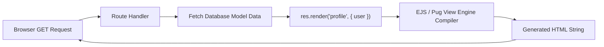

# File 11: Server-Side Template Rendering (EJS, Pug, Handlebars)

## Overview
Express supports **Server-Side Template Engine Rendering** (EJS, Pug, Handlebars) using **`app.set('view engine')`** and **`res.render('viewName', data)`** to generate dynamic HTML responses populated with server data.

---

## 1. Server-Side Rendering Flow



---

## 2. Express Template Engine Configuration

```javascript
const express = require("express");
const path = require("path");

const app = express();

// 1. Configure Template Engine Settings
app.set("views", path.join(__dirname, "views"));
app.set("view engine", "ejs");

// 2. Render Template Route
app.get("/user/profile", (req, res) => {
    const userData = {
        name: "Priya Sharma",
        role: "Senior Engineer",
        skills: ["JavaScript", "Node.js", "Express", "MongoDB"]
    };

    // Compiles views/profile.ejs with userData!
    res.render("profile", { user: userData, title: "User Profile" });
});
```

---

## Key Takeaways
1. Set view directory via **`app.set('views', path)`** and engine via **`app.set('view engine', 'ejs')`**.
2. Call **`res.render('view', data)`** to inject server-side data into HTML template layouts.
3. Automatically escapes HTML special characters in template views to prevent XSS vulnerabilities.
