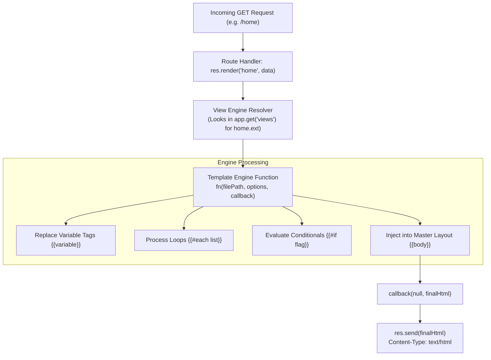

# Module 11: Server-Side Template Rendering & Custom View Engines

## Theoretical Overview & Server-Side Rendering (SSR)

Server-Side Rendering (SSR) with Express involves dynamically assembling HTML pages on the server by injecting data models into view templates before returning the generated HTML stream to the browser client.



### Real-World Analogy: Bollywood Film Poster Studio
Think of a poster designer at a Mumbai film studio:
- **Template Layout (`layout.simplehtml`)**: Reusable blank canvas framing with slots for the movie title, billing block, and release date.
- **View Data Model (`{ username: 'Shah Rukh Khan', films: [...] }`)**: The specific film details provided by the producer.
- **Render Engine (`app.engine()`)**: The printing press that fills in title placeholders (`{{username}}`), loops through cast credits (`{{#each films}}`), stamps producer badges (`{{#if isProducer}}`), and outputs the finalized poster (`res.render()`).

---

## 1. Express View Settings & API Reference

| Express API Setting / Method | Purpose & Description |
| :--- | :--- |
| **`app.engine(ext, fn)`** | Registers a template engine callback `fn(filePath, options, callback)` for handling files with extension `ext`. |
| **`app.set('view engine', ext)`** | Configures the default template extension so `res.render('home')` automatically resolves to `home.ext`. |
| **`app.set('views', dirPath)`** | Configures the directory path where template files are stored. Defaults to `process.cwd() + '/views'`. |
| **`res.render(view, data)`** | Resolves the view template, invokes the registered engine, and automatically sends the compiled HTML response (`200 OK`). |

---

## 2. Custom Template Engine Implementation (`simpleHtmlEngine`)

Every Express-compatible template engine implements the signature `(filePath, options, callback)`. Below is a custom implementation handling variable substitution, list iterations, and conditional logic:

```javascript
const express = require('express');
const fs = require('fs');
const path = require('path');
const app = express();

// Custom View Engine Callback Implementation
function simpleHtmlEngine(filePath, options, callback) {
  fs.readFile(filePath, 'utf8', (err, template) => {
    if (err) return callback(err);
    let rendered = template;

    // 1. Process Array Loops: {{#each collection}}...{{/each}}
    let eachStart = rendered.indexOf('{{#each ');
    while (eachStart !== -1) {
      let eachTagEnd = rendered.indexOf('}}', eachStart);
      let key = rendered.substring(eachStart + 8, eachTagEnd).trim();
      let endTag = '{{/each}}';
      let eachEnd = rendered.indexOf(endTag, eachTagEnd);
      let body = rendered.substring(eachTagEnd + 2, eachEnd);

      let arr = options[key];
      let replacement = '';
      if (Array.isArray(arr)) {
        for (let idx = 0; idx < arr.length; idx++) {
          let item = arr[idx];
          let row = body.split('{{this}}').join(String(item)).split('{{@index}}').join(String(idx));
          if (typeof item === 'object' && item !== null) {
            for (let prop in item) row = row.split(`{{${prop}}}`).join(String(item[prop]));
          }
          replacement += row;
        }
      }
      rendered = rendered.substring(0, eachStart) + replacement + rendered.substring(eachEnd + endTag.length);
      eachStart = rendered.indexOf('{{#each ', eachStart);
    }

    // 2. Process Conditionals: {{#if condition}}...{{/if}}
    let ifStart = rendered.indexOf('{{#if ');
    while (ifStart !== -1) {
      let ifTagEnd = rendered.indexOf('}}', ifStart);
      let key = rendered.substring(ifStart + 6, ifTagEnd).trim();
      let endTag = '{{/if}}';
      let ifEnd = rendered.indexOf(endTag, ifTagEnd);
      let body = rendered.substring(ifTagEnd + 2, ifEnd);

      let replacement = options[key] ? body : '';
      rendered = rendered.substring(0, ifStart) + replacement + rendered.substring(ifEnd + endTag.length);
      ifStart = rendered.indexOf('{{#if ', ifStart);
    }

    // 3. Process Simple Placeholders: {{variable}}
    for (let key in options) {
      rendered = rendered.split(`{{${key}}}`).join(String(options[key]));
    }

    callback(null, rendered);
  });
}

// Mount Engine & Configurations
app.engine('simplehtml', simpleHtmlEngine);
app.set('view engine', 'simplehtml');
app.set('views', path.join(__dirname, 'views'));
```

---

## 3. Master Layout Pattern & List Rendering (`block2`)

In real-world applications, views share common HTML boilerplate (headers, footers, navigation bars). The **Layout Pattern** renders the child content view first and injects the resulting HTML string into the `{{body}}` placeholder of a master layout template.

```javascript
// Render template helper wrapper
function renderFile(filePath, data) {
  return new Promise((resolve, reject) => {
    simpleHtmlEngine(filePath, data, (err, html) => err ? reject(err) : resolve(html));
  });
}

// 1. Basic View Rendering
app.get('/greeting', (req, res) => {
  res.render('greeting', { name: 'Shah Rukh Khan', count: 7 });
});

// 2. Master Layout Injection Pattern
app.get('/home', async (req, res) => {
  try {
    const innerHtml = await renderFile(path.join(app.get('views'), 'home.simplehtml'), {
      username: 'Sanjay Leela Bhansali',
      isProducer: true,
      films: [
        { title: 'Devdas 2 poster', status: 'in-progress' },
        { title: 'Padmaavat banner', status: 'done' }
      ],
      noFilms: false
    });

    // Inject inner view HTML into layout.simplehtml
    res.render('layout', {
      pageTitle: 'Dashboard',
      body: innerHtml,
      timestamp: new Date().toISOString()
    });
  } catch (err) {
    res.status(500).send('Render error: ' + err.message);
  }
});
```

---

## Key Takeaways

1. **Engine Contract**: Any view engine function registered via `app.engine(ext, fn)` must adhere to the standard callback signature `(filePath, options, callback)`.
2. **View Defaults**: Configure `app.set('view engine', 'ext')` and `app.set('views', dir)` once at application startup to streamline `res.render()` calls.
3. **Automated Content Type**: Calling `res.render()` automatically sets `Content-Type: text/html; charset=utf-8` and sends the compiled HTML payload.
4. **Layout Abstraction**: Implement layout wrappers by pre-rendering component templates and injecting the resulting markup string into a master layout template.
